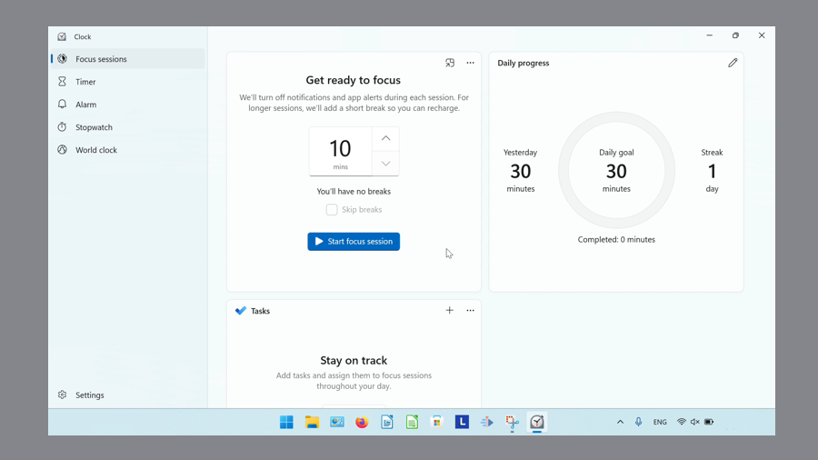

This tutorial covers:

## [What is the Microsoft Windows Clock](#1)

## [How to Open Microsoft Windows Clock With Search](#2)

## How to Pin the Microsoft Windows Clock to the Taskbar:
1. With Search (#3)
2. With Right Click (#4)
3. From Start (#5)

## [How to Pin the Microsoft Windows Clock to Start](#6)

No time to scroll down? Click through these tutorial slides:

<iframe src="https://docs.google.com/presentation/d/1Gll25rMk11HfZHe3OszYiqxz152r7XyaG8u_nAwW_iw/embed?start=false&loop=false&delayms=3000" frameborder="0" width="480" height="299" allowfullscreen="true" mozallowfullscreen="true" webkitallowfullscreen="true"></iframe>

 

Follow along with a video tutorial:
<iframe class="BLOG_video_class" allowfullscreen="" youtube-src-id="KryhNAhSYOQ" width="100%" height="416" src="https://www.youtube.com/embed/KryhNAhSYOQ"></iframe>

 

<h1 id="1">What is the Microsoft Windows Clock</h1>

Windows 11 comes with the Windows Clock app. The Windows Clock includes a timer, alarm, stopwatch, and world clock. Integrate Spotify with Windows Clock to play music during Focus Sessions, or keep track of tasks with both the Windows Clock and the Microsoft To Do app. 

<h1 id="2">How to Open Microsoft Windows Clock With Search</h1>

* Step 1: Go down to the taskbar and click the "Start" (four blue squares) button. 

* Step 2: In the Start window that opens, click in the search bar at the top and type "clock". 

* Step 3: On the search results screen, click one of these three buttons. 

* The Windows Clock app opens. 

<h1 id="3">How to Pin Microsoft Windows Clock to the Taskbar With Search</h1>

* Step 1: In a whiteboard with multiple objects, right click anywhere on the canvas. In the menu that opens, click the "More" or "..." button. 

* Step 2: In the menu that opens, click "Clear canvas". 

* Step 3: In the window that opens, click "Confirm". 

<h1 id="4">How to Pin Microsoft Windows Clock to the Taskbar With Right Click</h1>

* Step 1: On the keyboard press **Ctrl + A** to select all objects. Then press **Delete**. 

<h1 id="5">How to Pin Microsoft Windows Clock to the Taskbar From Start</h1>

<h1 id="6">How to Pin Microsoft Windows Clock to Start</h1>

Save a copy of these instructions for later with this free [tutorial PDF](https://drive.google.com/file/d/1zle_KRT5dkLyj68ntaPFbjoB9dowOFRS/view?usp=sharing).

 

