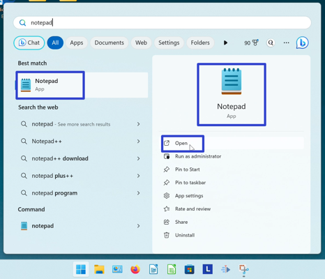
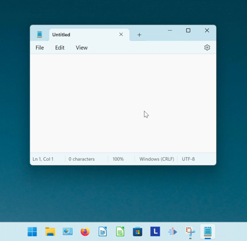

This tutorial covers:

1. [What is Notepad?](#1)
2. [How to Open Notepad With Search](#2)

 

No time to scroll down? Click through this tutorial presentation:
<iframe src="https://docs.google.com/presentation/d/e/2PACX-1vSHwm9CmrN-m0TEycUm9dmX62swABYlHb-2Gr1iApp4ssz2bzh97S9RQOThgbgGjI0QnHEKvoI-QhmT/embed?start=false&loop=false&delayms=3000" frameborder="0" width="480" height="299" allowfullscreen="true" mozallowfullscreen="true" webkitallowfullscreen="true"></iframe>

 

Watch a video tutorial:
<iframe class="BLOG_video_class" allowfullscreen="" youtube-src-id="G4JF7cjnOWQ" width="100%" height="416" src="https://www.youtube.com/embed/G4JF7cjnOWQ"></iframe>

<h1 id="1">What is Notepad?</h1>

Notepad is a basic text editor that comes with Windows 11. This app creates text files for various applications, such as editing code or writing stories. Notepad can save files with UTF-8 encoding, and customize document headers and footers with special codes.

<h1 id="2">How to Open Notepad With Search</h1>

* Step 1: Go down to the taskbar and click the Start (four blue squares) button. 

* Step 2: In the Start window that opens, click the top search bar and type "notepad". 

* Step 3: On the search results screen, one of these buttons. 

* Notepad opens. 

Refer to these instructions later with this free [PDF tutorial](https://drive.google.com/file/d/18A7BYVxKN-ObG1dL-5B6VXMhzz55bGjZ/view?usp=sharing).

 

