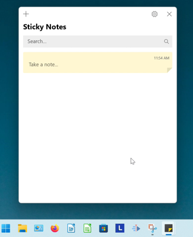
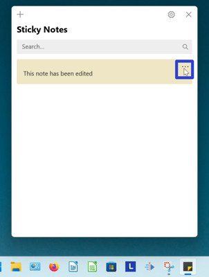
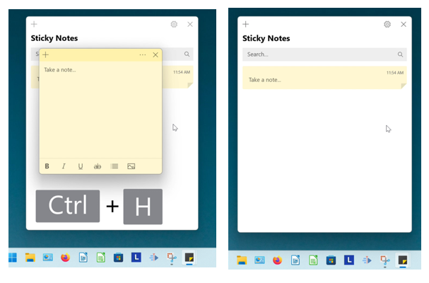

This tutorial covers:

## How to Open the Notes List:
1. [With Search](#1)
2. [With Hover](#2)
3. [With Right Click](#3)
4. [From a Sticky Note](#4)
5. [With Keyboard Shortcut](#5)

 

No time to scroll down? Click through this tutorial presentation:

<iframe src="https://docs.google.com/presentation/d/e/2PACX-1vTPrS7YCJPr6Ha87HIAju996z6GnW4BPqjVtd5ZUwKPqYFxDUpZxD3VuI0t_z_RZ-voPeYhxxkAfaF8/embed?start=false&loop=false&delayms=3000" frameborder="0" width="480" height="299" allowfullscreen="true" mozallowfullscreen="true" webkitallowfullscreen="true"></iframe>

 

View a video tutorial:
<iframe class="BLOG_video_class" allowfullscreen="" youtube-src-id="O-MRILaQUKA" width="100%" height="416" src="https://www.youtube.com/embed/O-MRILaQUKA"></iframe>

<h1 id="1">How to Open the Notes List With Search</h1>

* Step 1: Go down to the taskbar and click Start (four blue squares).

* Step 2: In the Start menu that opens, click in the search bar at the top and type "sticky notes". 

* Step 3: On the search results screen, click "Notes list". 

* The Notes List opens. 

<h1 id="2">How to Open the Notes List With Hover</h1>

* Step 1: [Open](https://qhtutorials.github.io/posts/how-to-open-sticky-notes/) the Sticky Notes app. Go down to the taskbar and hover the mouse over the Sticky Notes app icon. 

* Step 2: Two small windows appear; one is the Notes List and one is the sticky note. Click the Notes List window to open it. 

<h1 id="3">How to Open the Notes List With Right Click</h1>

* Step 1: First [open](https://qhtutorials.github.io/posts/how-to-open-sticky-notes/) or [pin](https://qhtutorials.github.io/posts/how-to-pin-sticky-notes/) the Sticky Notes app. Right click the Sticky Notes app icon on the taskbar. 

* Step 2: In the menu that opens, click "Notes list". 

* Step 3: The Notes List opens. 

<h1 id="4">How to Open the Notes List From a Sticky Note</h1>

* Step 1: [Open a sticky note](https://qhtutorials.github.io/posts/how-to-open-sticky-notes/). Type any text into the sticky note and click anywhere inside the Notes List.

* Step 2: On the far right side of a sticky note, click the "Menu" or "..." button. 

* Step 3: In the menu that opens, click "Open note" to open the sticky note. 

<h1 id="5">How to Open the Notes List With Keyboard Shortcut</h1>

* Step 1: First [open a sticky note](https://qhtutorials.github.io/posts/how-to-open-sticky-notes/). On the keyboard press **Ctrl + H** to open the Notes List. 

Refer to these instructions later with this free [PDF tutorial](https://drive.google.com/file/d/1ekgk7CcUtRD0teHTu9vYZ8RWCa-VuH4Y/view?usp=sharing).

 