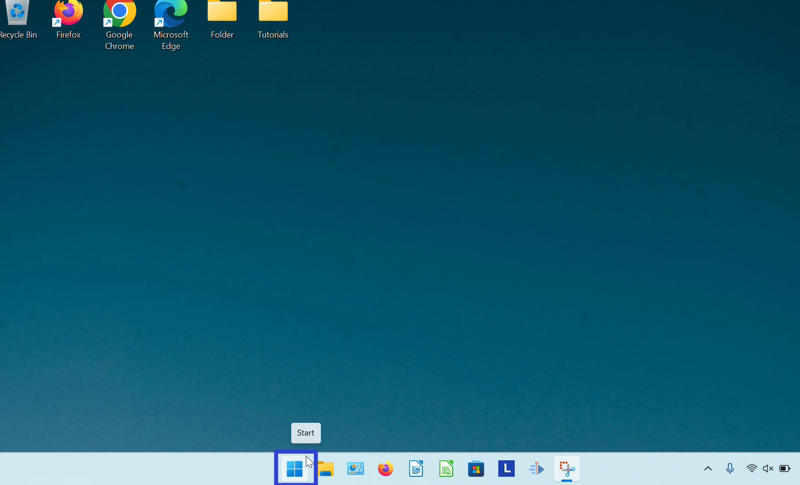
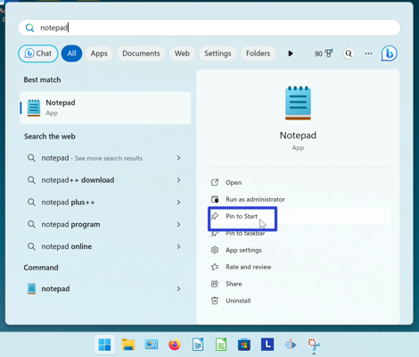

This tutorial covers:

## How to Pin Notepad to the Taskbar:
1. [With Search](#1)
2. [With Right Click](#2)
3. [From Start](#3)

## [How to Pin Notepad to Start](#4)

 

No time to scroll down? Click through this presentation tutorial:
<iframe src="https://docs.google.com/presentation/d/e/2PACX-1vTs5lUCO5sUvdFvv_AejCYJw5ZqacdbV8u8lfdcyaSxIjW8YKTeaWWj8qs4io8qZz-BdwLiJfjnicH7/embed?start=false&loop=false&delayms=3000" frameborder="0" width="480" height="299" allowfullscreen="true" mozallowfullscreen="true" webkitallowfullscreen="true"></iframe>

 

Watch a tutorial video:
<iframe class="BLOG_video_class" allowfullscreen="" youtube-src-id="HfzirKF1hrU" width="100%" height="416" src="https://www.youtube.com/embed/HfzirKF1hrU"></iframe>

<h1 id="1">How to Pin Notepad to the Taskbar With Search</h1>

* Step 1: Go down to the taskbar and click the Start (four blue squares) button. 

* Step 2: In the Start window that opens, click the top search bar and type "notepad". 

* Step 3: On the search results screen, click "Pin to taskbar". 

* Step 4: Go down to the taskbar and click the pinned Notepad icon. Notepad opens. 

<h1 id="2">How to Pin Notepad to the Taskbar With Right Click</h1>

* Step 1: First [open](https://qhtutorials.github.io/posts/how-to-open-notepad/) Notepad. Go down to the taskbar and right click the Notepad app icon. 

* Step 2: In the menu that opens, click "Pin to taskbar". 

<h1 id="3">How to Pin Notepad to the Taskbar From Start</h1>

* Step 1: Go down to the taskbar and click the Start (four blue squares) button. 

* Step 2: In the Start window that opens, right click the pinned Notepad app icon (if Notepad is not already pinned to Start, see [How to Pin Notepad to Start](#4)). In the menu that opens, click "Pin to taskbar". 

* Step 3: Go down to the taskbar and right click the pinned Notepad app icon. 

* Step 4: In the menu that opens, click "Notepad". 

* Notepad opens. 

<h1 id="4">How to Pin Notepad to Start</h1>

* Step 1: Go down to the taskbar and click the Start (four blue squares) button. 

* Step 2: In the Start window that opens, click the top search bar and type "notepad". 

* Step 3: On the search results screen, click "Pin to Start". 

* Step 4: Click the Start button twice, and in the Start window that opens, click the pinned Notepad app icon. 

* Notepad opens. 

Save a copy of these instructions for later with this free [PDF tutorial](https://drive.google.com/file/d/1AuQUPrD2lzUOk1SdJB3dA-uLsEIZLUtG/view?usp=sharing).

 

