This tutorial covers:

## How to Pin Microsoft Whiteboard To the Taskbar:
1. [With Search](#1)
2. [With Right Click](#2)
3. [From Start](#3)

## [How to Pin Microsoft Whiteboard To Start](#4)

No time to scroll down? Click through this presentation tutorial:

<iframe src="https://docs.google.com/presentation/d/e/2PACX-1vTim-YinVcvgp-Gqlb9u0Nb7MukeGggV9_2t8YKhkjJIgbr8A0ctDftbnZlhvJqjOn_g7wTax2e6SLs/embed?start=false&loop=false&delayms=3000" frameborder="0" width="480" height="299" allowfullscreen="true" mozallowfullscreen="true" webkitallowfullscreen="true"></iframe>

 

Watch a tutorial video:
<iframe class="BLOG_video_class" allowfullscreen="" youtube-src-id="W7EL6aMfgrM" width="100%" height="416" src="https://www.youtube.com/embed/W7EL6aMfgrM"></iframe>

 

<h1 id="1">How to Pin Microsoft Whiteboard to the Taskbar With Search</h1>

* Step 1: Go down to the taskbar and click the Start (four blue squares) button. 

* Step 2: In the Start window that opens, click the top search bar and type "whiteboard". 

* Step 3: On the search results screen, click "Pin to taskbar". 
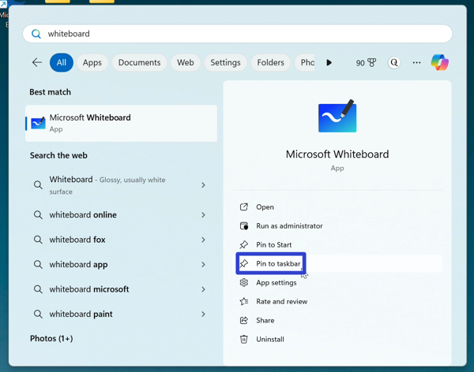

* Step 4: Click the pinned Whiteboard app icon. 
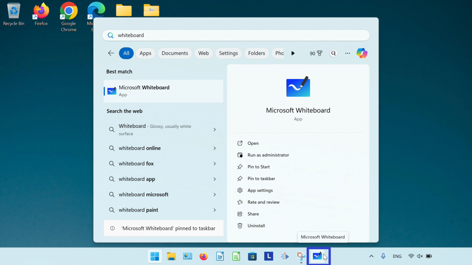

* Microsoft Whiteboard opens. 
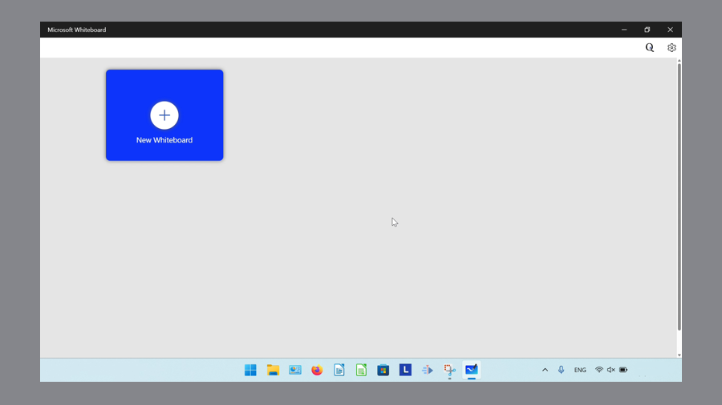

<h1 id="2">How to Pin Microsoft Whiteboard to the Taskbar With Right Click</h1>

* Step 1: First [open](https://qhtutorials.github.io/posts/how-to-open-microsoft-whiteboard/) Microsoft Whiteboard. Go down to the taskbar and right click the app icon. 
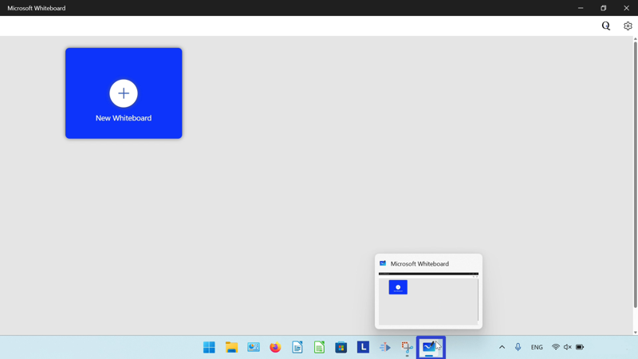

* Step 2: In the menu that opens, click "Pin to taskbar". 
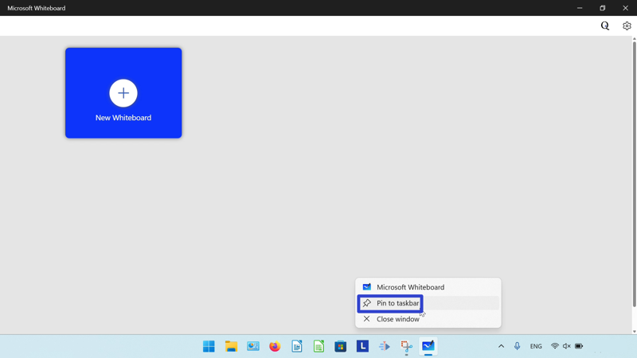

<h1 id="3">How to Pin Microsoft Whiteboard to the Taskbar From Start</h1>

* Step 1: Go down to the taskbar and click the Start (four blue squares) button. 

* Step 2: In the Start window that opens, right click the pinned Microsoft Whiteboard app icon. If Microsoft Whiteboard is not already pinned to start, please see [How to Pin Microsoft Whiteboard to Start](#4). 
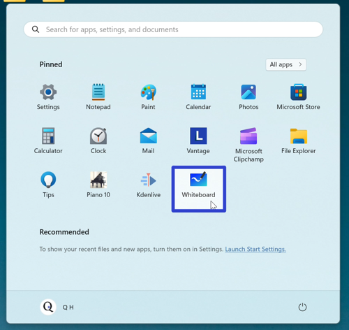

* Step 3: In the menu that opens, click "Pin to taskbar". 
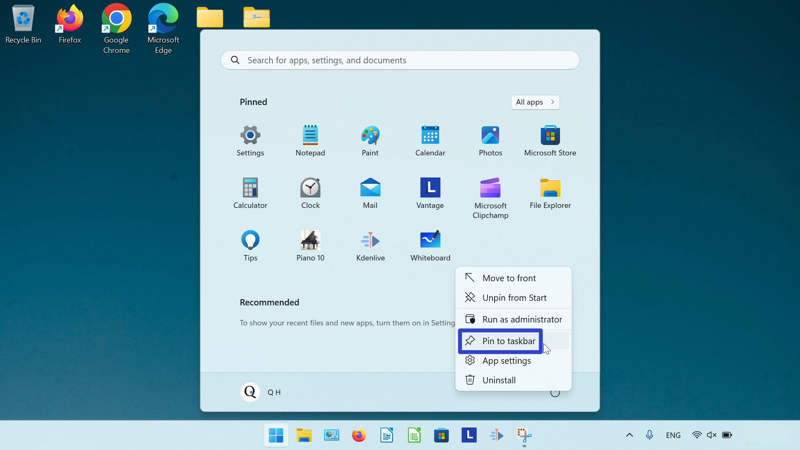

* Step 4: Go down to the taskbar and right click the pinned Microsoft Whiteboard app icon. 
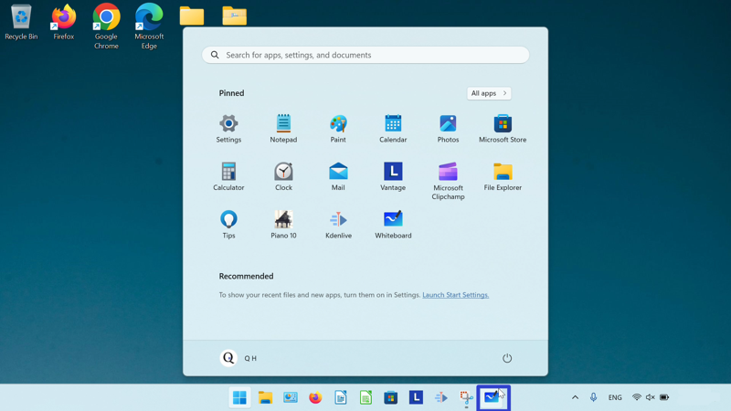

* Step 5: In the menu that opens, click "Whiteboard".
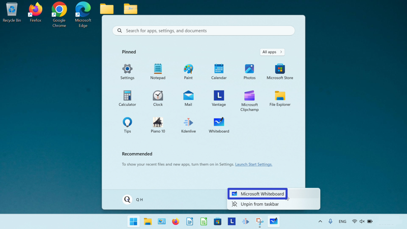

* Microsoft Whiteboard opens. 

<h1 id="4">How to Pin Microsoft Whiteboard to Start</h1>

* Step 1: Go down to the taskbar and click the Start (four blue squares) button. 

* Step 2: In the Start window that opens, click the top search bar and type "whiteboard". 

* Step 3: On the search results screen, click "Pin to Start". 
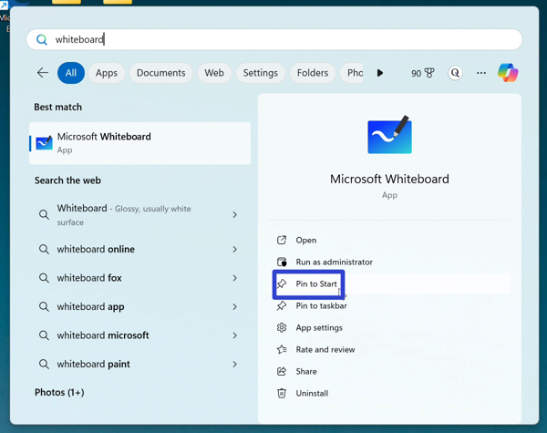

* Step 4: Click the Start button twice, and in the Start window that opens, click the pinned Microsoft Whiteboard app icon. 
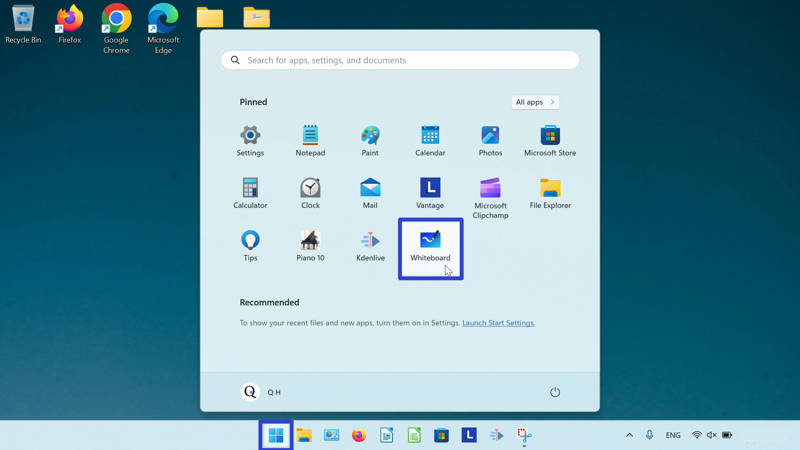

* Microsoft Whiteboard opens. 

Keep a copy of these instructions for later with this free [tutorial PDF](https://drive.google.com/file/d/1sN-IvFotZ1yhJyedVa5RSEfsnzC1zXLD/view?usp=sharing).

 

