This tutorial covers:

## How to Rotate an Object:
1. [With Mouse](#1)
2. [With Keyboard](#2)

## How to Bring an Object Forward:
1. [With Click](#3)
2. [With Keyboard](#4)

## How to Send an Object Backward:
1. [With Click](#5)
2. [With Keyboard](#6)

## [How to Lock an Object](#7)

## How to Unlock an Object:
1. [With Click](#8)
2. [With Right Click](#9)
3. [With Keyboard](#10)

No time to scroll down? Click through these tutorial slides:

<iframe src="https://docs.google.com/presentation/d/e/2PACX-1vT55nYcS4nT9BleZWOuuw2ikHATKD4v73_jX_M6xoi8LaYViQkoVQejJIvTVemHemJUrJMgg0SRIJ1h/embed?start=false&loop=false&delayms=3000" frameborder="0" width="480" height="299" allowfullscreen="true" mozallowfullscreen="true" webkitallowfullscreen="true"></iframe>

 

Follow along with a video tutorial:
<iframe class="BLOG_video_class" allowfullscreen="" youtube-src-id="_sSTqGVVXXE" width="100%" height="416" src="https://www.youtube.com/embed/_sSTqGVVXXE"></iframe>

 

<h1 id="1">How to Rotate an Object With Mouse</h1>

* Step 1: First [select](https://qhtutorials.github.io/posts/how-to-edit-objects-in-whiteboard/) an object. Hover the mouse over one corner, or sizing handle, of the object until the cursor becomes a circular arrow. Click and drag to rotate the object. 
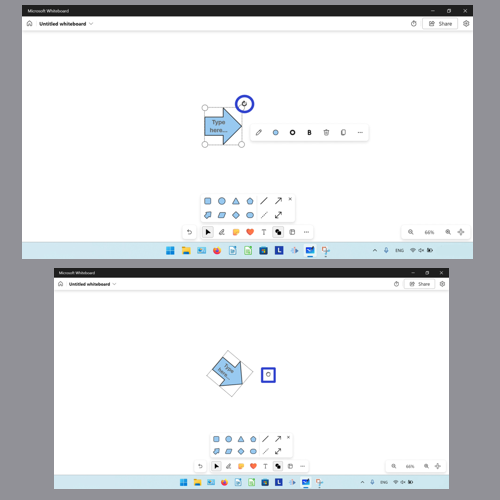

<h1 id="2">How to Rotate an Object With Keyboard</h1>

* Step 1: [Select](https://qhtutorials.github.io/posts/how-to-edit-objects-in-whiteboard/) an object. On the keyboard press **Alt + left arrow** key to rotate the object counterclockwise. Press **Alt + right arrow** key to rotate the object clockwise. 
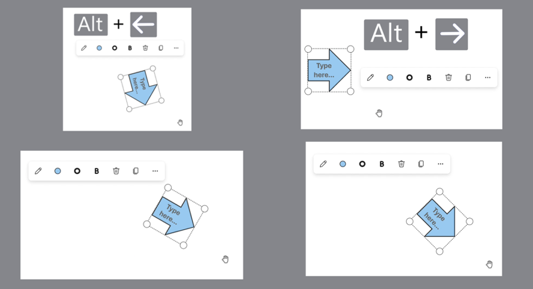

<h1 id="3">How to Bring an Object Forward With Click</h1>

* Step 1: First [select](https://qhtutorials.github.io/posts/how-to-edit-objects-in-whiteboard/) an object. In the menu that opens, click the "More" or "..." button. 
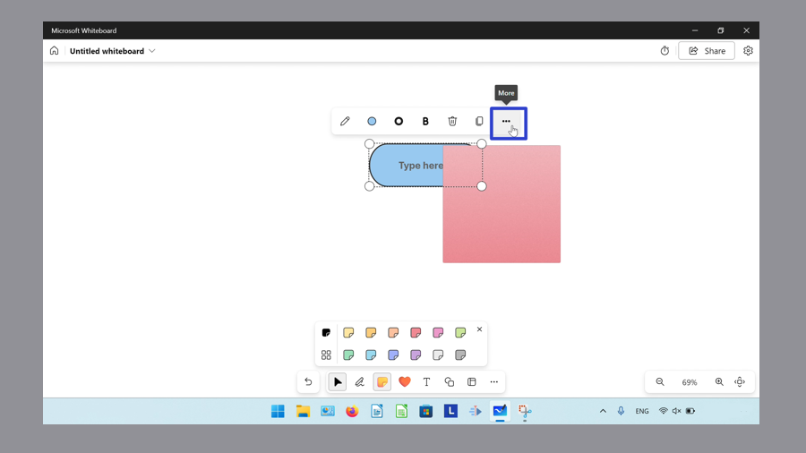

* Step 2: In the menu that opens, click "Bring to Front". 
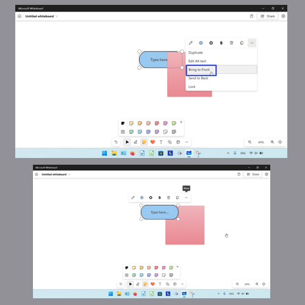

<h1 id="4">How to Bring an Object Forward With Keyboard</h1>

* Step 1: [Select](https://qhtutorials.github.io/posts/how-to-edit-objects-in-whiteboard/) an object. On the keyboard press **Ctrl + Shift + \]**. 
![Two screenshots where a graphic of the "Ctrl + Shift + \]" keyboard keys appears on the canvas, and the blue tube shape appears in front of the red square shape.](blogctrlshiftbringtofront.png "Press 'Ctrl + Shift + \]' ")

<h1 id="5">How to Send an Object Backward With Click</h1>

* Step 1: First [select](https://qhtutorials.github.io/posts/how-to-edit-objects-in-whiteboard/) an object, and in the menu that opens click the "More" or "..." button. 
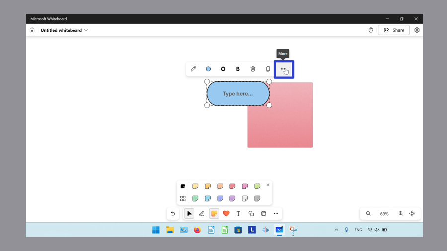

* Step 2: In the menu that opens, click "Send to Back". 
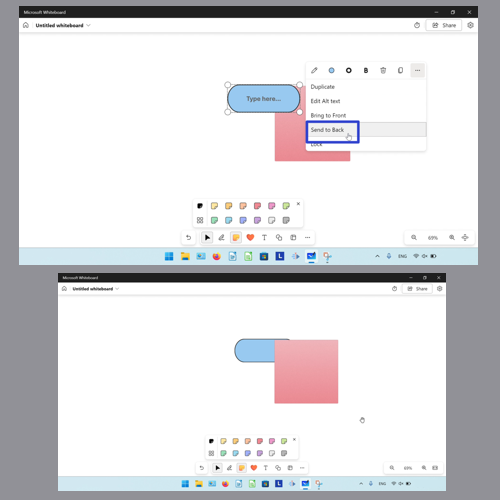

<h1 id="6">How to Send an Object Backward With Keyboard</h1>

* Step 1: [Select](https://qhtutorials.github.io/posts/how-to-edit-objects-in-whiteboard/) an object. On the keyboard press **Ctrl + Shift + \[**. 
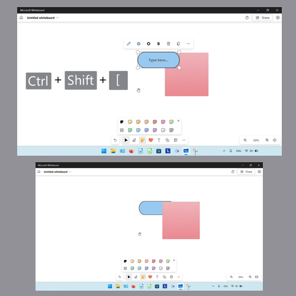

<h1 id="7">How to Lock an Object</h1>

* Step 1: First [select](https://qhtutorials.github.io/posts/how-to-edit-objects-in-whiteboard/) an object, and in the menu that opens, click the "More" or "..." button. 
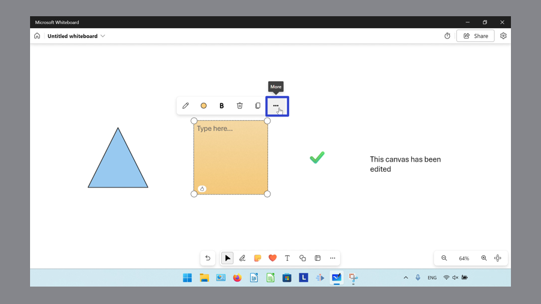

* Step 2: In the menu that opens, click "Lock". The locked object cannot be selected, resized, moved, or deleted. 
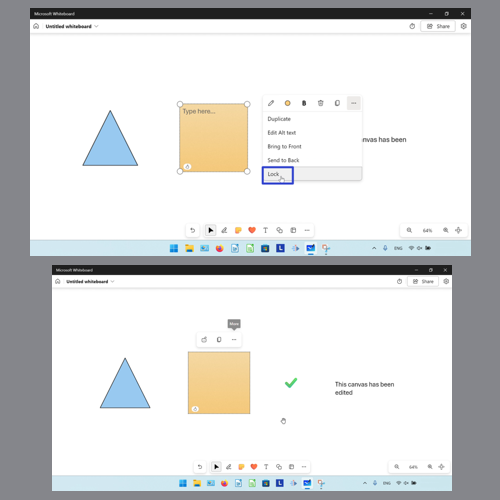

<h1 id="8">How to Unlock an Object With Click</h1>

* Step 1: Right click a [locked](#7) object. 
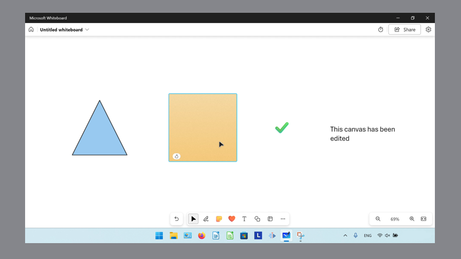

* Step 2: In the menu that opens, click "Unlock". 
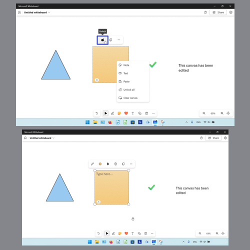

<h1 id="9">How to Unlock an Object With Right Click</h1>

* Step 1: First right click a [locked](#7) object, or anywhere on the canvas. 

* Step 2: In the menu that opens, click the "Unlock all" option. 
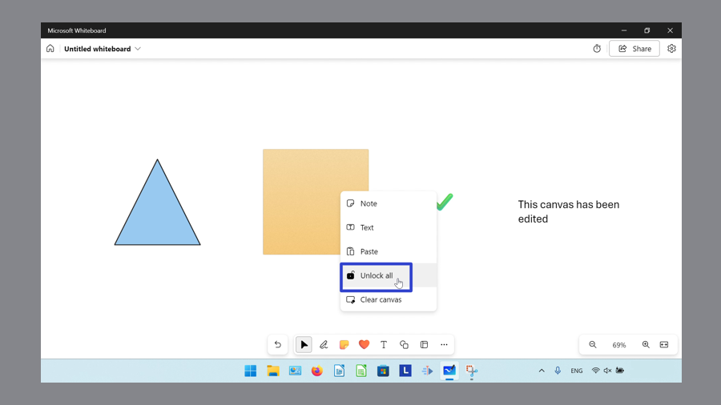

<h1 id="10">How to Unlock an Object With Keyboard</h1>

* Step 1: Press the **Tab** key until the keyboard focus is on the [locked](#7) object. 
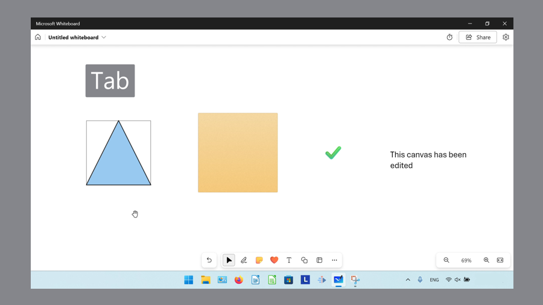

* Step 2: Press the **Enter** or **Spacebar** key, and in the menu that opens, click the "Unlock" option. 
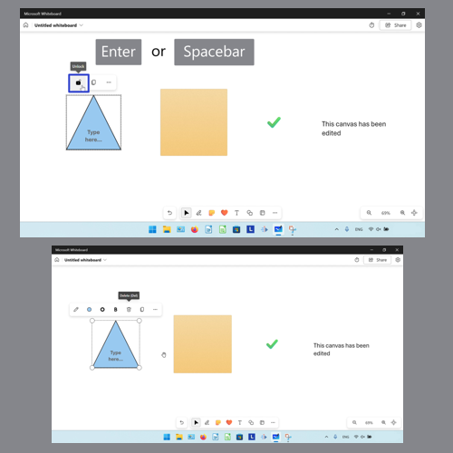

Save a copy of these instructions for later with this free [tutorial PDF](https://drive.google.com/file/d/1DaT9yh_lo8QnEsDj1_LXuUKGV8ITWxbQ/view?usp=sharing).

 

