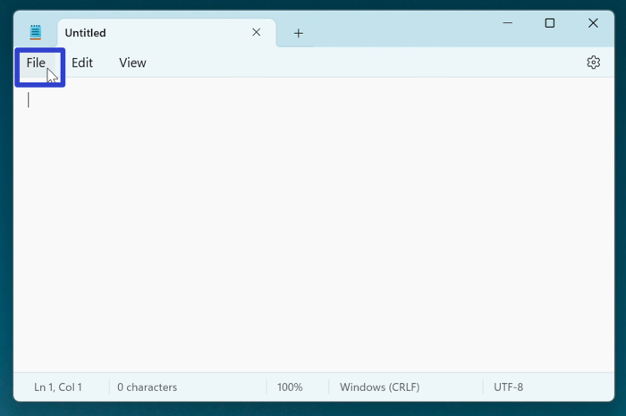
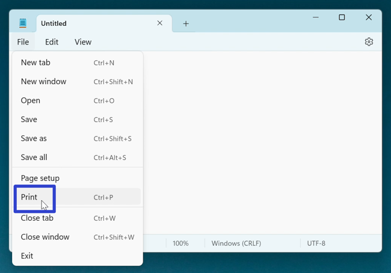
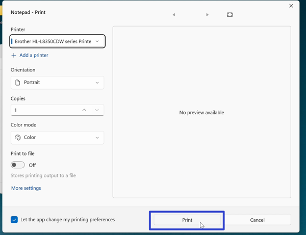

This tutorial covers:

## How to Print:
1. [With Menu](#1)
2. [With Keyboard Shortcut](#2)

## [How to Exit the Print Window](#3)

## [How to Add a Printer](#4)

## [How to Change the Number of Copies](#5)

## [How to Print to File](#6)

## [How to Let Notepad Change Printing Preferences](#7)

## [How to Print on Both Sides](#8)

 

No time to scroll down? Click through this tutorial presentation:

<iframe src="https://docs.google.com/presentation/d/e/2PACX-1vT30LnJ246sog2PFDj8tfHfkqsbABq46JDWltIWw1-ib3Zpm-YGOeqjLK0XZ5f6hGAQ7pPCYAcFFm16/embed?start=false&loop=false&delayms=3000" frameborder="0" width="480" height="299" allowfullscreen="true" mozallowfullscreen="true" webkitallowfullscreen="true"></iframe>

 

Watch a video tutorial:
<iframe class="BLOG_video_class" allowfullscreen="" youtube-src-id="qIImZi-rQIc" width="100%" height="416" src="https://www.youtube.com/embed/qIImZi-rQIc"></iframe>

<h1 id="1">How to Print With Menu</h1>

* Step 1: First [open](https://qhtutorials.github.io/posts/how-to-open-notepad/) a Notepad file. In the upper left click the "File" button. 

* Step 2: In the menu that opens, click "Print". 

* Step 3: In the "Print" window that opens, click the "Print" button. 

<h1 id="2">How to Print With Keyboard Shortcut</h1>

* Step 1: [Edit](https://qhtutorials.github.io/posts/how-to-edit-files-in-notepad/) a Notepad file. On the keyboard press **Ctrl + S**. 

* Step 2: In the "Save as" window that opens, type any text in the "File name" field and click the "Save" button. 

<h1 id="3">How to Save As With Menu</h1>

* Step 1: First [open](https://qhtutorials.github.io/posts/how-to-open-notepad/) a Notepad file. In the upper left click the "File" button. 

* Step 2: In the menu that opens, click "Save as". 

* Step 3: In the "Save as" window that opens, type any text in the "File name" field and click the "Save" button. 

<h1 id="4">How to Save As With Keyboard Shortcut</h1>

* Step 1: [Open](https://qhtutorials.github.io/posts/how-to-open-notepad/) a Notepad file. On the keyboard press **Ctrl + Shift + S**. 

* Step 2: In the "Save as" window that opens, type any text in the "File name" field and click the "Save" button. 

<h1 id="5">How to Save Multiple Files With Menu</h1>

* Step 1: First [edit](https://qhtutorials.github.io/posts/how-to-edit-files-in-notepad/) a Notepad window with at least two tabs. In the upper left click the "File" button. 

* Step 2: In the menu that opens, click "Save all". 

* Step 3: A "Save as" window opens for each tab. Type any text in the "File name" field and click the "Save" button. 

<h1 id="6">How to Save Multiple Files With Keyboard Shortcut</h1>

* Step 1: First [open](https://qhtutorials.github.io/posts/how-to-open-notepad/) a Notepad window with at least two tabs. On the keyboard press **Ctrl + Alt + S**. 

* Step 2: A "Save as" windnow opens for each tab. Type any text in the "File name" field and click the "Save" button. 

 
Refer to these instructions later with this free [PDF tutorial](https://drive.google.com/file/d/1uWl3V0gQB2ddSFDwuRfupguQOCiA5_e2/view?usp=sharing).

 

