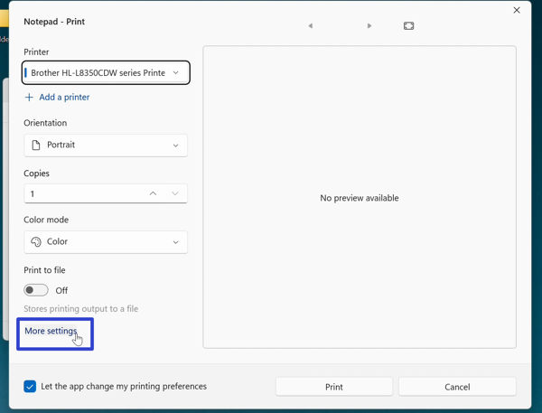

This tutorial covers:

## How to Print:
1. [With Menu](#1)
2. [With Keyboard Shortcut](#2)

## [How to Exit the Print Window](#3)

## [How to Add a Printer](#4)

## [How to Change the Number of Copies](#5)

## [How to Print to File](#6)

## [How to Let Notepad Change Printing Preferences](#7)

## [How to Print on Both Sides](#8)

 

No time to scroll down? Click through this tutorial presentation:

<iframe src="https://docs.google.com/presentation/d/e/2PACX-1vQHlkfNo7YUx-34VXTJ1yQHoAynWCf-iO0_qyp3iwCWmK6o_wa5DF4kqMzUubBuihvYLYcCFFwypufH/embed?start=false&loop=false&delayms=3000" frameborder="0" width="480" height="299" allowfullscreen="true" mozallowfullscreen="true" webkitallowfullscreen="true"></iframe>

 

Watch a video tutorial:
<iframe class="BLOG_video_class" allowfullscreen="" youtube-src-id="sLuHpEsYZ8o" width="100%" height="416" src="https://www.youtube.com/embed/sLuHpEsYZ8o"></iframe>

<h1 id="1">How to Print With Menu</h1>

* Step 1: First [open](https://qhtutorials.github.io/posts/how-to-open-notepad/) a Notepad file. In the upper left click the "File" button. 

* Step 2: In the menu that opens, click "Print". 

* Step 3: In the "Print" window that opens, click the "Print" button. 

<h1 id="2">How to Print With Keyboard Shortcut</h1>

* Step 1: [Open](https://qhtutorials.github.io/posts/how-to-open-notepad/) a Notepad file. On the keyboard press **Ctrl + P**. 

* Step 2: In the "Print" window that opens, click the "Print" button. 

<h1 id="3">How to Exit the Print Window</h1>

* Step 1: First [open](#2) the "Print" window. In the lower right click the "Cancel" button. 

* Alternatively click the "Close" or "X" button in the upper right corner. 

<h1 id="4">How to Add a Printer</h1>

* Step 1: [Open](#2) the "Print" window. Under the "Printer" section click the "+ Add a printer" option. 

* Step 2: In the Windows 11 "Bluetooth & devices" settings window that opens, click the "Add device" button. The computer adds a new printer through a Bluetooth connection. 

<h1 id="5">How to Change the Number of Copies</h1>

* Step 1: First [open](#2) the "Print" window. Under the "Copies" section, click the up arrow button to increase the number of copies. Click the down arrow button to decrease the number of copies. 

<h1 id="6">How to Print to File</h1>

* Step 1: [Open](#2) the "Print" window. Click under the "Print to file" section to toggle this option on or off. 

* Note: With "Print to file" on, Notepad creates a .prn file that outlines specific printing requirements of the file. Often these .prn files are transferred from computers lacking the necessary printer to other computers with printers that can handle the specific printing requirements. With "Print to file" off, Notepad does not create .prn files.

<h1 id="7">How to Let Notepad Change Printing Preferences</h1>
 
* Step 1: First [open](#2) the "Print" window. In the lower left click the "Let the app change my printing preferences" to toggle this option on or off. 

* With "Let the app change my printing preferences" on, Notepad overrides any selected printing options. With "Let the app change my printing preferences" off, Notepad saves any selected printing options.

<h1 id="8">How to Print on Both Sides</h1>

* Step 1: [Open](#2) the "Print" window. In the lower left click "More settings". 

* Step 2: In the "Printing Preferences" window that opens, under the "Print on Both Sides" section click the drop-down menu to select either the "None", "Flip on Short Edge", or "Flip on Long" edge option, and click the "OK" button. 

Save these instructions for later with this free [PDF tutorial](https://drive.google.com/file/d/1E9jHxwl1CXBPGVy3NbQUdQgowNzEJFTt/view?usp=sharing).

 

