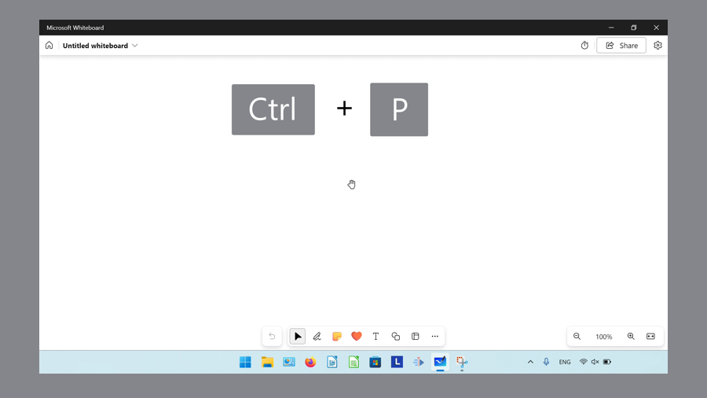

This tutorial covers:

## How to Print in Whiteboard:
1. [With Print Window](#1)
2. [With System Dialog](#2)

## How to Close the Print Window:
1. [With Click](#3)
2. [With Keyboard Shortcut](#4)
3. [With Close](#5)

## How to Specify Pages:
1. [With Print Window](#6)
2. [With System Dialog](#7)

## How to Print on Both Sides:
1. [With Print Window](#8)
2. [With Printing Preferences](#9)

## How to Add a Printer:
1. [With Print Window](#10)
2. [With System Dialog](#11)

## How to Change the Printer:
1. [With Print Window](#12)
2. [With System Dialog](#13)

## [How to Let Whiteboard Change Printing Preferences](#14) 

No time to scroll down? Click through this tutorial presentation:

<iframe src="https://docs.google.com/presentation/d/e/2PACX-1vTbsKvcDMAuzs2UWzRmobBNdfNyMsLyIR8XJMEAE7s-lQg7yyF15Cs759_aI_4B6_ChgAZus9AXuJnU/embed?start=false&loop=false&delayms=3000" frameborder="0" width="480" height="299" allowfullscreen="true" mozallowfullscreen="true" webkitallowfullscreen="true"></iframe>

 

Follow along with a tutorial video:
<iframe class="BLOG_video_class" allowfullscreen="" youtube-src-id="h5npr6wIjZk" width="100%" height="416" src="https://www.youtube.com/embed/h5npr6wIjZk"></iframe>

 

<h1 id="1">How to Print With Print Window</h1>

* Step 1: First [open](https://qhtutorials.github.io/posts/how-to-open-microsoft-whiteboard/) a whiteboard. On the keyboard press **Ctrl + P**. 

* Step 2: In the Print window that opens, lick the "Print" button. 

<h1 id="2">How to Print With System Dialog</h1>

* Step 1: [Open](https://qhtutorials.github.io/posts/how-to-open-microsoft-whiteboard/) a whiteboard. On the keyboard press **Ctrl + Shift + P**. 

* Step 2: In the System Dialog window that opens, click the "Print" button. 

* Alternatively, in a whiteboard press **Ctrl +P**, and in the Print window that opens, click "Print using system dialog" to open the System Dialog window. 

<h1 id="3">How to Close the Print Window With Click</h1>

* Step 1: First [open](#1) the Print window or the [System Dialog](#2) window. Click the "Cancel" button. 

<h1 id="4">How to Close the Print Window With Keyboard Shortcut</h1>

* Step 1: [Open](#1) the Print window or the [System Dialog](#2) window. On the keyboard press **Esc**. 

<h1 id="5">How to Close the Print Window With Close</h1>

* Step 1: First [open](#2) the System Dialog. In the upper right click the "Close" or "X" button. 

<h1 id="6">How to Specify Pages With the Print Window</h1>

* Step 1: [Open](#1) the Print window. Under the "Pages" section, click to select "All", "Odd pages only", or "Even pages only". Specify page numbers by clicking the last option and typing the page numbers. 

<h1 id="7">How to Specify Pages With System Dialog</h1>

* Step 1: First [open](#2) the System Dialog window. Click the "Pages" drop-down menu, select "Custom range", and in the "Page range" field that opens, type the page numbers. 

<h1 id="8">How to Print on Both Sides With the Print Window</h1>

* Step 1: First [open](#1) the Print window. Scroll down and click the "Print on both sides" drop-down menu to select "Print on one side", "Print on both sides flip on long edge", or "Print on both sides flip on short edge". 

<h1 id="9">How to Print on Both Sides With Printing Preferences</h1>

* Step 1: [Open](#2) the System Dialog window. On the lower left side, click "More settings". 

* Step 2: In the Printing Preferences window that opens, click the "Print on both sides" drop-down menu. Select "None", "Flip on short edge", or "Flip on long edge" and then click the "OK" button. 

<h1 id="10">How to Add a Printer With Print Window</h1>

* Step 1: First [open](#1) the Print window. Click the "Printer" drop-down menu, scroll down, and click "Add a printer". 

* Step 2: In the "Bluetooth & Devices" Settings window that opens, click "Add device". The computer adds a printer through a Bluetooth connection. 

<h1 id="11">How to Add a Printer With System Dialog</h1>

* Step 1: [Open](#2) the System Dialog window. Click the "+ Add a printer" option. 

* Step 2: In the "Bluetooth & Devices" Settings window that opens, click "Add device". The computer adds a printer through a Bluetooth connection. 

<h1 id="12">How to Change the Printer With Print Window</h1>

* Step 1: First [open](#1) the Print window. Click the "Printer" drop-down to select a printer. 

<h1 id="13">How to Change the Printer With System Dialog</h1>

* Step 1: [Open](#2) the System Dialog window. Click the "Printer" drop-down menu to select a printer. 

<h1 id="14">How to Let Whiteboard Change Printing Preferences</h1>

* Step 1: First [open](#2) the System  Dialog window. In the lower left, click to toggle the "Let the app change my printing preferences" option on or off. 

 

Refer these instructions later with this free [tutorial PDF](https://drive.google.com/file/d/1jOaHcZ_yX-eI8tBt0szE46Ed61fPLEdT/view?usp=sharing).

 

