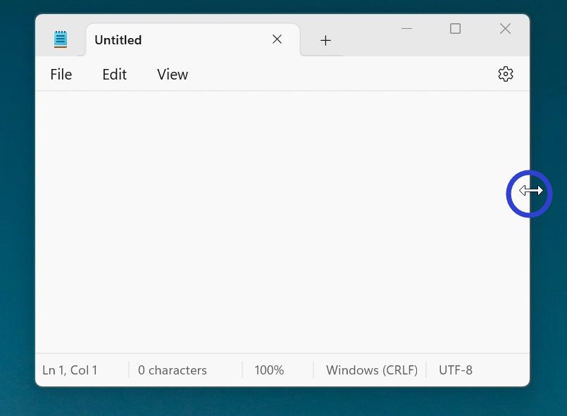
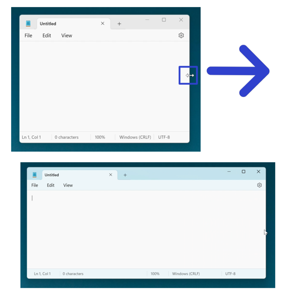
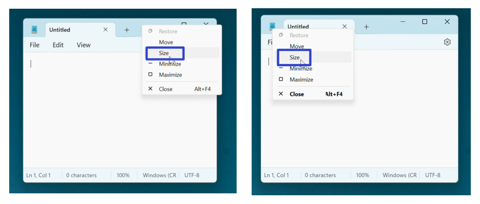
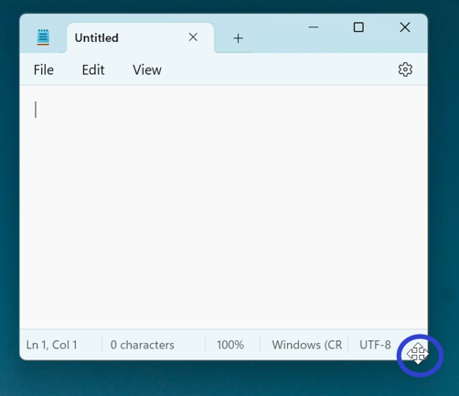
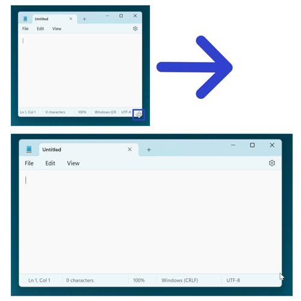
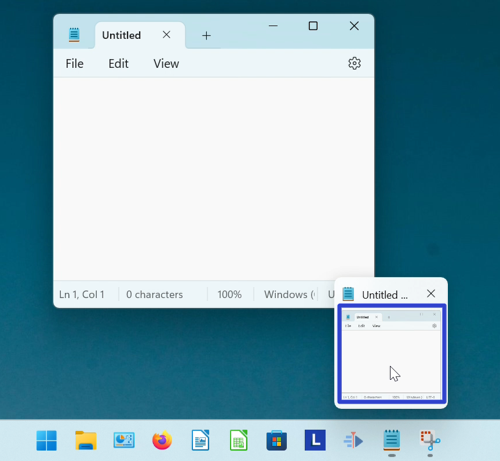
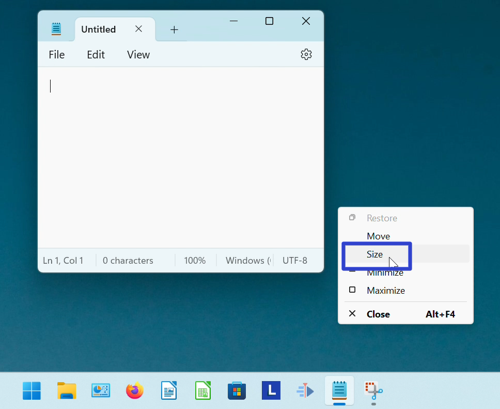

This tutorial covers:

## How to Resize Notepad:
1. [With Mouse](#1)
2. [With Right Click](#2)
3. [With Menu](#3)

 

No time to scroll down? Click through this tutorial presentation:

<iframe src="https://docs.google.com/presentation/d/e/2PACX-1vSX4cP_MiEggICt85Z9nm_jTW9kpFyIakqTA3qNkNfp773_BKIIc0t4sxsGwNLoKBdPf7XJQpbsiif-/embed?start=false&loop=false&delayms=3000" frameborder="0" width="480" height="299" allowfullscreen="true" mozallowfullscreen="true" webkitallowfullscreen="true"></iframe>

 

Watch a tutorial video:
<iframe class="BLOG_video_class" allowfullscreen="" youtube-src-id="fA4_JdhDIAA" width="100%" height="416" src="https://www.youtube.com/embed/fA4_JdhDIAA"></iframe>

<h1 id="1">How to Resize Notepad With Mouse</h1>

* Step 1: First [open](https://qhtutorials.github.io/posts/how-to-open-notepad/) Notepad. Hover the mouse over any edge or corner of the window, until the cursor becomes a double sided arrow. 

* Step 2: Click, hold, and drag the mouse to resize the window. Release the mouse to stop resizing the window. 

<h1 id="2">How to Resize Notepad With Right Click</h1>

* Step 1: [Open](https://qhtutorials.github.io/posts/how-to-open-notepad/) Notepad. Right click either the top or the upper left corner of the window. 

* Step 2: In the menu that opens, click "Size". 

* Step 3: Hover the four arrows cursor over any edge or corner of the window. 

* Step 4: Click, hold, and drag the mouse to resize the window. Release the mouse to stop resizing the window. 

<h1 id="3">How to Resize Notepad With Menu</h1>

* Step 1: First [open](https://qhtutorials.github.io/posts/how-to-open-notepad/) Notepad. Go down to the taskbar and hover the mouse over the Notepad app icon. 

* Step 2: Right click the small window that appears. 

* Step 3: In the menu that opens, click "Size". 

* Step 4: Hover the four arrows cursor over any edge or corner of the window. 

* Step 5: Click, hold, and drag the mouse to resize the window. Release the mouse to stop resizing the window. 

Refer to these instructions later with this free [PDF tutorial](https://drive.google.com/file/d/1COPDgkPo29yXyyNun6GftzHt8EhVi691/view?usp=sharing).

 