This tutorial covers:

## How to Resize Objects:
1. [With Mouse](#1)
2. [With Keyboard](#2)
3. [Proportionally](#3)

## [How to Decrease the Size of an Inserted Shape](#4)

## [How to Insert an Unproportional Shape](#5)

No time to scroll down? Click through this presentation tutorial:

<iframe src="https://docs.google.com/presentation/d/e/2PACX-1vT_byV3dAj-orN1uVVixdGgod54OXe8mgQoAhgOOwSNpwzhQz0hBggRCwohDe7zFu6WJY2QVpeG1jEU/embed?start=false&loop=false&delayms=3000" frameborder="0" width="480" height="299" allowfullscreen="true" mozallowfullscreen="true" webkitallowfullscreen="true"></iframe>

 

See a video tutorial:
<iframe class="BLOG_video_class" allowfullscreen="" youtube-src-id="anaNWyZqIFk" width="100%" height="416" src="https://www.youtube.com/embed/anaNWyZqIFk"></iframe>

 

<h1 id="1">How to Resize Objects With Mouse</h1>

* Step 1: First [select](https://qhtutorials.github.io/posts/how-to-edit-objects-in-whiteboard/) an object. Hover the mouse over one corner, or sizing handle, of the object until the cursor becomes a double sided arrow. 
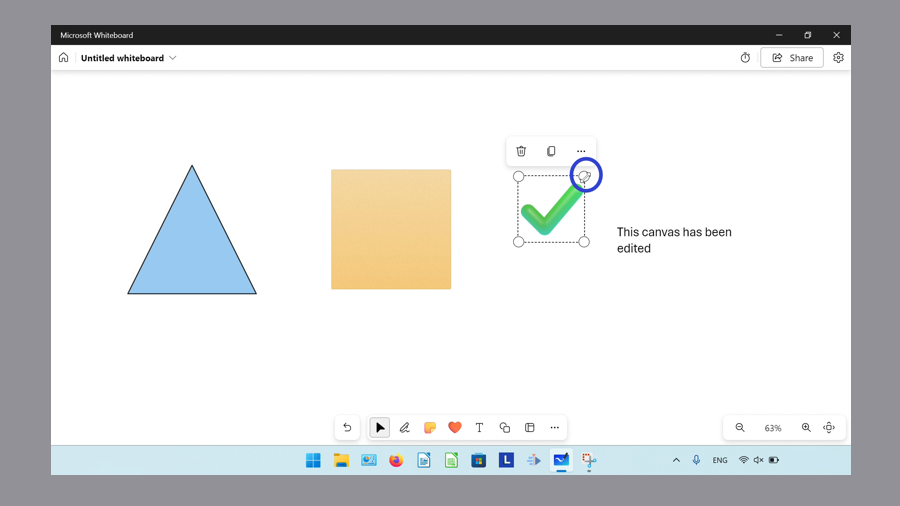

* Step 2: Click and drag outward to increase the size of the object, or click and drag inward to decrease the size of the object. 
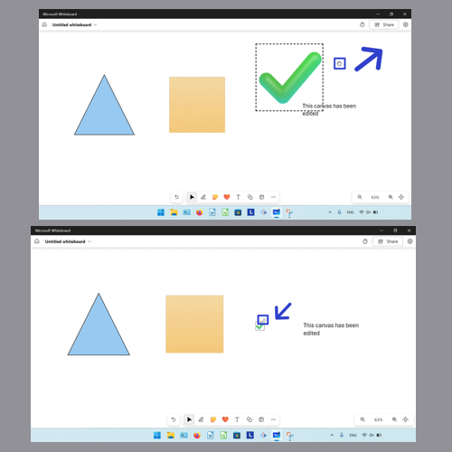

<h1 id="2">How to Resize Objects With Keyboard</h1>

* Step 1: [Select](https://qhtutorials.github.io/posts/how-to-edit-objects-in-whiteboard/) an object. On the keyboard hold the **Shift** key, then press the **up arrow** key to increase the size of the object. Hold **Shift** and press the **down arrow** key to decrease the size of the object. 
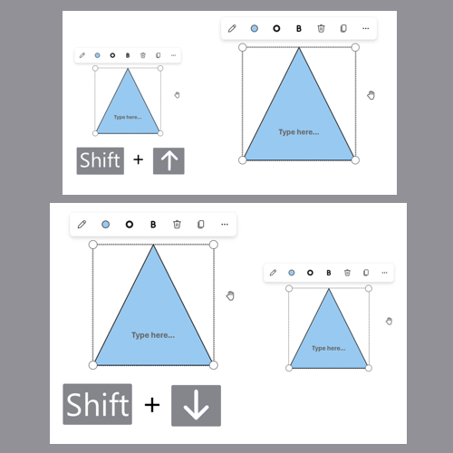

<h1 id="3">How to Resize Objects Proportionally</h1>

* Step 1: First [insert](https://qhtutorials.github.io/posts/how-to-insert-objects-in-whiteboard/) a shape. Hover the mouse over one corner, or sizing handle, of the shape until the cursor becomes a double sided arrow. 
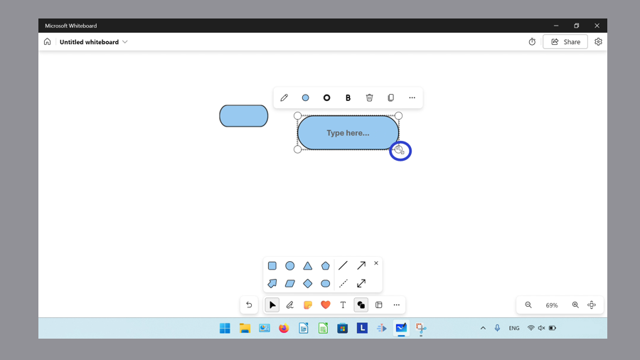

* Step 2: Hold **Shift**, then click and drag to resize the shape proportionally. 
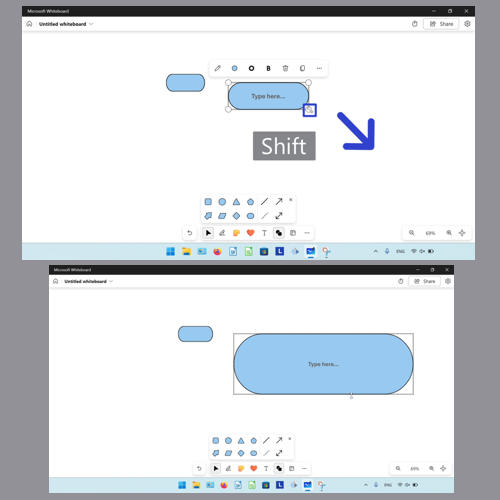

<h1 id="4">How to Decrease the Size of an Inserted Shape</h1>

* Step 1: [Open](https://qhtutorials.github.io/posts/how-to-open-microsoft-whiteboard/) a whiteboard, then click the "Add shape or line" button. 
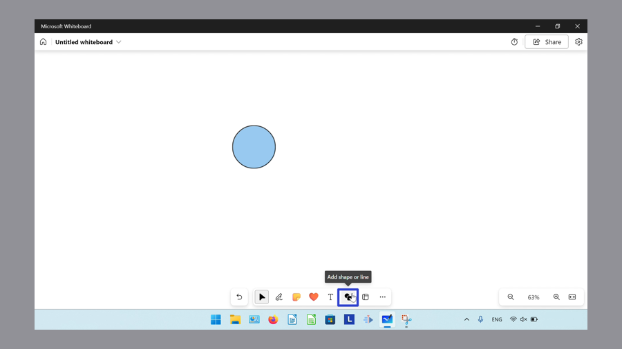

* Step 2: In the menu that opens, click to select a shape. 
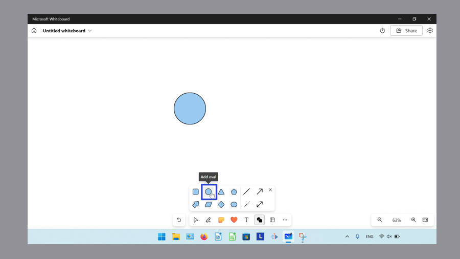

* Step 3: Hold **Shift**, then click and drag the mouse to insert a shape that is smaller than the default size. 
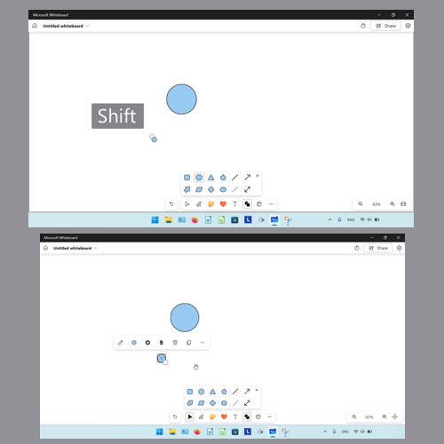

<h1 id="5">How to Insert an Unproportional Shape</h1>

* Step 1: First [open](https://qhtutorials.github.io/posts/how-to-open-microsoft-whiteboard/) a whiteboard, and click the "Add shape or line" button. 
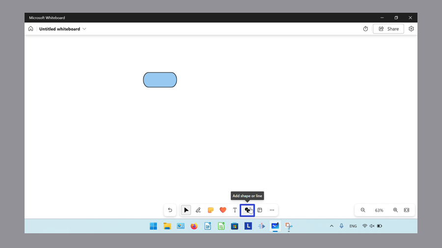

* Step 2: In the menu that opens, click to select a shape. 
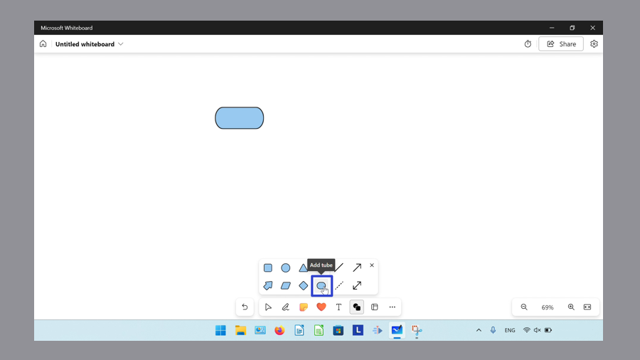

* Step 3: Hold **Ctrl**, then click and drag to resize the shape while inserting it. 
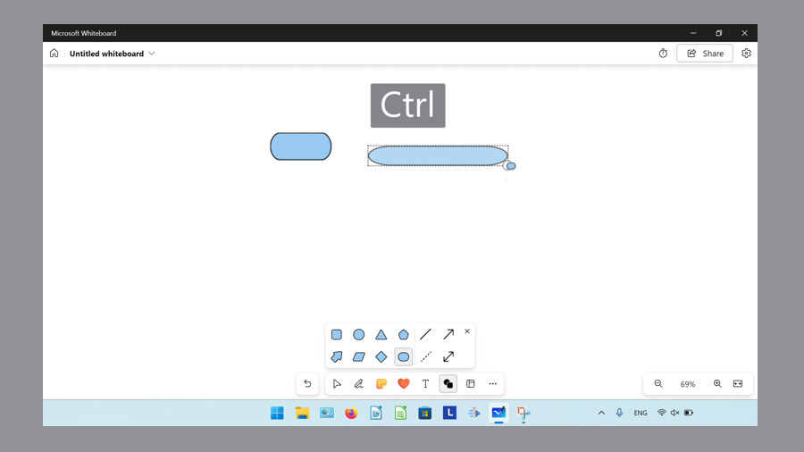

Save these instructions for later with this free [PDF tutorial](https://drive.google.com/file/d/1Gxwr4XSi66NYIiu6q9Yu4OxnSuHVfe2o/view?usp=sharing).

 

