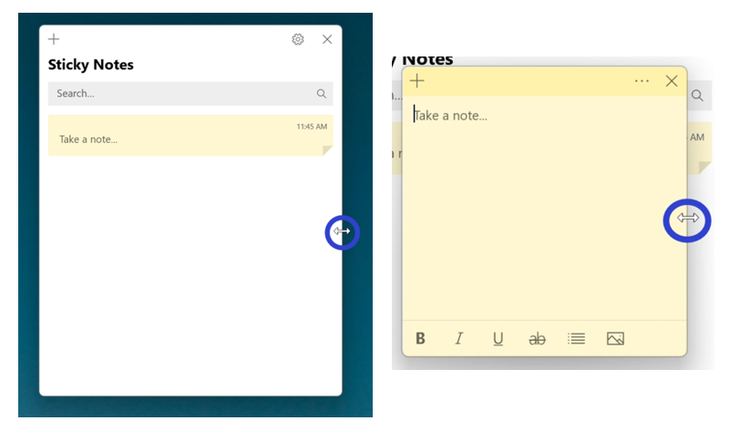
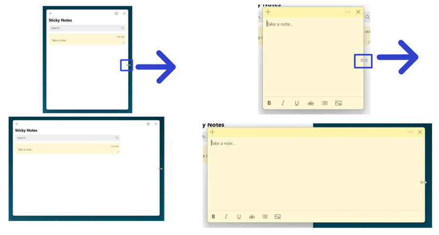
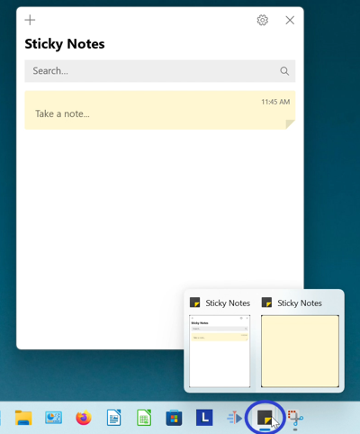
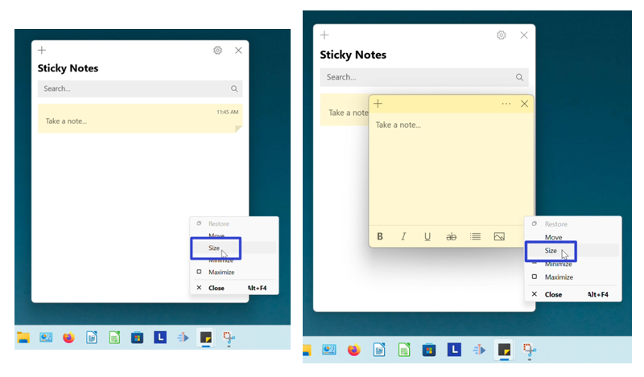
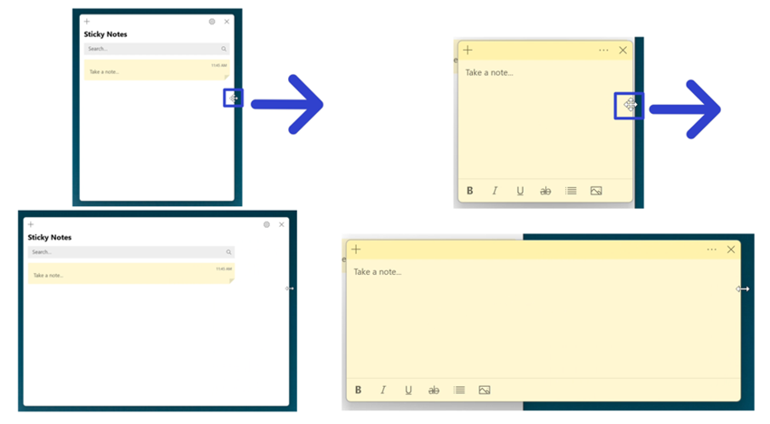

This tutorial covers:
1. [How to Resize the Sticky Notes Window With Mouse](#1)
2. [How to Resize the Sticky Notes Window With Menu](#2)

 

No time to scroll down? Click through these presentation slides:

<iframe src="https://docs.google.com/presentation/d/e/2PACX-1vQLmoJOcRP5MUPranlLi8KgG0son8qZQa5gHEeERZGXHENTCg0SvP0omxaOqmkADtBX8Rq1fuTTkH5B/embed?start=false&loop=false&delayms=3000" frameborder="0" width="480" height="299" allowfullscreen="true" mozallowfullscreen="true" webkitallowfullscreen="true"></iframe>

 

See a video tutorial:
<iframe class="BLOG_video_class" allowfullscreen="" youtube-src-id="1BsJkz-LPNs" width="100%" height="416" src="https://www.youtube.com/embed/1BsJkz-LPNs"></iframe>

<h1 id="1">How to Resize the Sticky Notes Window With Mouse</h1>

* Step 1: First [open](https://qhtutorials.github.io/posts/how-to-open-sticky-notes/) the Sticky Notes app. Hover the mouse over any edge or corner of the window. 

* Step 2: After the cursor becomes a double sided arrow, click, hold, and drag the mouse to resize the window. Release the mouse to stop resizing the window. 

A quick demo:

<h1 id="2">How to Resize the Sticky Notes Window With Menu</h1>

* Step 1: [Open](https://qhtutorials.github.io/posts/how-to-open-sticky-notes/) the Sticky Notes app. Go down to the taskbar and hover over the Sticky Notes app icon. 

* Step 2: Two small windows appear; one is the Notes List and the other is the sticky note. Right click one of the small windows. 

* Step 3: In the menu that opens, click "Size". 

* Step 4: Hover the four arrows cursor over any edge or corner of the window. Click, hold, and drag to resize the window. Release the mouse to stop resizing the window. 

Refer to these steps later with this free [PDF tutorial.](https://drive.google.com/file/d/1z67pP26eE_PORbo9zg62EMKP6ZY6e6Dq/view?usp=sharing)

 