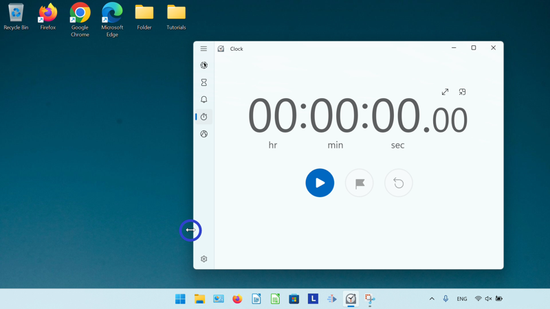
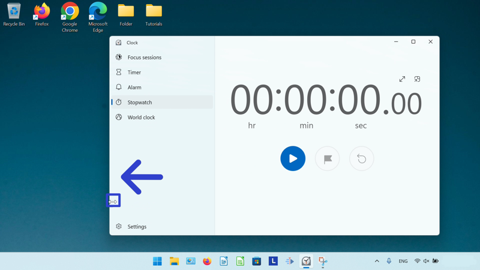
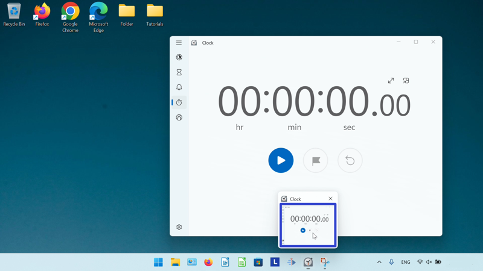
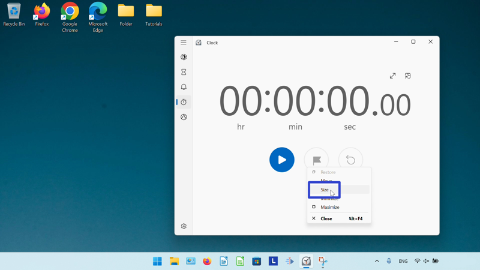
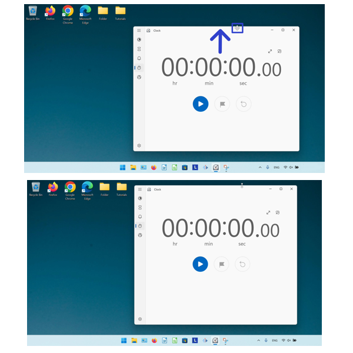
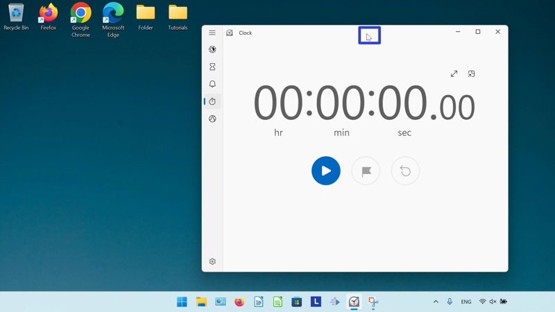
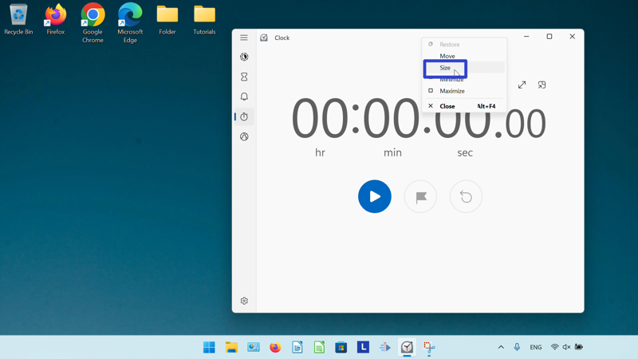

This tutorial covers:

## How to Resize the Microsoft Windows Clock:
1. [With Mouse](#1)
2. [With Menu](#2)
3. [With Right Click](#3)

No time to scroll down? Click through this tutorial presentation:

<iframe src="https://docs.google.com/presentation/d/1pPXMEIrOCo1B-BdDWNjpuVH12xwE4apDE74oGPlf8Fk/embed?start=false&loop=false&delayms=3000" frameborder="0" width="480" height="299" allowfullscreen="true" mozallowfullscreen="true" webkitallowfullscreen="true"></iframe>

 

Watch a video tutorial:
<iframe class="BLOG_video_class" allowfullscreen="" youtube-src-id="TBQarqGJtkY" width="100%" height="416" src="https://www.youtube.com/embed/TBQarqGJtkY"></iframe>

 

<h1 id="1">How to Resize the Microsoft Windows Clock With Mouse</h1>

* Step 1: First [open](https://qhtutorials.github.io/posts/how-to-open-microsoft-windows-clock/) Windows Clock. Hover the mouse over any edge or corner of the window, until the cursor becomes a double sided arrow. 

* Step 2: Click, hold, and drag the mouse to resize the window. Release the mouse to stop resizing the window. 

<h1 id="2">How to Resize the Microsoft Windows Clock With Menu</h1>

* Step 1: [Open](https://qhtutorials.github.io/posts/how-to-open-microsoft-windows-clock/) Windows Clock. Go down to the taskbar and hover the mouse over the Windows Clock app icon. 

* Step 2: Right click the small window that appears. 

* Step 3: In the menu that opens, click "Size". 

* Step 4: Click, hold, and drag the four arrows cursor to resize the window. Release the mouse to stop resizing the window. 

<h1 id="3">How to Resize the Microsoft Windows Clock With Right Click</h1>

* Step 1: First [open](https://qhtutorials.github.io/posts/how-to-open-microsoft-windows-clock/) Windows Clock. Right click the top of the window. 

* Step 2: In the menu that opens, click "Size". 

* Step 3: Click, hold, and drag the four arrows cursor to resize the window. Release the mouse to stop resizing the window. 

Save a copy of these instructions for later with this free [tutorial PDF](https://drive.google.com/file/d/17Jn6OrLw5wYdfwRuAs9SREFSmFKweli2/view?usp=sharing).

 

