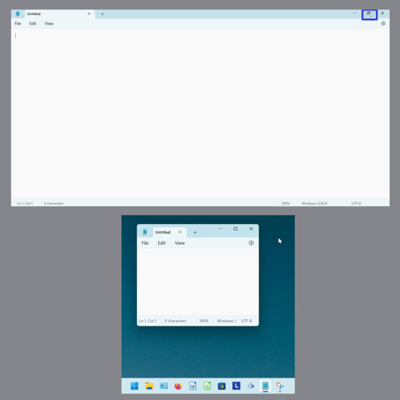
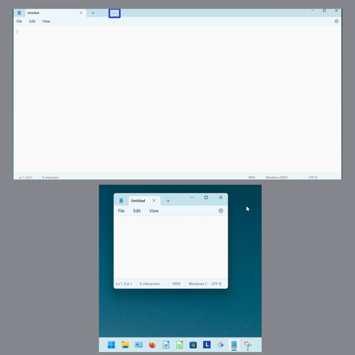
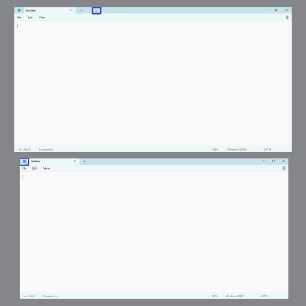
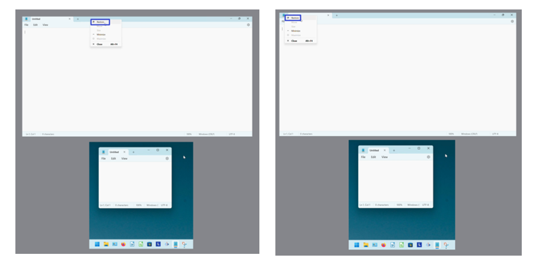
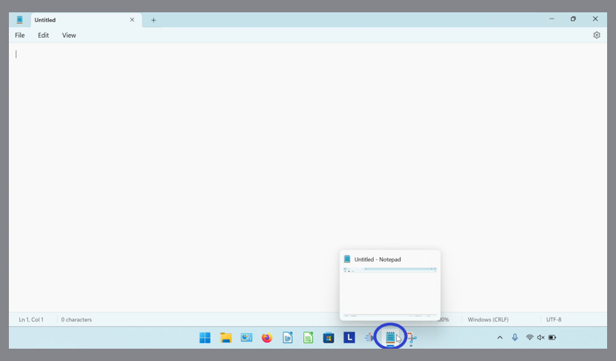
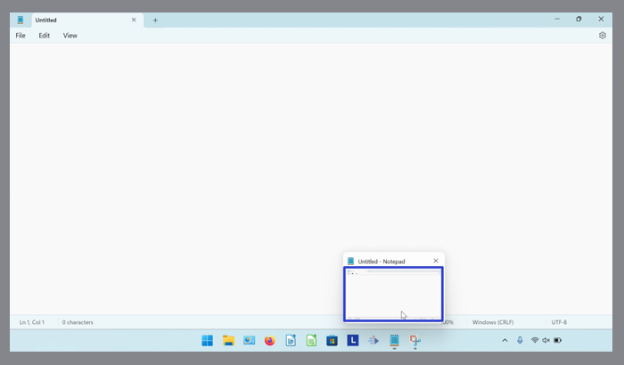
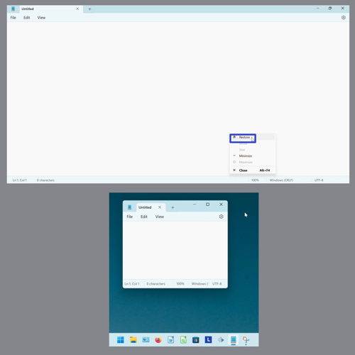

This tutorial covers:

## How to Restore Notepad:
1. [With Click](#1)
2. [With Double Click](#2)
3. [With Right Click](#3)
4. [With Menu](#4)

 

No time to scroll down? Click through these presentation slides:

<iframe src="https://docs.google.com/presentation/d/e/2PACX-1vR4QXAj8KMKwtDPTuJ-TdL7JSc4BpypAx8S4_Ajd9ViomnHlr3ie1VTDJrR4TqkEypJQjt-qCtLNksn/embed?start=false&loop=false&delayms=3000" frameborder="0" width="480" height="299" allowfullscreen="true" mozallowfullscreen="true" webkitallowfullscreen="true"></iframe>

 

Watch a video tutorial:
<iframe class="BLOG_video_class" allowfullscreen="" youtube-src-id="IJY0M6Wvsu4" width="100%" height="416" src="https://www.youtube.com/embed/IJY0M6Wvsu4"></iframe>

<h1 id="1">How to Restore Notepad With Click</h1>

* Step 1: First [maximize](https://qhtutorials.github.io/posts/how-to-maximize-notepad/) Notepad. Go to the upper right and click the "Maximize" button. The Notepad window is restored to its original size. 

<h1 id="2">How to Restore Notepad With Double Click</h1>

* Step 1: [Maximize](https://qhtutorials.github.io/posts/how-to-maximize-notepad/) Notepad. Double click the top of the window. The Notepad window is restored to its original size. 

<h1 id="3">How to Restore Notepad With Right Click</h1>

* Step 1: First [maximize](https://qhtutorials.github.io/posts/how-to-maximize-notepad/) Notepad. Right click the top of, or the upper left corner of the Notepad window. 

* Step 2: In the menu that opens, click "Restore". The Notepad window is restored to its original size. 

<h1 id="4">How to Restore Notepad With Menu</h1>

* Step 1: [Maximize](https://qhtutorials.github.io/posts/how-to-maximize-notepad/) Notepad. Go down to the taskbar and hover over the Notepad app icon. 

* Step 2: Right click the small window that appears. 

* Step 3: In the menu that opens, click "Restore". The Notepad window is restored to its original size. 

Save these instructions for later with this free [PDF tutorial](https://drive.google.com/file/d/1tBTfrzklGTwsCFFX4fg_PzDp_aDtBkH4/view?usp=sharing).

 
