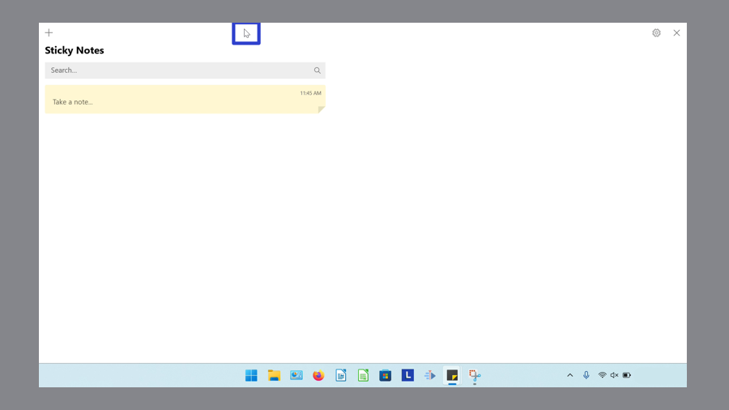
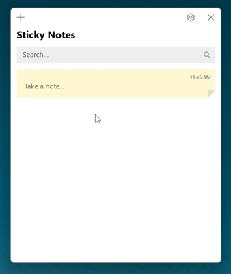
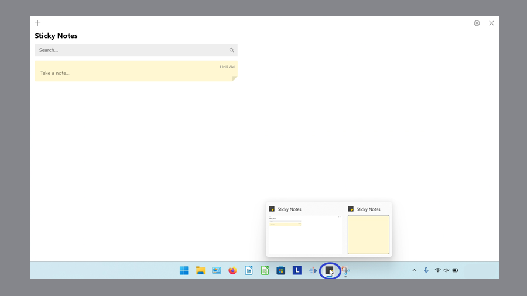
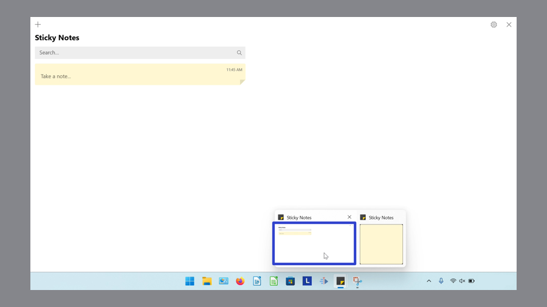
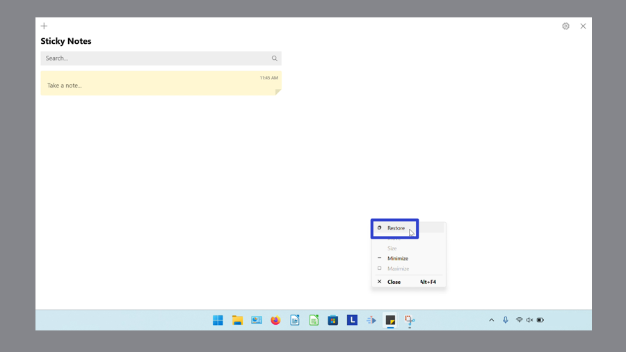
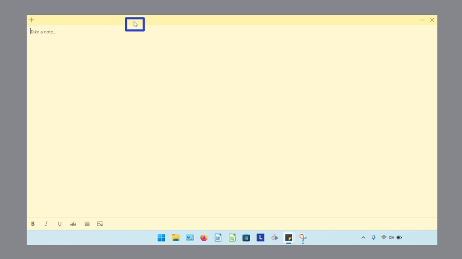
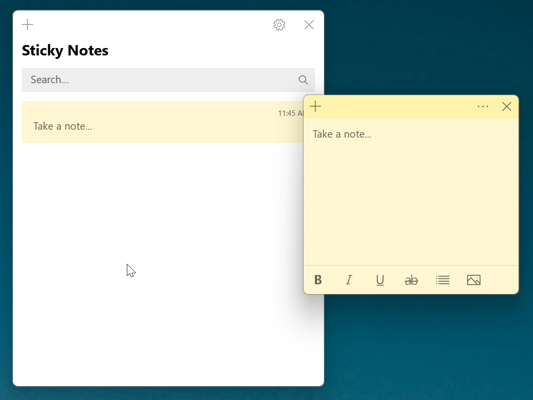
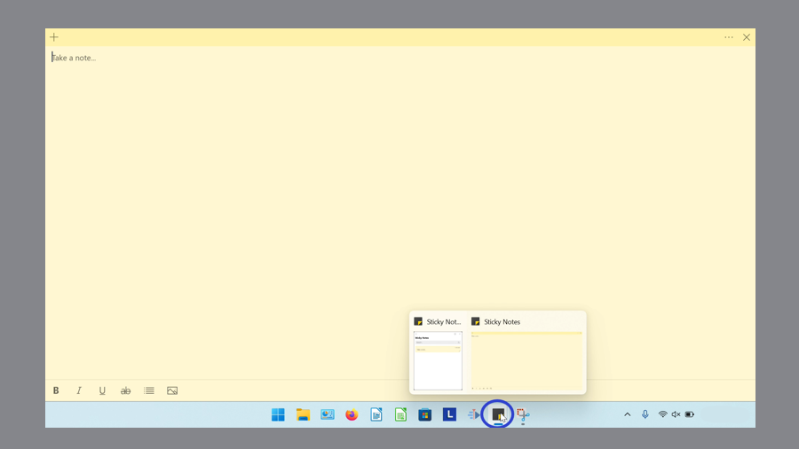
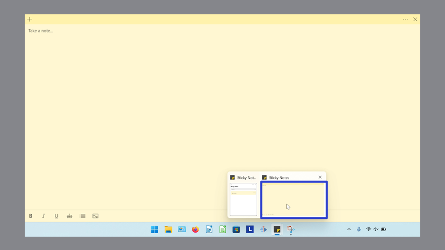
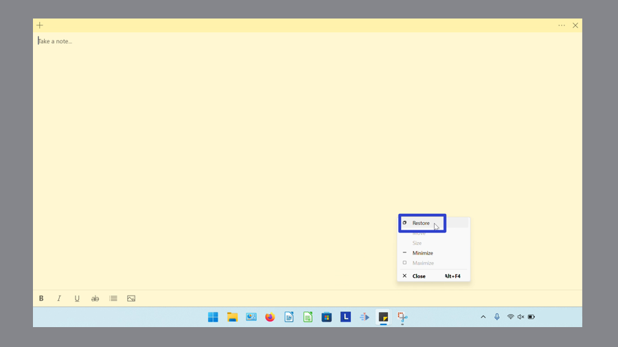

This tutorial covers:

### How to Restore the Notes List:
1. [With Double Click](#1)
2. [With Menu](#2)

### How to Restore a Sticky Note:
1. [With Double Click](#3)
2. [With Menu](#4)

 

No time to scroll down? Click through this tutorial presentation:

<iframe src="https://docs.google.com/presentation/d/e/2PACX-1vSJTWv8Z-nfKErQdGVJRKgIx91QsCk79aEPZ-70IgDg-8divKCqwQzkP3GNN86YjrVZV7I7EThxub6Z/embed?start=false&loop=false&delayms=3000" frameborder="0" width="480" height="299" allowfullscreen="true" mozallowfullscreen="true" webkitallowfullscreen="true"></iframe>

 

Watch a tutorial video:
<iframe class="BLOG_video_class" allowfullscreen="" youtube-src-id="vsRW-454E-o" width="100%" height="416" src="https://www.youtube.com/embed/vsRW-454E-o"></iframe>

<h1 id="1">How to Restore the Notes List With Double Click</h1>

* Step 1: First [maximize](https://qhtutorials.github.io/posts/how-to-maximize-sticky-notes/) the Notes List. Double click the top of the maximized Notes List. 

* The Notes List is restored to its original size before being maximized. 

<h1 id="2">How to Restore the Notes List With Menu</h1>

* Step 1: [Maximize](https://qhtutorials.github.io/posts/how-to-maximize-sticky-notes/) the Notes List. Go down to the taskbar and hover the mouse over the Sticky Notes app icon. 

* Step 2: Two small windows appear; one is the Notes List and the other is the sticky note. Right click the small Notes List window. 

*  Step 3: In the menu that opens, click "Restore". 

* The Notes List is restored to its original size before being maximized. 

<h1 id="3">How to Restore a Sticky Note With Double Click</h1>

* Step 1: First [maximize](https://qhtutorials.github.io/posts/how-to-maximize-sticky-notes/) a sticky note. Double click the top of the sticky note.

* The sticky note is restored to its original size before being maximized. 

<h1 id="4">How to Restore a Sticky Note With Menu</h1>

* Step 1: [Maximize](https://qhtutorials.github.io/posts/how-to-maximize-sticky-notes/) a sticky note. Go down to the taskbar and hover the mouse over the Sticky Notes app icon. 

* Step 2: Two small windows appear; one is the Notes List and the other is the sticky note. Right click the small sticky note window. 

*  Step 3: In the menu that opens, click "Restore". 

* The sticky note is restored to its original size before being maximized. 

Save a copy of these instructions with this free [PDF tutorial.](https://drive.google.com/file/d/1G-kz1jiIh3q3SFcL_2tgvmsd3ioyy3k2/view?usp=sharing)

 

