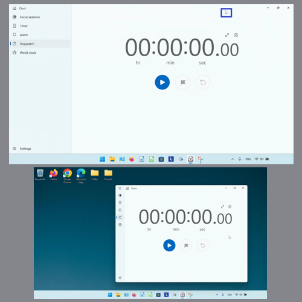
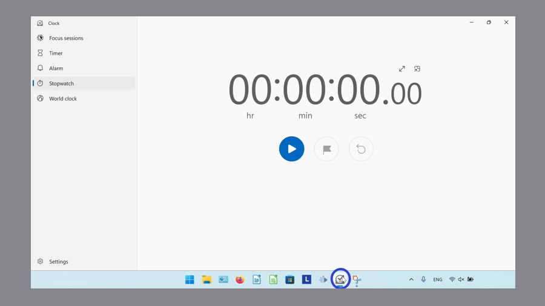
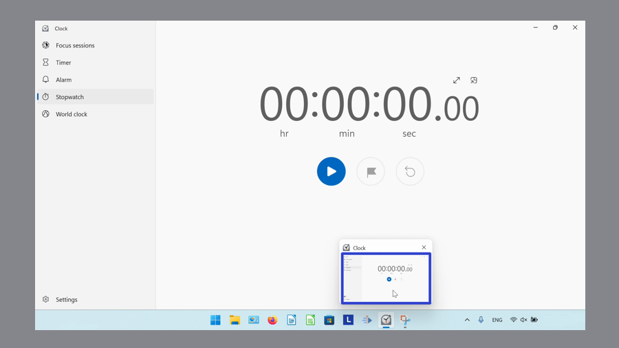
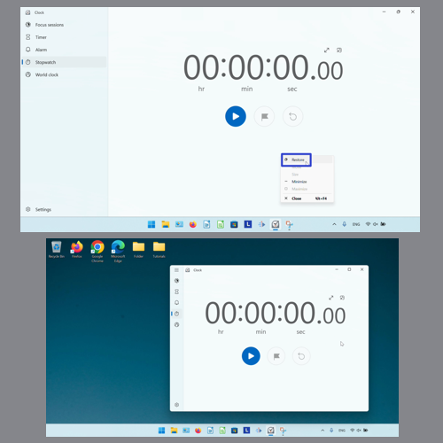
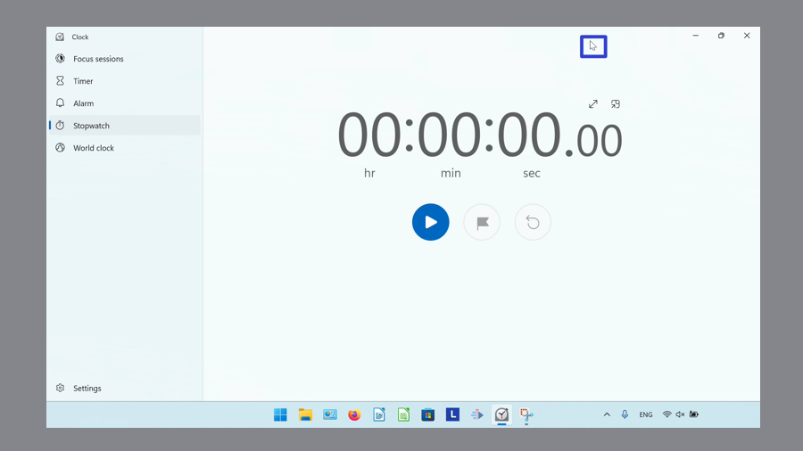
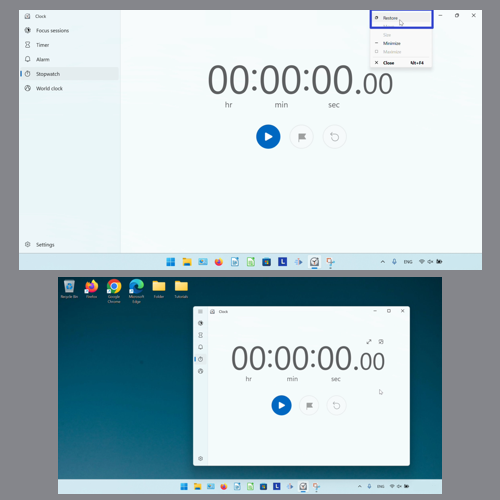

This tutorial covers:

## How to Restore the Microsoft Windows Clock:
1. [With Click](#1)
2. [With Double Click](#2)
2. [With Menu](#3)
3. [With Right Click](#4)

No time to scroll down? Click through this presentation tutorial:

<iframe src="https://docs.google.com/presentation/d/1uYhGo_1kr60Ohq_zNJE6jszlw4RF8RVPtb0B8n3LvdQ/embed?start=false&loop=false&delayms=3000" frameborder="0" width="480" height="299" allowfullscreen="true" mozallowfullscreen="true" webkitallowfullscreen="true"></iframe>

 

See a tutorial video:
<iframe class="BLOG_video_class" allowfullscreen="" youtube-src-id="4lVbyBaIYSc" width="100%" height="416" src="https://www.youtube.com/embed/4lVbyBaIYSc"></iframe>

 

<h1 id="1">How to Restore the Microsoft Windows Clock With Click</h1>

* Step 1: First [maximize](https://qhtutorials.github.io/posts/how-to-maximize-windows-clock/) Windows Clock. In the upper right corner, click the "Maximize" button. 

<h1 id="2">How to Restore the Microsoft Windows Clock With Double Click</h1>

* Step 1: [Maximize](https://qhtutorials.github.io/posts/how-to-maximize-windows-clock/) Windows Clock. Double click the top of the app window. 

<h1 id="3">How to Restore the Microsoft Windows Clock With Menu</h1>

* Step 1: First [maximize](https://qhtutorials.github.io/posts/how-to-maximize-windows-clock/) Windows Clock. Go down to the taskbar and hover the mouse over the Windows Clock app icon. 

* Step 2: Right click the small window that appears. 

* Step 3: In the menu that opens, click "Restore". 

<h1 id="4">How to Restore the Microsoft Windows Clock With Right Click</h1>

* Step 1: [Maximize](https://qhtutorials.github.io/posts/how-to-maximize-windows-clock/) Windows Clock. Right click the top of the window. 

* Step 2: In the menu that opens, click "Restore". 

Keep a copy of these instructions for later with this free [PDF tutorial](https://drive.google.com/file/d/17JbZqFAvPaHJAQ57JD2ZVVLTJ3Ykkdjj/view?usp=sharing).

 

