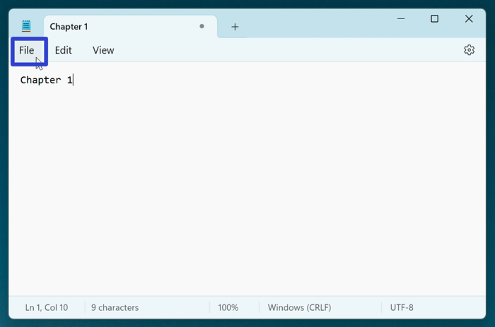

This tutorial covers:

## How to Save a File:
1. [With Menu](#1)
2. [With Keyboard Shortcut](#2)

## How to Save As:
1. [With Menu](#3)
2. [With Keyboard Shortcut](#4)

## How to Save Multiple Files:
1. [With Menu](#5)
2. [With Keyboard Shortcut](#6)

 

No time to scroll down? Click through this presentation tutorial:

<iframe src="https://docs.google.com/presentation/d/e/2PACX-1vSsWAM95VdRo4pkVmfGuvjJFNebXSNciz0fQwgDGYa2mFdcCARFBpkcuq_iPNOsQKrrvTLr-33HPxAY/embed?start=false&loop=false&delayms=3000" frameborder="0" width="480" height="299" allowfullscreen="true" mozallowfullscreen="true" webkitallowfullscreen="true"></iframe>

 

Watch a tutorial video:
<iframe class="BLOG_video_class" allowfullscreen="" youtube-src-id="BblKsYzmBqA" width="100%" height="416" src="https://www.youtube.com/embed/BblKsYzmBqA"></iframe>

<h1 id="1">How to Save a File With Menu</h1>

* Step 1: First [edit](https://qhtutorials.github.io/posts/how-to-edit-files-in-notepad/) a Notepad file. In the upper left click the "File" button. 

* Step 2: In the menu that opens, click "Save". 

* Step 3: In the Settings window that opens, click the drop-down arrows to adjust the font family, style, and size. After clicking the back arrow in the upper left corner, the Notepad window displays the adjusted font. 

<h1 id="2">How to Save a File With Keyboard Shortcut</h1>

* Step 1: [Edit](https://qhtutorials.github.io/posts/how-to-edit-files-in-notepad/) a Notepad file. In the upper right click the "Settings" or gear button. 

* Step 2: In the Settings window that opens, click the drop-down arrows to adjust the font family, style, and size. After clicking the back arrow in the upper left corner, the Notepad window displays the adjusted font. 

<h1 id="3">How to Save As With Menu</h1>

* Step 1: First [edit](https://qhtutorials.github.io/posts/how-to-edit-files-in-notepad/) a Notepad file. Right click anywhere in teh window. 

* Step 2: In the menu that opens, click "Right-to-left reading order" to toggle this option on or off. With "Right-to-left reading order" on, a check mark appears to the left of this option, and text displays on the right side of the Notepad window. This option is intended for right-to-left languages such as Arabic, Persian, and Hebrew. 

* With "Right-to-left reading order" off, this option does not display a check mark, and text displays on the left side of the Notepad window. This is the default option. 

<h1 id="4">How to Save As With Keyboard Shortcut</h1>

* Step 1: [Edit](https://qhtutorials.github.io/posts/how-to-edit-files-in-notepad/) a Notepad file. Right click anywhere in the window. 

* Step 2: In the menu that opens, hover over "Insert Unicode control characters". In the second menu that opens, click one of the options to insert it. If "Show Unicode control characters" is turned on, the inserted Unicode control character appears in the Notepad window. 

* Note: If "Show Unicode control characters" is turned off, the inserted Unicode control characters are not visible. See [How to Show Unicode Control Characters](#5) to turn "Show Unicode control characters" on. 

<h1 id="5">How to Save Multiple Files With Menu</h1>

* Step 1: First [edit](https://qhtutorials.github.io/posts/how-to-edit-files-in-notepad/) a Notepad file. Right click anywhere in the window. 

* Step 2: In the menu that opens, click "Show Unicode control characters" to toggle this option on or off. With "Show Unicode control characters" on, a check mark appears to the left of this option, and the Notepad window displays any inserted Unicode control character. 

* With "Show Unicode control characters" off, this option does not display a check mark, and the Notepad window does not display inserted Unicode control characters. 

<h1 id="6">How to Save Multiple Files With Keyboard Shortcut</h1>

* Step 1: First download a language pack from the Windows 11 Settings (if a language pack is already installed, skip to step 9); go down to the taskbar and click the Start (four blue squares) button. 

* Step 2: In the Start window that opens, click the "Settings" button. 

* Step 3: In the Settings window that opens, go to the left menu and click "Time & language". 

* Step 4: Click the "Language & region" button. 

* Step 5: Click the "Add a language" button. 

* Step 6: In the "Choose a language to install" window, type a language, click a language in the list, and click the "Next" button. 

* Step 7: Click the "Install" button. 

* Step 8: Wait for the language to install, then click the "Close" or "X" button in the upper right of the Settings window. 

* Step 9: Go down to the taskbar and click the "ENG" button. 

* Step 10: In the menu that opens, click the installed language option, such as "Japanese Microsoft IME". 

* Step 11: [Open](https://qhtutorials.github.io/posts/how-to-open-notepad/) a Notepad file, then go down to the taskbar and click the "A" button. The text input changes from the English alphabet to the installed language pack. 

* Step 12: Click inside the Notepad window, type and select any text, and right click the Notepad window. 

* Step 13: In the menu that opens, click "Reconversion". In the menu that opens, click to select an option. Notepad replaces the selected text with the selected Reconversion option. 

 
Refer to these instructions later with this free [PDF tutorial](https://drive.google.com/file/d/1psmsqI5KYCRHJ7VCSvXim30e1FvmLPB8/view?usp=sharing).

 

