This tutorial covers:

## How to Use Find:
1. [With Menu](#1)
2. [With Keyboard Shortcut](#2)

## How to Use Find Next:
1. [With Menu](#3)
2. [With Click](#4)
3. [With Keyboard Shortcut](#5)

## How to Use Find Previous:
1. [With Menu](#6)
2. [With Click](#7)
3. [With Keyboard Shortcut](#8)

## [How to Apply Match Case](#9)

## [How to Apply Wrap Around](#10)

## [How to Clear the Find Bar](#11)

## How to Exit the Find Window:
1. [With Click](#12)
2. [With Keyboard](#13)

## How to Use Find and Replace:
1. [With Menu](#14)
2. [With Click](#15)
3. [With Keyboard Shortcut](#16)

 

No time to scroll down? Click through these tutorial slides:

<iframe src="https://docs.google.com/presentation/d/e/2PACX-1vSqYF7nsUjIgVZaILK47SD3QnOZ4xoOLREQiEYuDAdiLIUPn-6WNQNTu8YkNQVWuzkTCi-WelypvjEG/embed?start=false&loop=false&delayms=3000" frameborder="0" width="480" height="299" allowfullscreen="true" mozallowfullscreen="true" webkitallowfullscreen="true"></iframe>

 

Watch a video tutorial:
<iframe class="BLOG_video_class" allowfullscreen="" youtube-src-id="EdDB2iBk-ak" width="100%" height="416" src="https://www.youtube.com/embed/EdDB2iBk-ak"></iframe>

<h1 id="1">How to Use Find With Menu</h1>

* Step 1: First [edit](https://qhtutorials.github.io/posts/how-to-edit-files-in-notepad/) a Notepad file. In the upper left click the "Edit" button. 
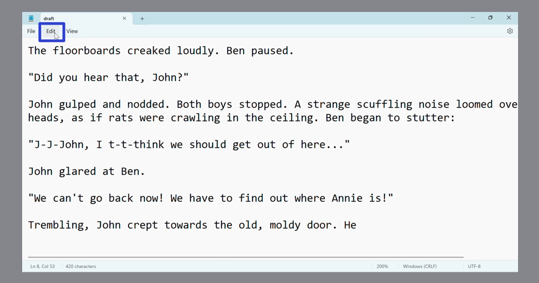

* Step 2: In the menu that opens, click "Find". 
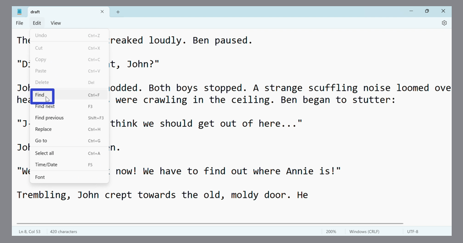

* Step 3: In the Find window that opens, type any text and click the magnifying glass button on the right. Notepad highlights the resulting text that matches the search term. 
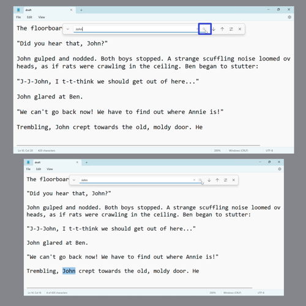

<h1 id="2">How to Use Find With Keyboard Shortcut</h1>

* Step 1: [Edit](https://qhtutorials.github.io/posts/how-to-edit-files-in-notepad/) a Notepad file. On the keyboard press **Ctrl + F**. 
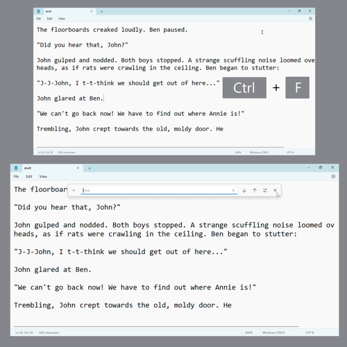

* Step 2: In the Find window that opens, type any text and press **Enter**. Notepad highlights the resulting text that matches the search term. 
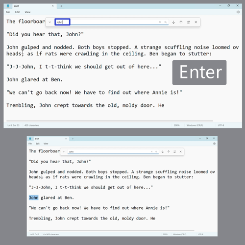

<h1 id="3">How to Use Find Next With Menu</h1>

* Step 1: First [edit](https://qhtutorials.github.io/posts/how-to-edit-files-in-notepad/) a Notepad file. In the upper left click the "Edit" button. 

* Step 2: In the menu that opens, click "Find next". 
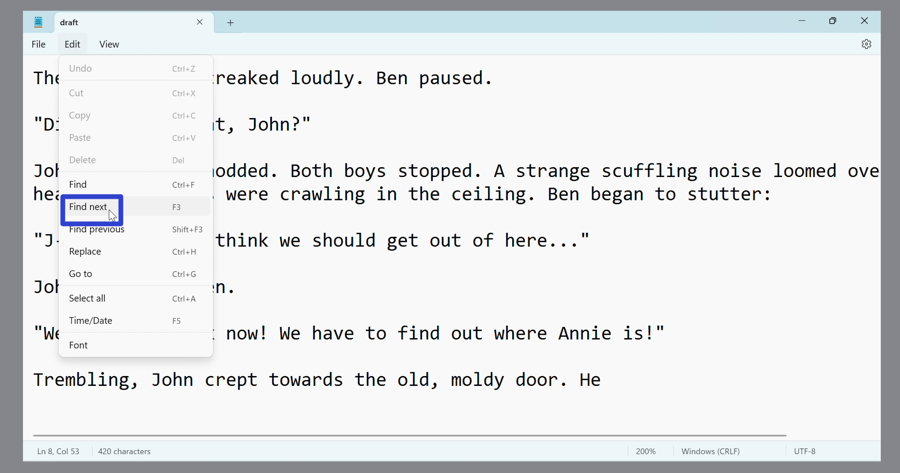

* Step 3: In the Find window that opens, type any text to search for. Continue clicking the "Edit" button and the "Find next" option to continue searching for the next instance of that text. 
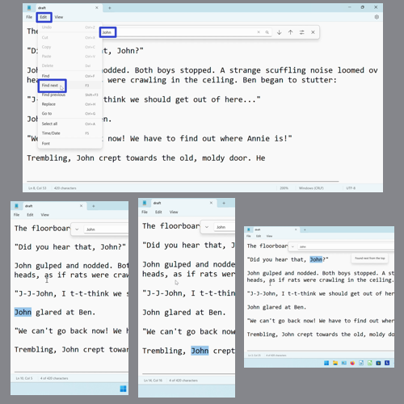

<h1 id="4">How to Use Find Next With Click</h1>

* Step 1: [Edit](https://qhtutorials.github.io/posts/how-to-edit-files-in-notepad/) a Notepad file and [open](#2) the Find window. 

* Step 2: Type any text to search for, and click the "Search down" or down arrow button. Continue clicking "Search down" to continue searching for the next instance of that text. 
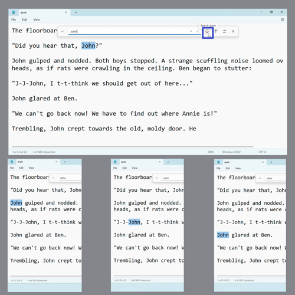

* Alternatively, continue clicking the magnifying glass button to continue searching for the next instance of that text. 
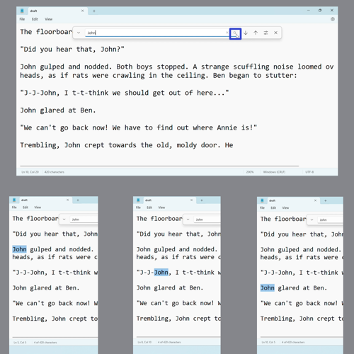

<h1 id="5">How to Use Find Next With Keyboard Shortcut</h1>

* Step 1: First [edit](https://qhtutorials.github.io/posts/how-to-edit-files-in-notepad/) a Notepad file. On the keyboard press **F3** (some computers accept this shortcut as **Fn + F3**). 
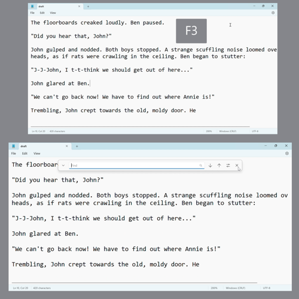

* Step 2: Type any text to search for, and continue pressing **F3** or **Fn + F3** to continue searching for the next instance of that text. 
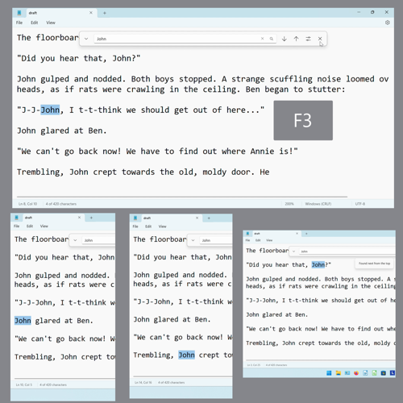

<h1 id="6">How to Use Find Previous With Menu</h1>

* Step 1: [Edit](https://qhtutorials.github.io/posts/how-to-edit-files-in-notepad/) a Notepad file. In the upper left click the "Edit" button. 

* Step 2: In the menu that opens, click "Find previous". 
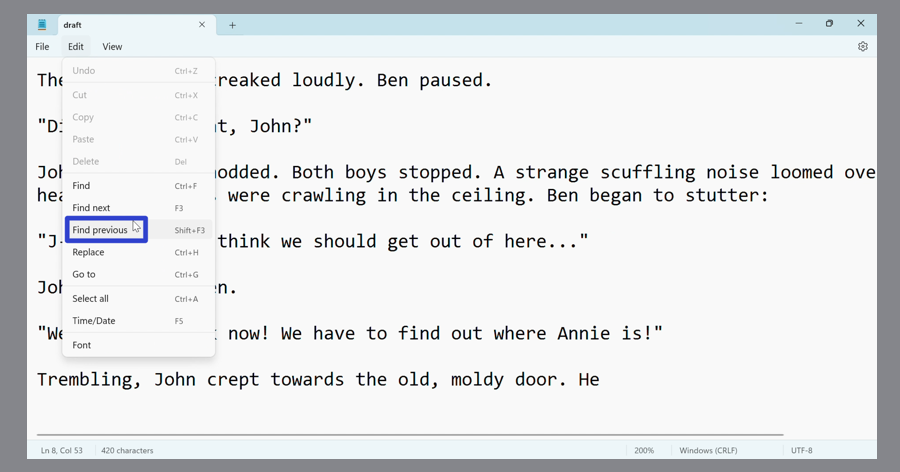

* Step 3: In the Find window that opens, type any text. Continue clicking the "Edit" button and the "Find previous" option to continue searching for the previous instance of that text. 
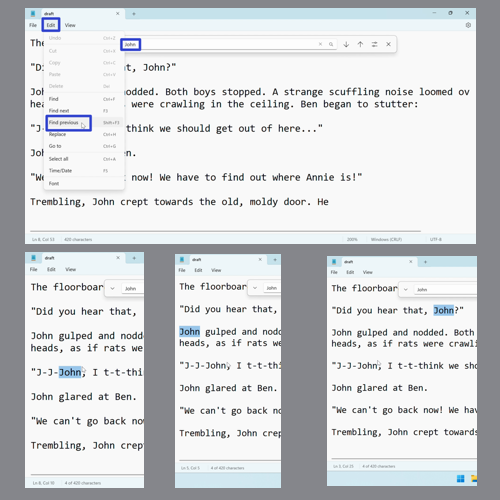

<h1 id="7">How to Use Find Previous With Click</h1>

* Step 1: First [edit](https://qhtutorials.github.io/posts/how-to-edit-files-in-notepad/) a Notepad file and [open](#2) the Find window. 

* Step 2: Type any text to search for, and click the "Search up" or up arrow button. Continue clicking the "Search up" button to continue searching for the previous instance of that text. 
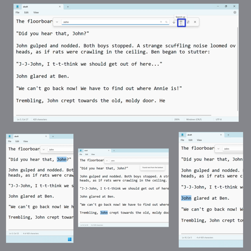
 

<h1 id="8">How to Use Find Previous With Keyboard Shortcut</h1>

* Step 1: [Edit](https://qhtutorials.github.io/posts/how-to-edit-files-in-notepad/) a Notepad file. On the keyboard press **Shift + F3** (some computers accept this shortcut as **Fn + Shift + F3**). 
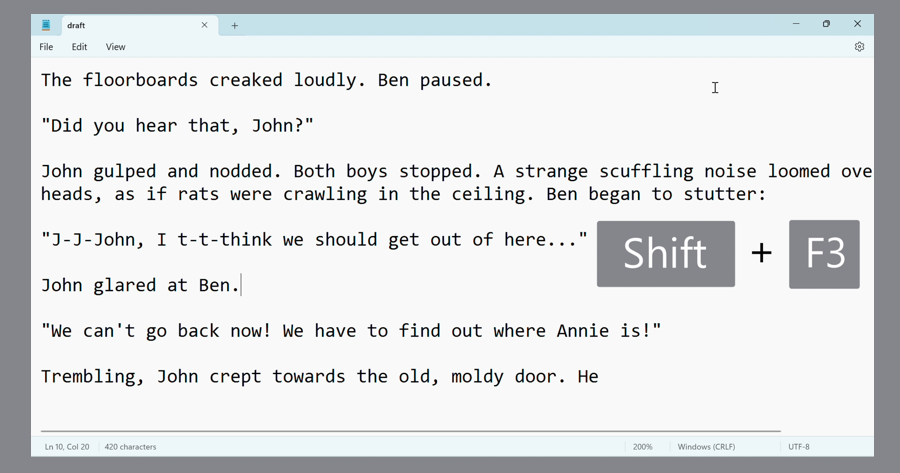

* Step 2: In the Find window that opens, type any text to search for. Continue pressing **Shift + F3** or **Fn + Shift + F3** to continue searching for the previous instance of that text. 
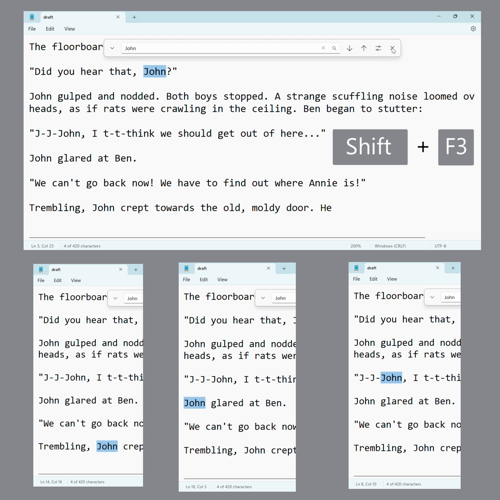

<h1 id="9">How to Apply Match Case</h1> 

* Step 1: First [edit](https://qhtutorials.github.io/posts/how-to-edit-files-in-notepad/) a Notepad file and [open](#2) the Find window. On the far right side of the Find window, click the "More options" button. 
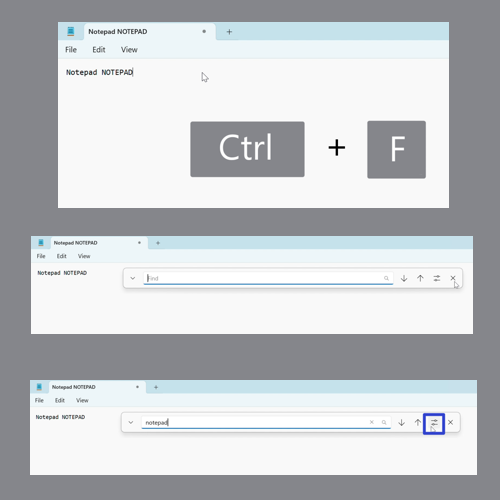

* Step 2: In the menu that opens, click "Match case" to toggle this option on or off. With "Match case" on, a check mark appears to the left of this option in the menu. The Find window searches for text that matches the exact same capital or lowercase letters as the search term. If no text matches these conditions, a message states that no match was found. 
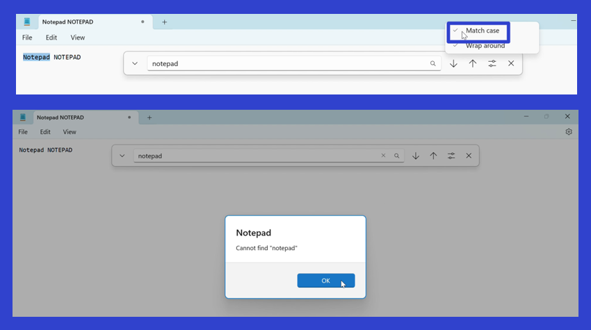

* With "Match case" off, the menu option does not display a check mark, and the Find window searches for any text that matches the search term, regardless of capital or lowercase letters. 
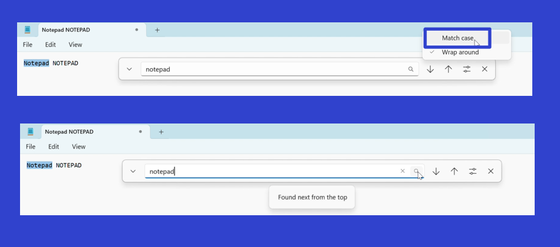

<h1 id="10">How to Apply Wrap Around</h1>

* Step 1: [Edit](https://qhtutorials.github.io/posts/how-to-edit-files-in-notepad/) a Notepad file and [open](#2) the Find window. On the far right side of the window, click the "More options" button. 

* Step 2: In the menu that opens, click "Wrap around" to toggle this option on or off. With "Wrap around" on, a check mark appears to the left of this menu option. The Find window searches for text from the top to the bottom of the Notepad window, over and over again. 
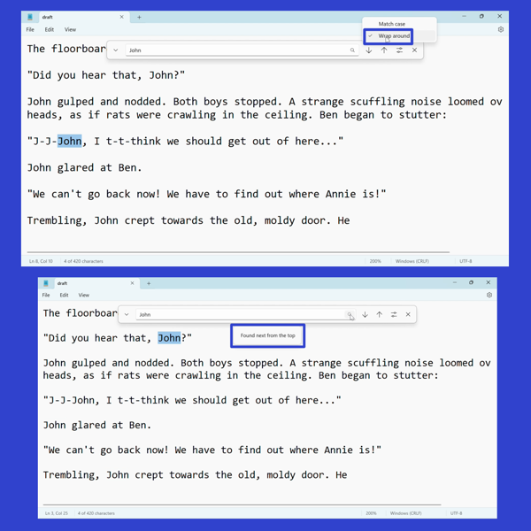

* With "Wrap around" off, the menu option does not display a check mark. The Find window searches for text from the top to the bottom of the Notepad window only once, and displays an error message if the text was not found. 
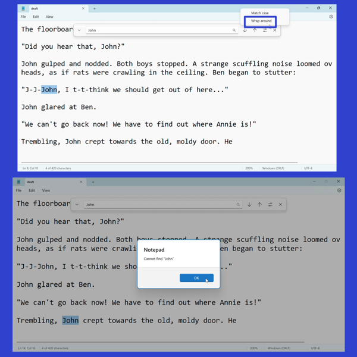

<h1 id="11">How to Clear the Find Bar</h1>

* Step 1: First [edit](https://qhtutorials.github.io/posts/how-to-edit-files-in-notepad/) a Notepad file and [open](#2) the Find window. Click the "X" button to the right of the search bar. The search bar clears as the previous search term disappears. 
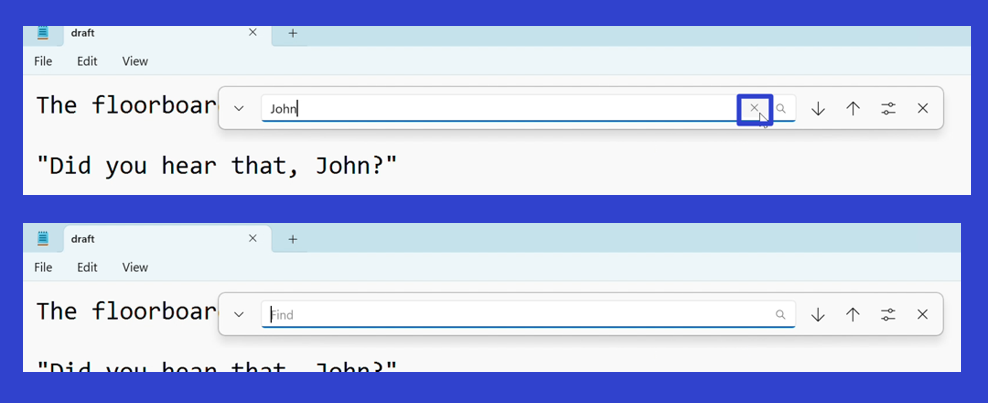

* Step 2: Click anywhere inside the Notepad window to deselect the previously highlighted text. The next time the Find window opens, the search bar will be empty. div class="stepimage">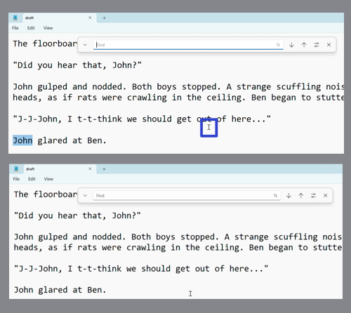

<h1 id="12">How to Exit the Find Window With Click</h1>

* Step 1: 

Refer to these instructions later with this free [PDF tutorial](https://drive.google.com/file/d/17u3pXn9Y4zFL0WkQP0Hf1QBUUh-Ho7D_/view?usp=sharing).

 

