This tutorial covers:

## 1. [How to Remove the Header/Footer](#1)

## 2. [How to Add the Header/Footer](#2)

## 3. [What are the Header and Footer Codes?](#3)

## 4. [How to Add Custom Words to the Header/Footer](#4)

 

No time to scroll down? Click through this presentation tutorial:

<iframe src="https://docs.google.com/presentation/d/e/2PACX-1vRDH0rX_9gJpOll9Bkd9fuXJ65Cl08HeRgpMPR--3hap1f7o2GnpHCA4br1SYThNQZVT38DGYOJxzuo/embed?start=false&loop=false&delayms=3000" frameborder="0" width="480" height="299" allowfullscreen="true" mozallowfullscreen="true" webkitallowfullscreen="true"></iframe>

 

Watch a tutorial video:
<iframe class="BLOG_video_class" allowfullscreen="" youtube-src-id="DvXw-sSjKTI" width="100%" height="416" src="https://www.youtube.com/embed/DvXw-sSjKTI"></iframe>

<h1 id="1">How to Remove the Header/Footer</h1>

* Step 1: First [open](https://qhtutorials.github.io/posts/how-to-open-notepad/) a Notepad window. In the lower left click "More settings". 

* Step 2: In the menu that opens, click "Page setup". 
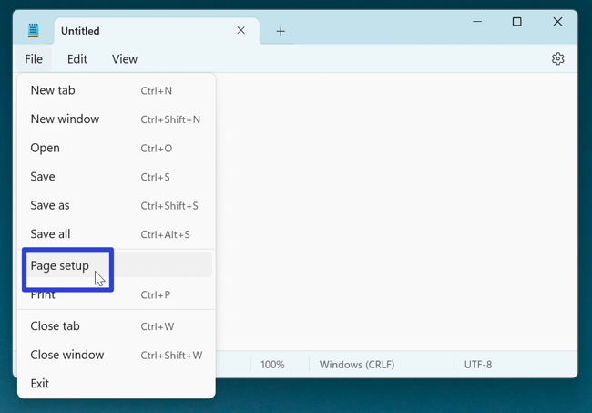

* Step 3: In the "Page setup" window that opens, click inside the "Header:" and "Footer:" fields, and press **Backspace** or **Delete** to clear them. When these fields are empty, Notepad removes the header and footer from the printed document. 
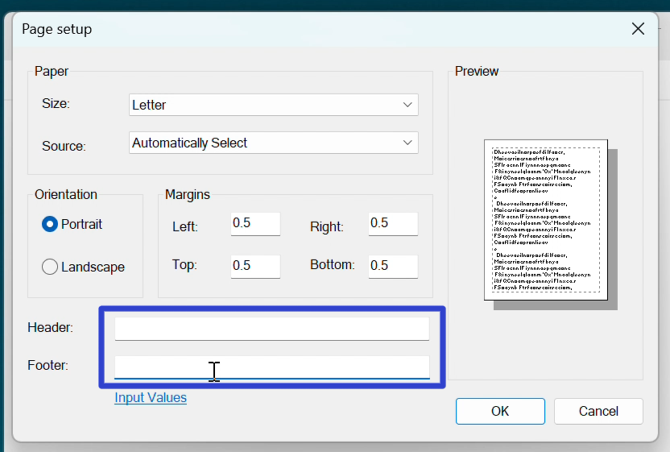

<h1 id="2">How to Add the Header/Footer</h1>

* Step 1: [Open](https://qhtutorials.github.io/posts/how-to-open-notepad/) a Notepad window. In the upper left click the "File" button. 

* Step 2: In the menu that opens, click "Page setup". 

* Step 3: In the "Page setup" window that opens, click inside the "Header:" or "Footer:" fields, type a code, then press **Enter** or click "OK". 
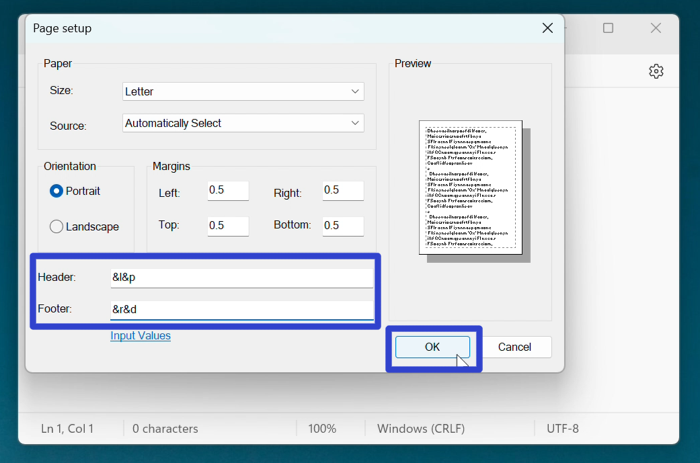

* Note: For a complete list of Header and Footer codes in Notepad, please see [What are the Header and Footer Codes?](#3).

<h1 id="3">What are the Header and Footer Codes?</h1>

There are two types of codes:

1. **Print codes**
2. **Alignment codes**

 

**1. Print Codes:**

*Four print codes tell Notepad what to print. 

|&d|&t|&f|&p|
|--|--|--|--|
|Prints current date|Prints current time|Prints document name|Prints page number| 

 

*An example of how the print codes display in the printed document: 
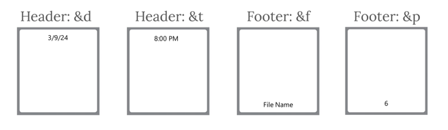

**2. Alignment Codes:**

* Three alignment codes tell Notepad where to print information.

|&l|&c|&r|
|--|--|--|
|Aligns left|Aligns center|Aligns right|

 

*An example of how the alignment codes display in the printed document: 
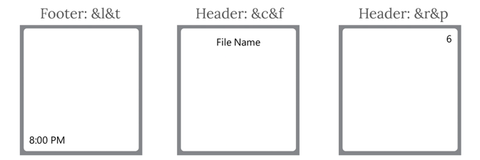

To enter a valid code in Notepad, do one of the following:

* Type a print code by itself
* Type the alignment code first, followed by the print code

 

The following tables list all the possible combinations of alignment and print codes.

##### For the Header:
* All the Header left-aligned codes: 
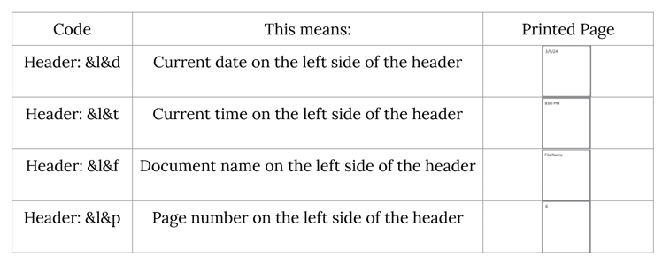

* All the Header center-aligned codes: 
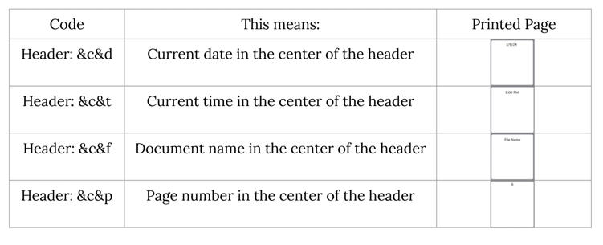

* All the Header right-aligned codes: 
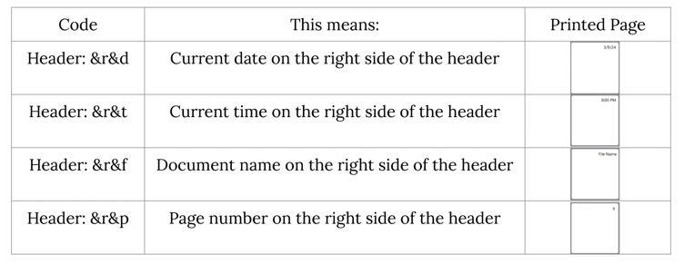

##### For the Footer:
* All the Footer left-aligned codes: 
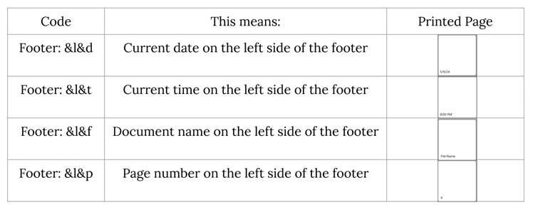

* All the Footer center-aligned codes: 
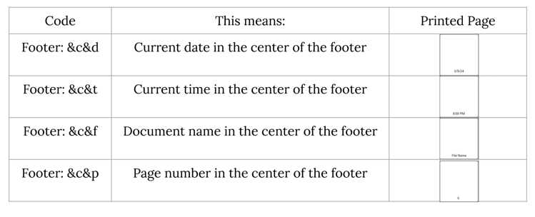

* All the Footer right-aligned codes: 
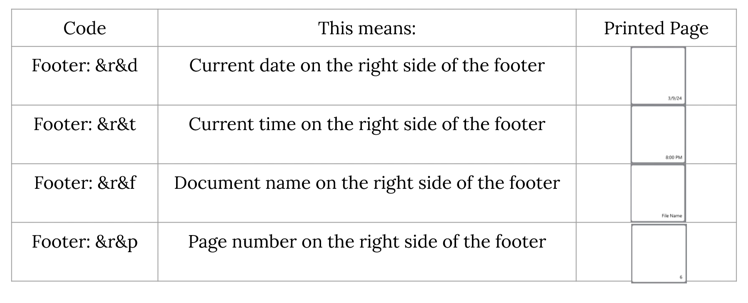

<h1 id="4">How to Add Custom Words to the Header/Footer</h1>

* Step 1: [Open](https://qhtutorials.github.io/posts/how-to-print-in-notepad/) a Notepad window. In the upper left click the "File" button. 

* Step 2: In the menu that opens, click "Page setup". 

* Step 3: In the "Page setup" window that opens, click the "Header:" or "Footer:" fields and type one of the following:

1. **"Custom word" + print code**

    Footer: **Page&p** prints "Page 6" at the bottom of the Notepad document. 
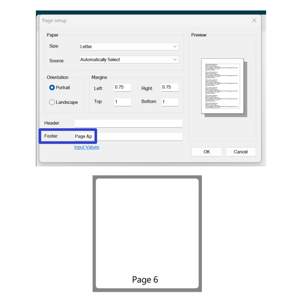

 
    
2. **Alignment code + "Custom word"**
    
    Header: **&cThe Story** prints "The Story" at the top of the Notepad document. 
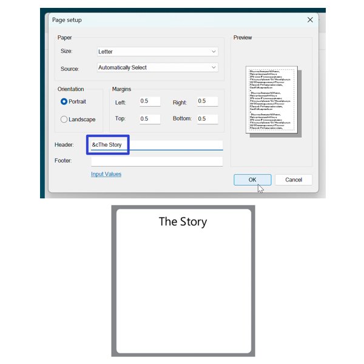

Keep a copy of these instructions for later with this free [tutorial PDF](https://drive.google.com/file/d/18r3AOq20KvWgAaVHDUIqKrFOsLzALbMY/view?usp=sharing).

 

