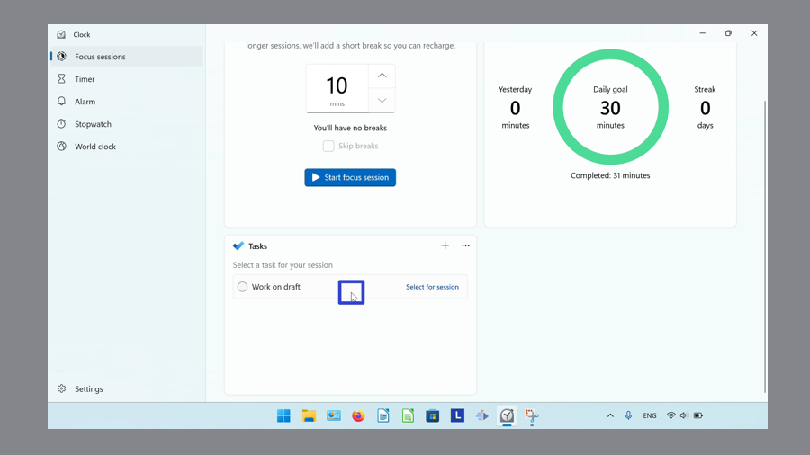

This tutorial covers:

## [How to Add a Task](#1)

## How to Select a Task:
1. [With Click](#2)
2. [With Right Click](#3)

## How to Deselect a Task:
1. [With Click](#4)
2. [With Right Click](#5)

## How to Mark a Task as Complete:
1. [With Click](#6)
2. [With Right Click](#7)

## How to Mark a Task as Not Started:
1. [With Click](#8)
2. [With Right Click](#9)

## How to Rename a Task:
1. [With Right Click](#10)
2. [With Double Click](#11)

## [How to Delete a Task](#12)

No time to scroll down? Click through this tutorial presentation:

<iframe src="https://docs.google.com/presentation/d/16IHNiHtwi9e29SS1BarXRH7YSkDDH6c-A9lqeMJOTwc/embed?start=false&loop=false&delayms=3000" frameborder="0" width="480" height="299" allowfullscreen="true" mozallowfullscreen="true" webkitallowfullscreen="true"></iframe>

 

See a tutorial video:
<iframe class="BLOG_video_class" allowfullscreen="" youtube-src-id="aT3xrx-WPmE" width="100%" height="416" src="https://www.youtube.com/embed/aT3xrx-WPmE"></iframe>

 

<h1 id="1">How to Add a Task</h1>

* Step 1: First [switch](https://qhtutorials.github.io/posts/how-to-edit-windows-clock-settings/) to Focus Sessions mode. In the upper right click the "+" or "Add a task" button, or in the center click the "+ Add a task" button. 

* Step 2: Type any text to name the task, and press **Enter**. 

<h1 id="2">How to Select a Task</h1>

Step 1: [Add](#1) a task. On the right side of the task, click "Select for session". 

<h1 id="3">How to Select a Task With Right Click</h1>

* Step 1: First [add](#1) a task. Right click the task. 

 
* Step 2: In the menu that opens, click "Select for focus session". 

<h1 id="4">How to Deselect a Task With Click</h1>

* Step 1: [Select](#2) a task for a Focus Session. On the right side of the task, click the "Deselect" option. 

 

<h1 id="5">How to Deselect a Task With Right Click</h1>

* Step 1: First [select](#2) a task for a Focus Session. Right click the task. 

 
* Step 2: In the menu that opens, click "Deselect for focus session". 

 

<h1 id="6">How to Mark a Task as Complete With Click</h1>

* Step 1: [Add](#1) a task to a Focus Session. On the left side of the task, click the circle. 

 

<h1 id="7">How to Mark a Task as Complete With Right Click</h1>

* Step 1: First [add](#1) a task. Right click the task. 

 
* Step 2: In the menu that opens, click "Mark as complete". 

 

<h1 id="8">How to Mark a Task as Not Started With Click</h1>

* Step 1: [Mark](#7) a task as complete. On the left side of the task, click the circle. 

 

<h1 id="9">How to Mark a Task as Not Started With Right Click</h1>

* Step 1: First [mark](#7) a task as complete. Right click the task. 

 
* Step 2: In the menu that opens, click "Mark as not started". 

 

<h1 id="10">How to Rename a Task With Right Click</h1>

* Step 1: [Add](#1) a task. Right click the task. 

 
* Step 2: In the menu that opens, click "Rename". 

 
* Step 3: Type any text to rename the task, then press **Enter**. 

 

<h1 id="11">How to Rename a Task With Double Click</h1>

* Step 1: First [add](#1) a task. Double click the task name. 

 
* Step 2: Type any text to rename the task, then press **Enter**. 

 

<h1 id="12">How to Delete a Task</h1>

* Step 1: [Add](#1) a task. Right click the task. 

 
* Step 2: In the menu that opens, click "Delete task". 

 

Save these instructions for later with this free [tutorial PDF](https://drive.google.com/file/d/1qJdTnQMWYKWxfqDVcOuFuQbsbQG20N_3/view?usp=sharing).

 

