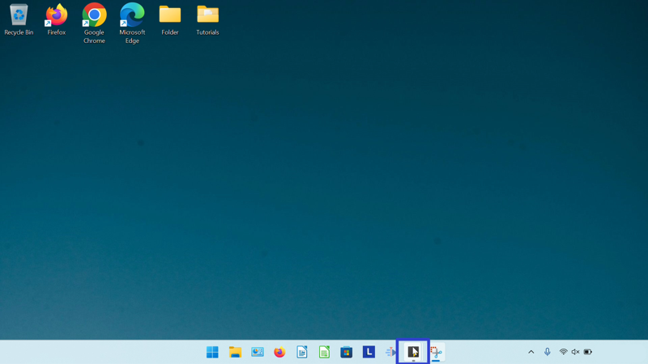
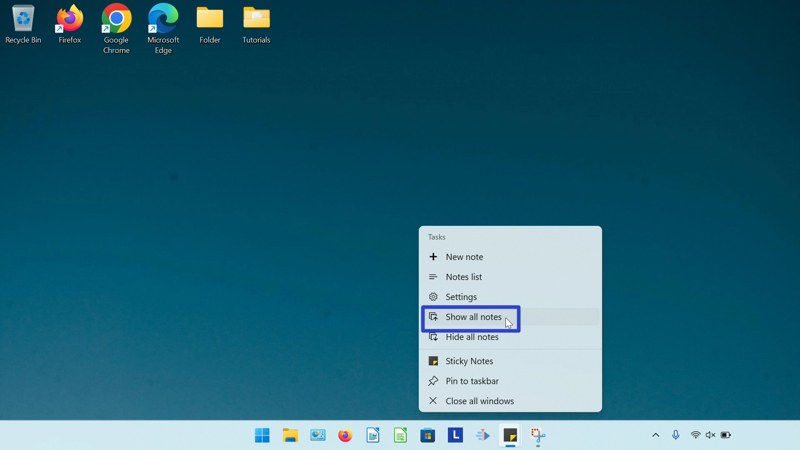
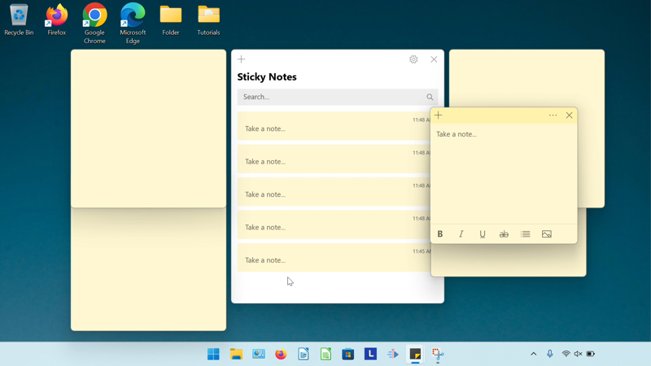
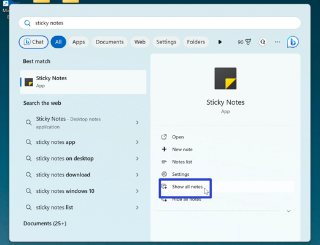

This tutorial covers:

### How to Show All Notes:
1. [With Right Click](#1)
2. [With Start](#2)

 

No time to scroll down? Click through this tutorial presentation:

<iframe src="https://docs.google.com/presentation/d/e/2PACX-1vQ5bEu_YkMs0ynKoAQ1JbrAN2V3b6_9Z7CCJnjdLnCMmMDDYriWJkM2t47MWMFSsqjJtA8Tp0uYeTGM/embed?start=false&loop=false&delayms=3000" frameborder="0" width="480" height="299" allowfullscreen="true" mozallowfullscreen="true" webkitallowfullscreen="true"></iframe>

 

Watch a tutorial video:
<iframe class="BLOG_video_class" allowfullscreen="" youtube-src-id="p0Wo4VfjGHw" width="100%" height="416" src="https://www.youtube.com/embed/p0Wo4VfjGHw"></iframe>

<h1 id="1">How to Show All Notes With Right Click</h1>

* Step 1: First [minimize or hide all notes](https://qhtutorials.github.io/posts/how-to-minimize-sticky-notes/). Go down to the taskbar and right click the Sticky Notes app icon. 

* Step 2: In the menu that opens, click "Show all notes". 

* The Notes List and all sticky notes display on the Desktop. 

<h1 id="2">How to Show All Notes With Start</h1>

* Step 1: [Minimize or hide all notes](https://qhtutorials.github.io/posts/how-to-minimize-sticky-notes/). Go down to the taskbar and click the Start (four blue squares) button. 

* Step 2: In the Start window that opens, click in the top search bar and type "sticky notes". 

*  Step 3: On the search results screen, click "Show all notes". 

* The Notes List and all sticky notes display on the Desktop. 

Save a copy of these instructions with this free [PDF tutorial.](https://drive.google.com/file/d/1d00eJgCUX2nIF9kYVqaPeyvV6aZJsOc9/view?usp=sharing)

 

