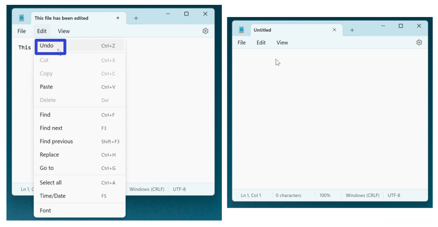
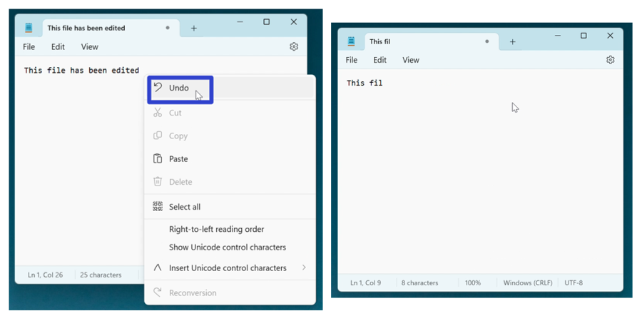
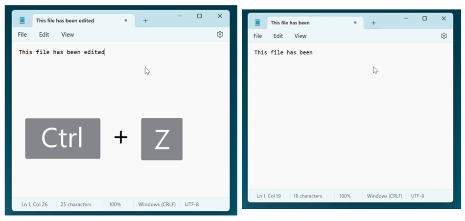
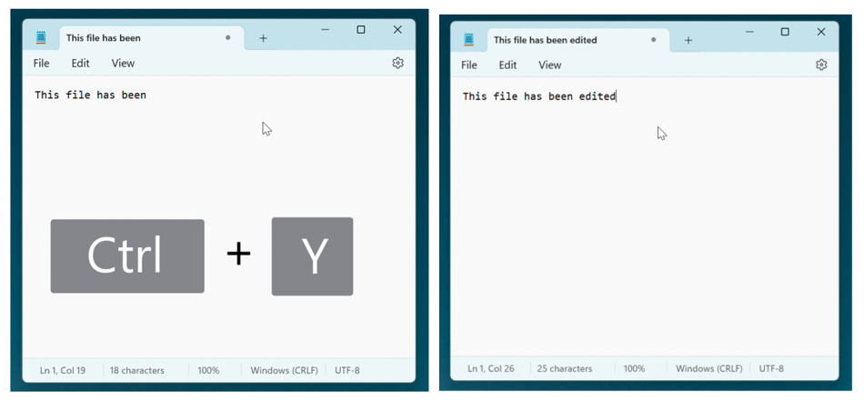

This tutorial covers:

## How to Undo:
1. [With Menu](#1)
2. [With Right Click](#2)
3. [With Keyboard Shortcut](#3)

## [How to Redo With Keyboard Shortcut](#4)

 

No time to scroll down? Click through this presentation tutorial:

<iframe src="https://docs.google.com/presentation/d/e/2PACX-1vSqYF7nsUjIgVZaILK47SD3QnOZ4xoOLREQiEYuDAdiLIUPn-6WNQNTu8YkNQVWuzkTCi-WelypvjEG/embed?start=false&loop=false&delayms=3000" frameborder="0" width="480" height="299" allowfullscreen="true" mozallowfullscreen="true" webkitallowfullscreen="true"></iframe>

 

Follow along with a tutorial video:
<iframe class="BLOG_video_class" allowfullscreen="" youtube-src-id="nScdx-Ealg0" width="100%" height="416" src="https://www.youtube.com/embed/nScdx-Ealg0"></iframe>

<h1 id="1">How to Undo With Menu</h1>

* Step 1: First [edit](https://qhtutorials.github.io/posts/how-to-edit-files-in-notepad/) a Notepad file. In the upper left click the "Edit" button. 

* Step 2: In the menu that opens, click "Undo". Notepad reverses the last action. 

<h1 id="2">How to Undo With Right Click</h1>

* Step 1: [Edit](https://qhtutorials.github.io/posts/how-to-edit-files-in-notepad/) a Notepad file. Right click anywhere in the window. 

* Step 2: In the menu that opens, click "Undo". Notepad reverses the last action. 

<h1 id="3">How to Undo With Keyboard Shortcut</h1>

* Step 1: First [edit](https://qhtutorials.github.io/posts/how-to-edit-files-in-notepad/) a Notepad file. On the keyboard press **Ctrl +Z**. Notepad reverses the last action. 

<h1 id="4">How to Redo With Keyboard Shortcut</h1>

* Step 1: [Edit](https://qhtutorials.github.io/posts/how-to-edit-files-in-notepad/) a Notepad file. On the keyboard press **Ctrl + Y**. Notepad reverses the last Undo. 

Save these instructions for later with this free [tutorial PDF](https://drive.google.com/file/d/17u3pXn9Y4zFL0WkQP0Hf1QBUUh-Ho7D_/view?usp=sharing).

 

