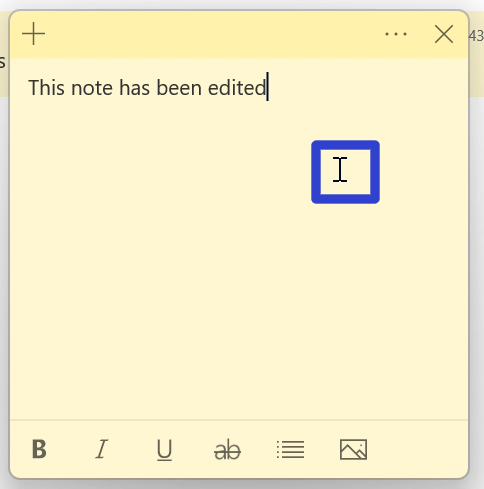
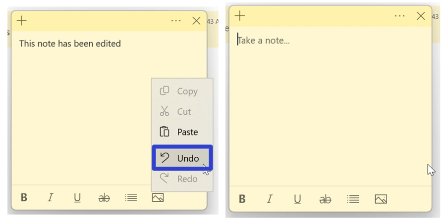
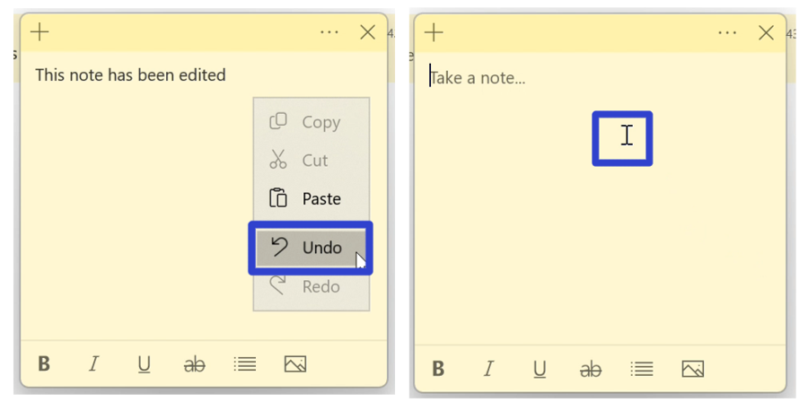
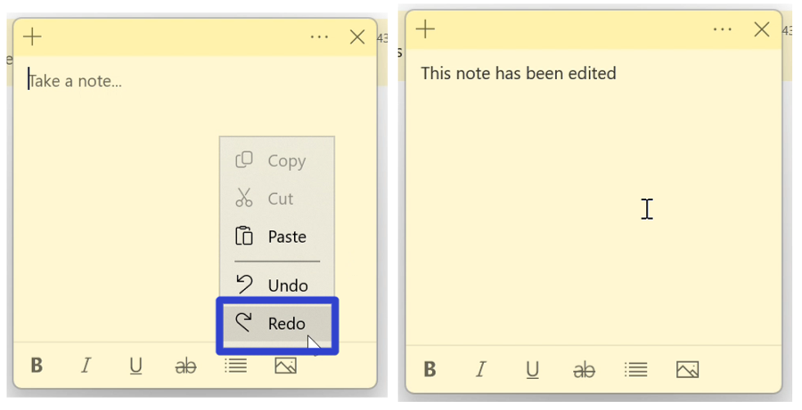
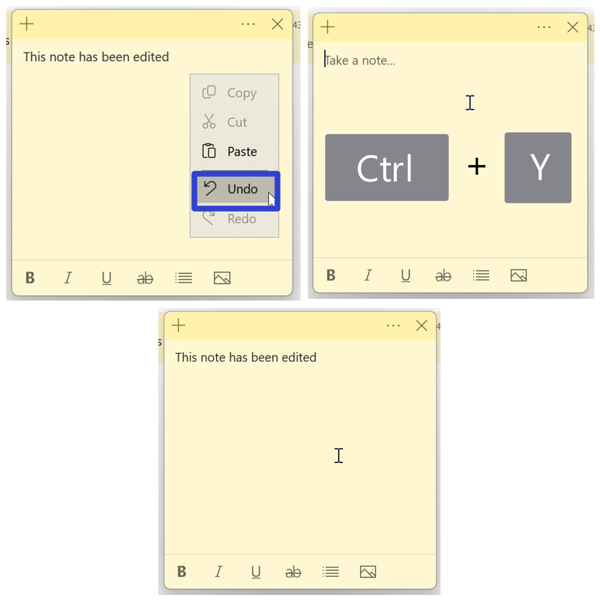

This tutorial covers:

## How to Undo:
1. [With Right Click](#1)
2. [With Keyboard Shortcut](#2)

## How to Redo:
1. [With Right Click](#3)
2. [With Keyboard Shortcut](#4)

 

No time to scroll down? Click through this presentation tutorial:

<iframe src="https://docs.google.com/presentation/d/e/2PACX-1vQs3geSJ6BPP_jlCwD6OX8Dj7tvShwxr0doiUFeoqCuRfJhQ1wK7LA8N4yjyDydEPvRxwAlBg6qJrbC/embed?start=false&loop=false&delayms=3000" frameborder="0" width="480" height="299" allowfullscreen="true" mozallowfullscreen="true" webkitallowfullscreen="true"></iframe>

 

Watch a tutorial video:
<iframe class="BLOG_video_class" allowfullscreen="" youtube-src-id="5bOIfnzRilk" width="100%" height="416" src="https://www.youtube.com/embed/5bOIfnzRilk"></iframe>

<h1 id="1">How to Undo With Right Click</h1>

* Step 1: First [edit](https://qhtutorials.github.io/posts/how-to-edit-a-sticky-note/) a sticky note. Right click anywhere in the note.  

* Step 2: In the menu that opens, click "Undo". The previous action is reversed. 

<h1 id="2">How to Undo With Keyboard Shortcut</h1>

* Step 1: [Edit](https://qhtutorials.github.io/posts/how-to-edit-a-sticky-note/) a sticky note. On the keyboard, press **Ctrl + Z**. The previous action is reversed. 

<h1 id="3">How to Redo With Right Click</h1>

* Step 1: First [undo](#1), then right click anywhere in the sticky note. 

* Step 2: In the menu that opens, click "Redo". The previous "Undo" is reversed.

 

<h1 id="4">How to Redo With Keyboard Shortcut</h1>

* Step 1: [Undo](#1) in a sticky note. On the keyboard press **Ctrl + Y**. The previous "Undo" is reversed. 

 

Save these instructions for later with this free [tutorial PDF](https://drive.google.com/file/d/1HteQMc8FBWjPfJKa71rcndN32M7ayQUd/view?usp=sharing).

 

