This tutorial covers:

## How to Select the Eraser: 
1. [With Click](#1)
2. [With Keyboard](#2)

## [How to Change Eraser Width](#3)

## How to Change Eraser Stroke:
1. [How to Erase Entire Stroke](#4)
2. [How to Erase Partial Stroke](#5)

## How to Select the Highlighter:
1. [With Click](#4)
2. [With Keyboard](#5)

## [How to Change Highlighter Width](#6)

## How to Change Highlighter Color:
1. [To Default Colors](#7)
2. [To Custom Colors](#8)

No time to scroll down? Click through this presentation tutorial:

<iframe src="https://docs.google.com/presentation/d/e/2PACX-1vQZNEeWxSEDC0qyapM9PRyZrtpE8AWmdEtyRd_xRkE25vbuf2tHdHw0Iq9lygYwGgTDp9NK9-akIr5D/embed?start=false&loop=false&delayms=3000" frameborder="0" width="480" height="299" allowfullscreen="true" mozallowfullscreen="true" webkitallowfullscreen="true"></iframe>

 

See a video tutorial:
<iframe class="BLOG_video_class" allowfullscreen="" youtube-src-id="3bSeJ0m7SvI" width="100%" height="416" src="https://www.youtube.com/embed/3bSeJ0m7SvI"></iframe>

 

<h1 id="1">How to Select the Eraser With Click</h1>

* Step 1: First [switch](https://qhtutorials.github.io/posts/how-to-use-ink-objects-in-whiteboard/) to Inking mode. On the bottom toolbar click the "Eraser" button. 
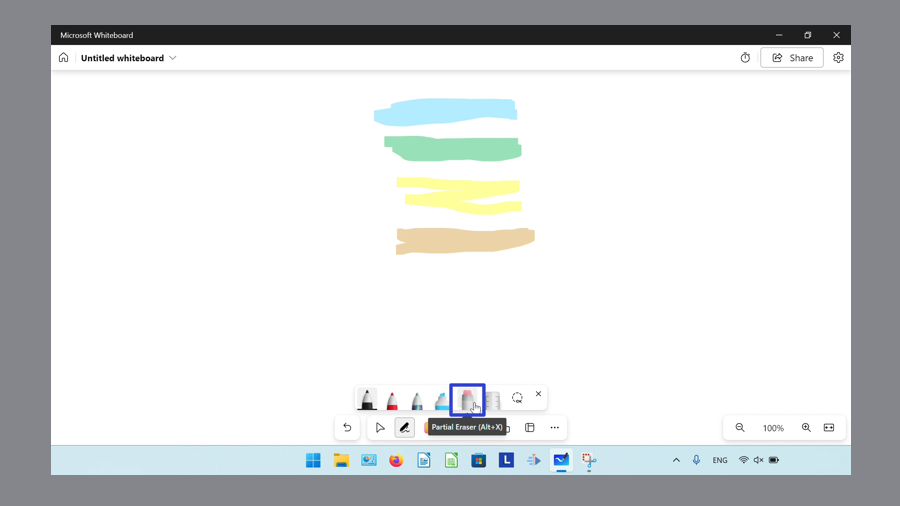

<h1 id="2">How to Select the Eraser With Keyboard</h1>

* Step 1: [Open](https://qhtutorials.github.io/posts/how-to-open-microsoft-whiteboard/) a whiteboard. On the keyboard press **Alt + X**. 
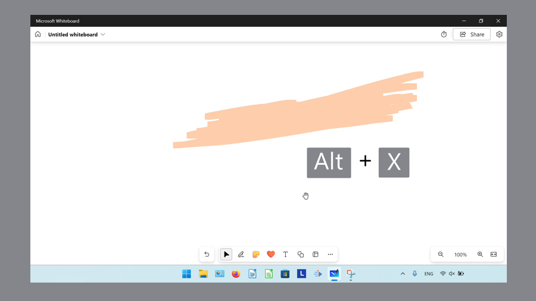

<h1 id="3">How to Change Eraser Width</h1>

* Step 1: First [select](#1) the Eraser. On the canvas, click and drag the eraser back and forth rapidly. The faster the eraser moves, the larger it becomes. 
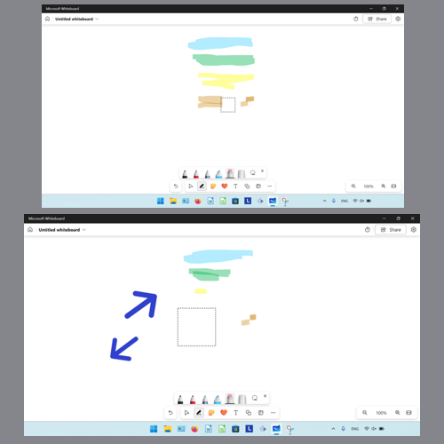

<h1 id="4">How to Erase Entire Stroke</h1>

* Step 1: [Switch](https://qhtutorials.github.io/posts/how-to-use-ink-objects-in-whiteboard/) to Inking mode. Double click the "Eraser" button. 

* Step 2: In the menu that opens, click "Erase entire stroke". 
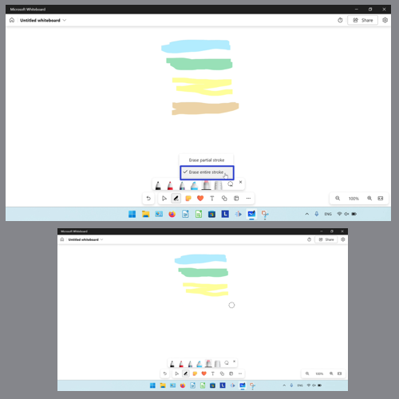

<h1 id="5">How to Erase Partial Stroke</h1>

* Step 1: First [switch](https://qhtutorials.github.io/posts/how-to-use-ink-objects-in-whiteboard/) to Inking mode. Double click the "Eraser" button. 

* Step 2: In the menu that opens, click "Erase partial stroke". 
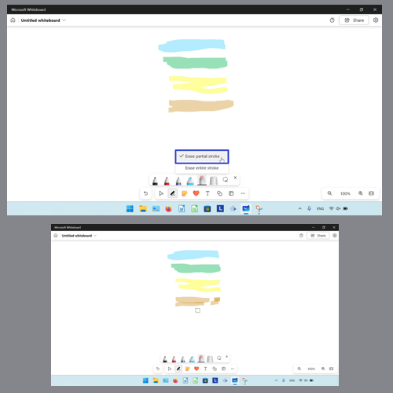

<h1 id="6">How to Select the Highlighter With Click</h1>

* Step 1: [Switch](https://qhtutorials.github.io/posts/how-to-use-ink-objects-in-whiteboard/) to Inking mode. Click the "Highlighter" button. 
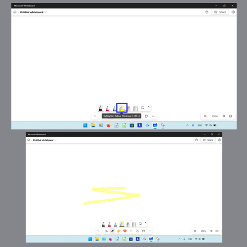

<h1 id="6">How to Select the Highlighter With Keyboard</h1>

* Step 1: First [open](https://qhtutorials.github.io/posts/how-to-open-microsoft-whiteboard/) a whiteboard. On the keyboard press **Alt + I**. 
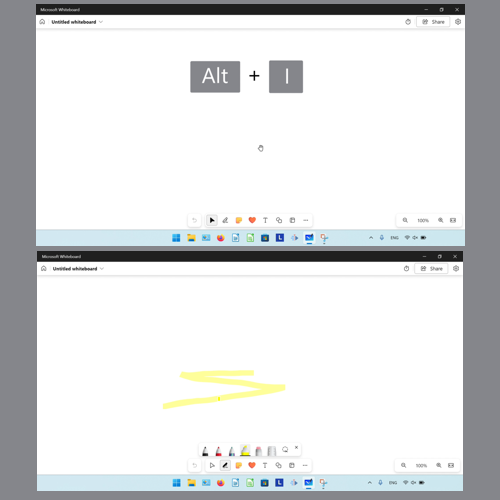

<h1 id="7">How to Change Highlighter Width</h1>

* Step 1: [Switch](https://qhtutorials.github.io/posts/how-to-use-ink-objects-in-whiteboard/) to Inking mode. Double click the "Highlighter" button. 
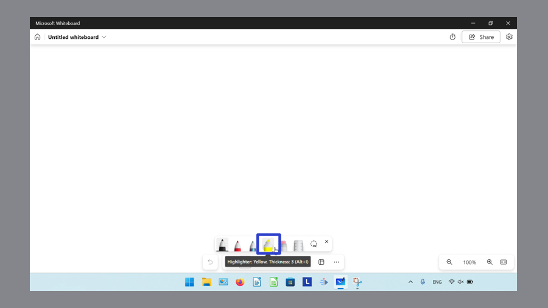

* Step 2: In the menu that opens, click and drag the slider at the top. 
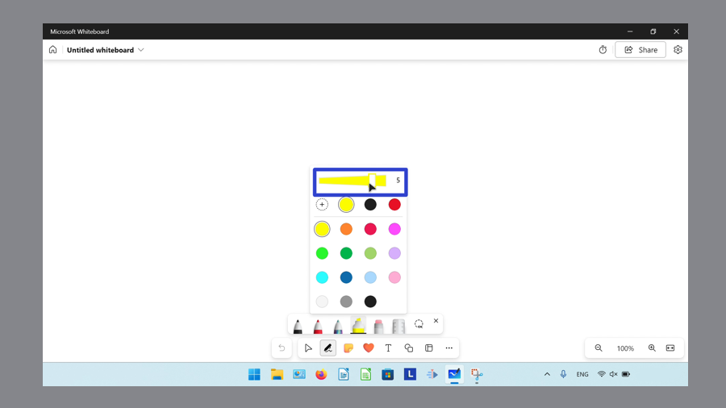

<h1 id="8">How to Change the Highlighter Color to Default Colors</h1>

* Step 1: First [switch](https://qhtutorials.github.io/posts/how-to-use-ink-objects-in-whiteboard/) to Inking mode. Double click the "Highlighter" button. 

* Step 2: In the menu that opens, click to select a color. 
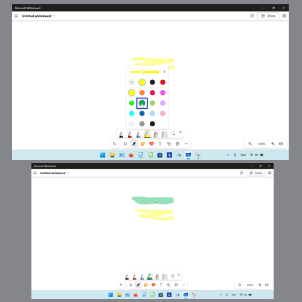

<h1 id="9">How to Change the Highlighter Color to Custom Colors</h1>

* Step 1: [Switch](https://qhtutorials.github.io/posts/how-to-use-ink-objects-in-whiteboard/) to Inking mode. Double click the "Highlighter" button. 

* Step 2: In the menu that opens, click the "More colors" button. 
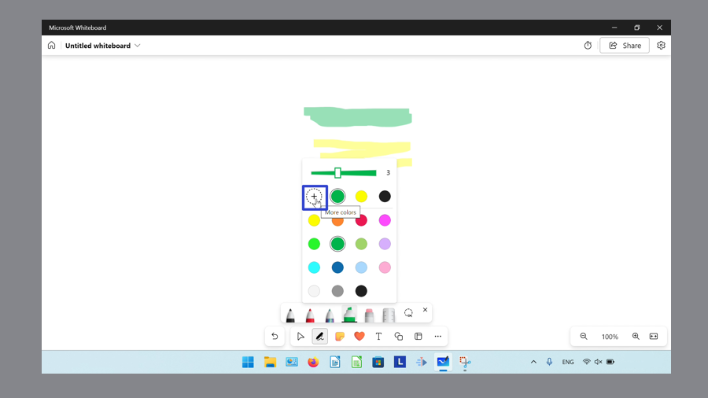

* Step 3: In the window that opens, under "Spectrum" click and drag the slider to browse different colors, then click inside the square to select a color. Alternatively, type a value in the "Hex" field. 
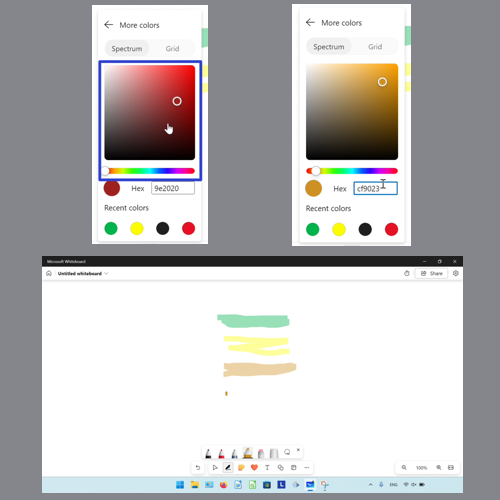

* Alternatively, click the "Grid" button and click to select a color swatch. 
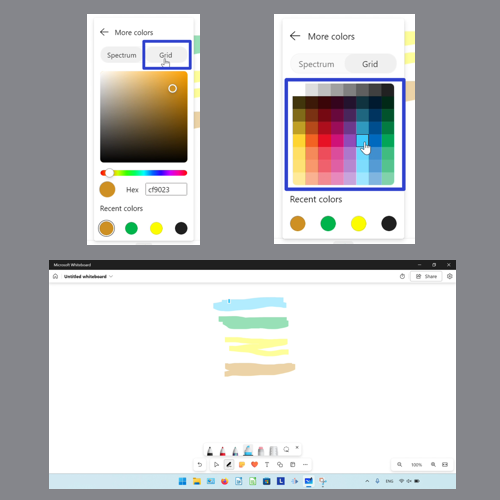

Keep a copy of these instructions for later with this free [tutorial PDF](https://drive.google.com/file/d/1sCSr9tpQj9E1kQIocw1ssQed7NIQoz3d/view?usp=sharing).

 

