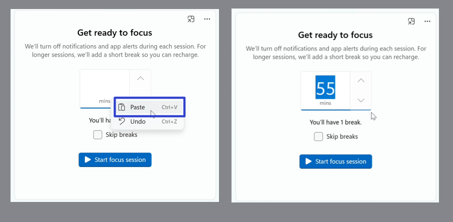
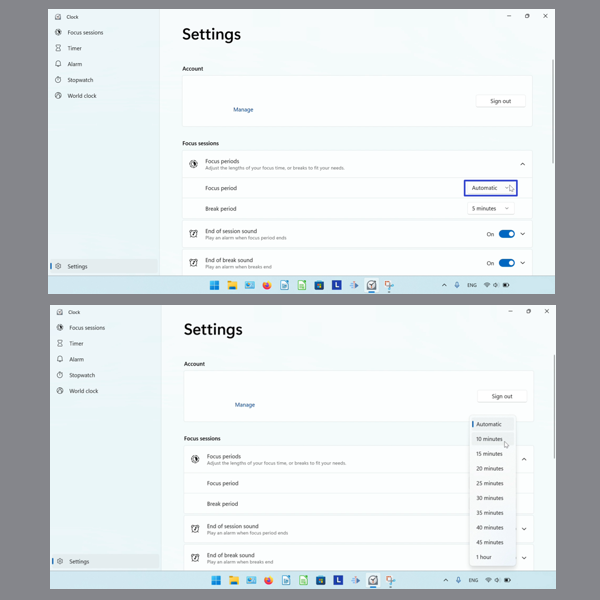

This tutorial covers:

## How to Edit Focus Session Length:
1. [With Click](#1)
2. [With Keyboard](#2)
3. [With Right Click](#3)
4. [With Keyboard Shortcuts](#4)
5. [With Settings](#5)
6. [With Default Length](#6)

## [How to Set the Number of Breaks in a Focus Session](#7)

## [How to Set Break Length in a Focus Session](#8)

## [How to Customize End of Session Sound](#9)

## [How to Customize End of Break Sound](#10)

## [How to Integrate Focus Sessions With Spotify](#11)

No time to scroll down? Click through this tutorial presentation:

<iframe src="https://docs.google.com/presentation/d/1i50ROaexZ8pTHceLMmXRIoxXVz2xc1TKZ2M1LmPBsbU/embed?start=false&loop=false&delayms=3000" frameborder="0" width="480" height="299" allowfullscreen="true" mozallowfullscreen="true" webkitallowfullscreen="true"></iframe>

 

See a video tutorial:
<iframe class="BLOG_video_class" allowfullscreen="" youtube-src-id="7WaMAGIkE1I" width="100%" height="416" src="https://www.youtube.com/embed/7WaMAGIkE1I"></iframe>

 

<h1 id="1">How to Edit Focus Session Length With Click</h1>

* Step 1: First [switch](https://qhtutorials.github.io/posts/how-to-edit-windows-clock-settings/) to Focus Sessions mode. Click the up arrow to increase the time. 

* Click the down arrow to decrease the time. 

<h1 id="2">How to Edit Focus Session Length With Keyboard</h1>

Step 1: [Switch](https://qhtutorials.github.io/posts/how-to-edit-windows-clock-settings/) to Focus Sessions mode. Click the time, and on the keyboard type a number. 

<h1 id="3">How to Edit Focus Session Length With Right Click</h1>

Step 1: First [switch](https://qhtutorials.github.io/posts/how-to-edit-windows-clock-settings/) to Focus Sessions mode. Right click the time do one of the following: 

 
- Click "Select all" to select the number. 

 
- Click "Copy" to copy the number. 

 
- Click "Cut" to cut the number. 

 
- Click "Paste" to paste the number. 

 
- Click "Undo" to reverse the last action. 

 
- Click "Redo" to reverse the last Undo. 

 

<h1 id="4">How to Edit Focus Session Length With Keyboard Shortcuts</h1>

* Step 1: [Switch](https://qhtutorials.github.io/posts/how-to-edit-windows-clock-settings/) to the Focus Sessions mode. Click the time, and on the keyboard:
- Press **Ctrl + A** to select the number. 

 
- Press **Ctrl + C** to copy the number. 

 
- Press **Ctrl + X** to cut the number. 

 
- Press **Ctrl + V** to paste the number. 

 
- Press **Ctrl + Z** to Undo. 

 
- Press **Ctrl + Y** to Redo. 

 

<h1 id="5">How to Edit Focus Session Length With Settings</h1>

* Step 1: First [open](https://qhtutorials.github.io/posts/how-to-open-microsoft-windows-clock/) Windows Clock. In the lower left click the "Settings" or gear button. 

 
* Step 2: On the far right side of the "Focus periods" section, click the drop-down menu arrow. 

 
* Step 3: Click the drop-down menu arrow on the right of the "Focus period" section, and click to select a time. 

 

<h1 id="6">How to Edit Focus Session Length With Default Length</h1>

* Step 1: [Switch](https://qhtutorials.github.io/posts/how-to-edit-windows-clock-settings/) to Focus Sessions mode and click the "See more" or "..." button. 

 
* Step 2: In the menu that opens, click "Use default focus session length". 

 

<h1 id="7">How to Set the Number of Breaks in a Focus Session</h1>

* Step 1: First [switch](https://qhtutorials.github.io/posts/how-to-edit-windows-clock-settings/) to Focus Sessions mode. Click the up arrow to increase the time to greater than 30 minutes. 

 
* As the time increases, the number of breaks increases:

- 30 minutes = 1 break
- 80 minutes = 2 breaks
- 110 minutes = 3 breaks
- 125 minutes = 4 breaks
- 155 minutes = 5 breaks
- 185 minutes = 6 breaks
- 200 minutes = 7 breaks
- 230 minutes = 8 breaks 

 

 

<h1 id="8">How to Set Break Length in a Focus Session</h1>

* Step 1: [Switch](https://qhtutorials.github.io/posts/how-to-edit-windows-clock-settings/) to the Focus Sessions mode. Click the "See more" or "..." button. 

 
* Step 2: In the menu that opens, click "View settings". 

* Step 3: On the far right side of the "Focus periods" section, click the drop-down menu arrow. 

 
* Step 4: On the far right side of the "Break period" section, click the drop-down menu arrow, and click to select "5 minutes", "10 minutes", or "15 minutes". 

<h1 id="9">How to Customize the End of Session Sound</h1>

* Step 1: First [open](https://qhtutorials.github.io/posts/how-to-open-microsoft-windows-clock/) Windows Clock. In the lower left click the "Settings" or gear button. 

* Step 2: On the far right side of the "End of session sound" section, click to turn the sound on or off. 

* Step 3: On the far right side of the "End of session sound" section, click the drop-down menu arrow. 

* Step 4: Click the "Alarm sound" drop-down menu, and click to select a sound. 

<h1 id="10">How to Customize End of Break Sound</h1>

* Step 1: [Open](https://qhtutorials.github.io/posts/how-to-open-microsoft-windows-clock/) Windows Clock. In the lower left click the "Settings" or gear button.  

* Step 2: On the far right side of "End of break sound" section, click to turn the sound on or off. 

* Step 3: On the far right side of the "End of break sound" section, click the drop-down menu arrow. 

* Step 4: Click the "Alarm sound" drop-down menu, and click to select a sound. 

<h1 id="">How to Integrate Focus Sessions With Spotify</h1>

* Step 1: First [open](https://qhtutorials.github.io/posts/how-to-open-microsoft-windows-clock/) Windows Clock. In the lower left the "Settings" or gear button. 

* Step 2: Scroll down and on the far right side of the "Spotify" section, click to turn Spotify integration on or off. 

Save these instructions for later with this free [PDF tutorial](https://drive.google.com/file/d/1qET8OWVlLrNgVdJG_jrAgv_2uuBL9mZc/view?usp=sharing).

 

