This tutorial covers:

## How to Switch to Inking Mode:
1. [With Click](#1)
2. [With Keyboard Shortcut](#2)

## [How to Insert an Ink Object](#3)

## How to Switch the Pen:
1. [How to Switch to the First Pen With Click](#4)
2. [How to Switch to the First Pen With Keyboard Shortcut](#5)
3. [How to Switch to the Second Pen With Click](#6)
4. [How to Switch to the Second Pen With Keyboard Shortcut](#7)
5. [How to Switch to the Third Pen With Click](#8)
6. [How to Switch to the Third Pen With Keyboard Shortcut](#9)
7. [How to Switch to the Single Arrow Tip With Click](#10)
8. [How to Switch to the Single Arrow Tip With Keyboard Shortcut](#11)
9. [How to Switch to the Double Arrow Tip With Click](#12)
10. [How to Switch to the Double Arrow Tip With Keyboard Shortcut](#13)

## How to Draw Straight Lines:
1. [With Ruler](#14)
2. [With Keyboard](#15)
3. [With Touch Screen](#16)

## [How to Change Pen Width](#17)

## How to Change Pen Opacity:
1. [By Default](#18)
2. [With Menu](#19)

## How to Change Pen Color:
1. [To Default Colors](#20)
2. [To Custom Colors](#21)

No time to scroll down? Click through these tutorial slides:

<iframe src="https://docs.google.com/presentation/d/e/2PACX-1vRNp47Y50OoL8luIsr4eJ6TaJ6FvnnNRPofqDmYBTn9YBS640RK2WLr9lFvriwx1qm_XovNS3HM_cHk/embed?start=false&loop=false&delayms=3000" frameborder="0" width="480" height="299" allowfullscreen="true" mozallowfullscreen="true" webkitallowfullscreen="true"></iframe>

 

Watch a tutorial video:
<iframe class="BLOG_video_class" allowfullscreen="" youtube-src-id="e6S67M4-_ow" width="100%" height="416" src="https://www.youtube.com/embed/e6S67M4-_ow"></iframe>

 

<h1 id="1">How to Switch to Inking Mode With Click</h1>

* Step 1: First [open](https://qhtutorials.github.io/posts/how-to-open-microsoft-whiteboard/) a whiteboard. On the bottom toolbar click the "Inking" button. 
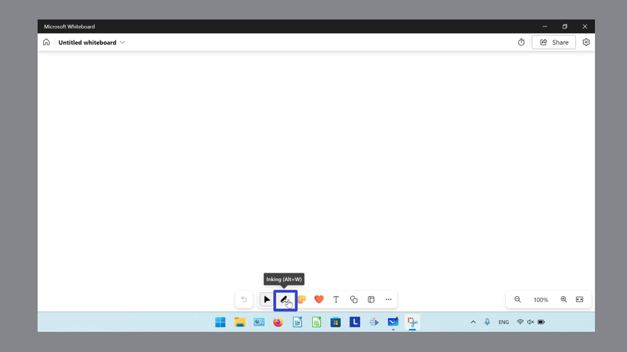

<h1 id="2">How to Switch to Inking Mode With Keyboard Shortcut</h1>

* Step 1: [Open](https://qhtutorials.github.io/posts/how-to-open-microsoft-whiteboard/) a whiteboard. On the keyboard press **Alt + W**. 

<h1 id="3">How to Insert an Ink Object</h1>

* Step 1: First [switch](#1) to Inking mode. Click and drag the mouse to draw an Ink object on the canvas. 
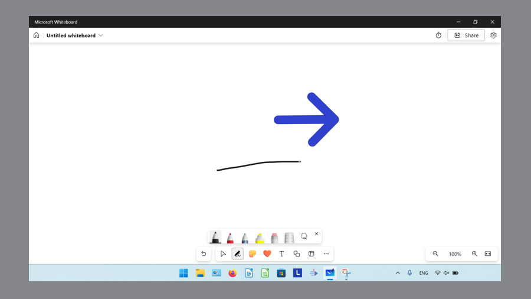

<h1 id="4">How to Switch to the First Pen With Click"</h1>

* Step 1: [Switch](#1) to Inking mode. In the menu that opens, click the first pen button. 
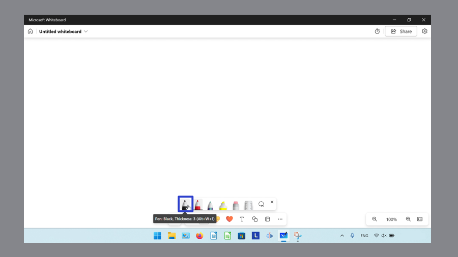

<h1 id="5">How to Switch to the First Pen With Keyboard Shortcut</h1>

* Step 1: First [open](https://qhtutorials.github.io/posts/how-to-open-microsoft-whiteboard/) a whiteboard. On the keyboard press **Alt + W + 1**. 
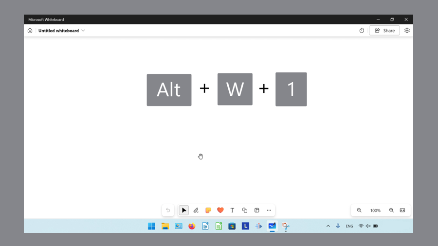

<h1 id="6">How to Switch to the Second Pen With Click</h1>

* Step 1: [Switch](#1) to Inking mode. In the menu that opens, click the second pen button. 
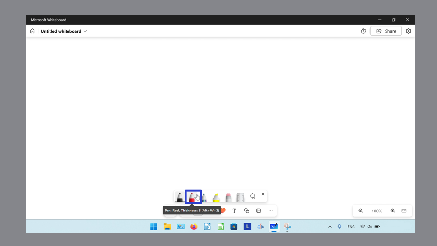

<h1 id="7">How to Switch to the Second Pen With Keyboard Shortcut</h1>

* Step 1: First [open](https://qhtutorials.github.io/posts/how-to-open-microsoft-whiteboard/) a whiteboard. On the keyboard press **Alt + W + 2**. 
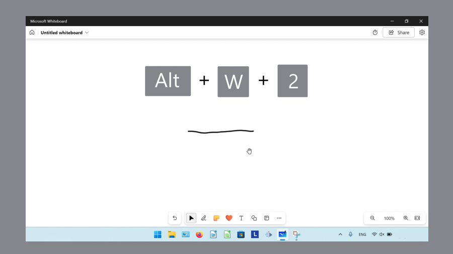

<h1 id="8">How to Switch to the Third Pen With Click</h1>

* Step 1: [Switch](#1) to Inking mode. In the menu that opens, click the third pen button. 
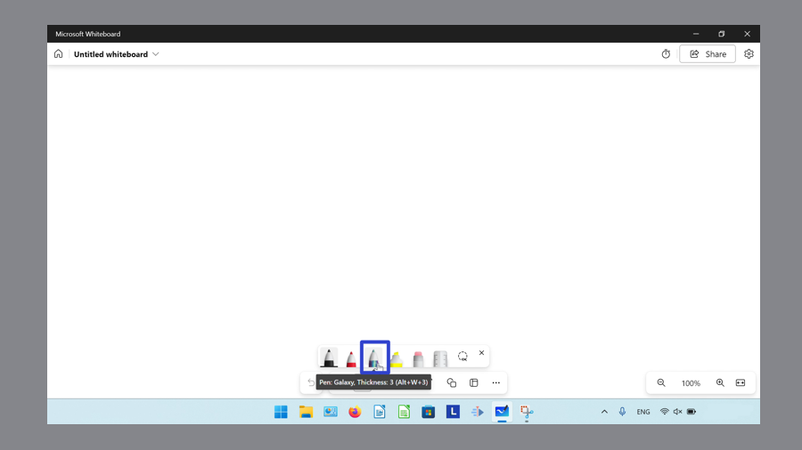

<h1 id="9">How to Switch to the Third Pen With Keyboard Shortcut</h1>

* Step 1: First [open](https://qhtutorials.github.io/posts/how-to-open-microsoft-whiteboard/) a whiteboard. On the keyboard press **Alt + W + 3**. 
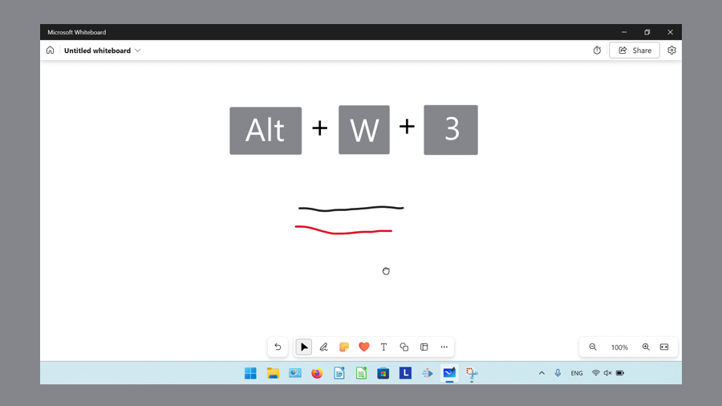

<h1 id="10">How to Switch to Single Arrow Tip With Click</h1>

* Step 1: [Switch](#1) to Inking mode. Double click a pen. 
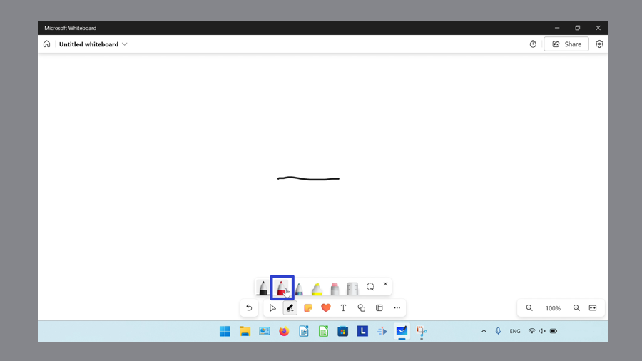

* Step 2: In the menu that opens, click the "Single arrow tip" button. 
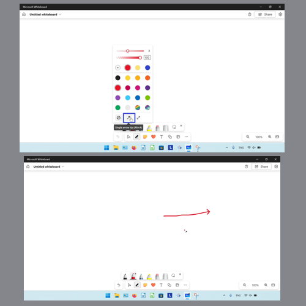

* Step 3: To switch back to the pen, click a pen and in the menu that opens, click the "No arrow" button. 
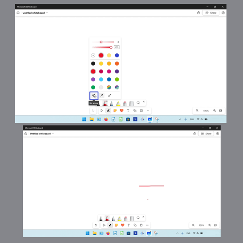

<h1 id="11">How to Switch to Single Arrow Tip With Keyboard Shortcut</h1>

* Step 1: First [open](https://qhtutorials.github.io/posts/how-to-open-microsoft-whiteboard/) a whiteboard. On the keyboard press **Alt + A**. Press **Alt + A** again to switch back to the pen. 
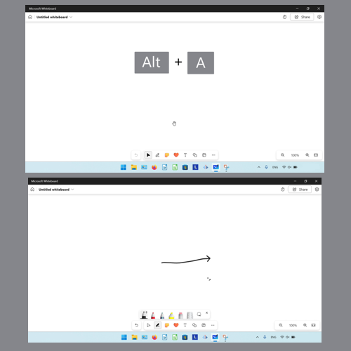

<h1 id="12">How to Switch to Double Arrow Tip With Click</h1>

* Step 1: [Switch](#1) to Inking mode. Double click a pen. 
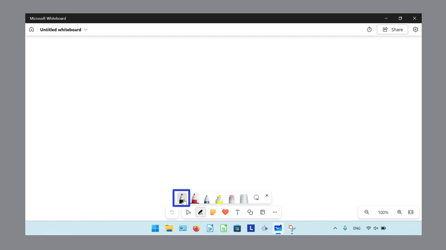

* Step 2: In the menu that opens, click the "Double arrow tips" button. To switch back to the pen, click the pen and in the menu click the "No arrow" button. 
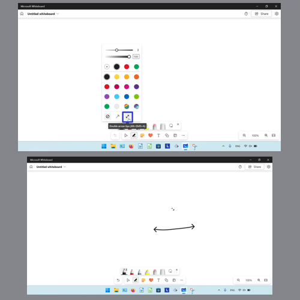

<h1 id="13">How to Switch to Double Arrow Tip With Keyboard Shortcut</h1>

* Step 1: First [open](https://qhtutorials.github.io/posts/how-to-open-microsoft-whiteboard/) a whiteboard. On the keyboard press **Alt + Shift + A**. Press **Alt + Shift + A** again to switch back to the pen. 
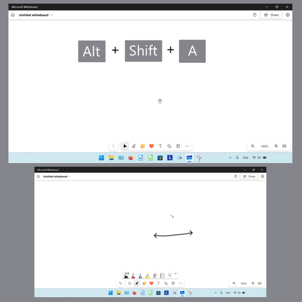

<h1 id="14">How to Draw a Straight Line With the Ruler</h1>

* Step 1: [Open](https://qhtutorials.github.io/posts/how-to-open-microsoft-whiteboard/) a whiteboard. On the keyboard press **Alt + R**. 
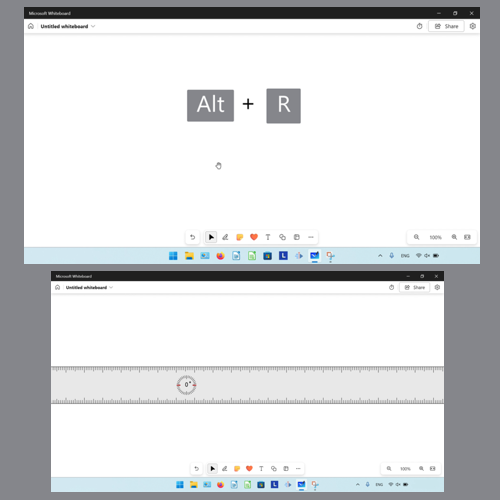
 
* Step 2: Click the "Inking" button, and draw a line next to the ruler. 
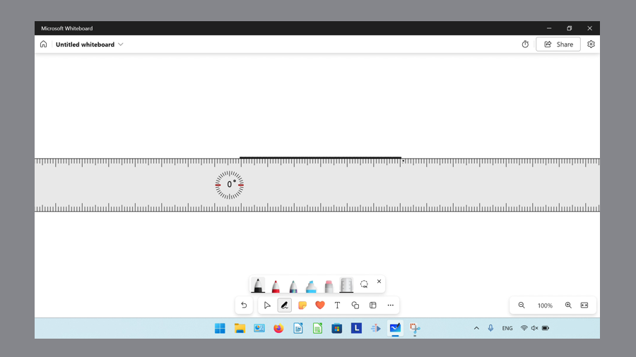

<h1 id="15">How to Draw a Straight Line With the Keyboard</h1>

* Step 1: First [switch](#1) to Inking mode. On the keyboard, hold **Shift**, then click and drag with the mouse to draw a line. 
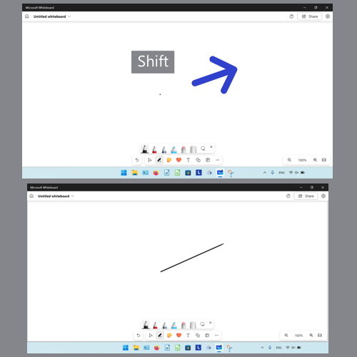

<h1 id="16">How to Draw a Straight  Line With Touch Screen</h1>

* Step 1: [Switch](#1) to Inking mode. With one finger, draw a line on the touch screen, then press and hold for several seconds. Microsoft Whiteboard automatically straightens the line. 
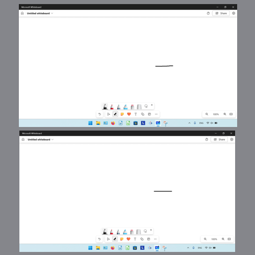

<h1 id="17">How to Change Pen Width</h1>

* Step 1: First [switch](#1) to Inking mode. Double click a pen. 

* Step 2: In the menu that opens, click and drag the slider at the top. 
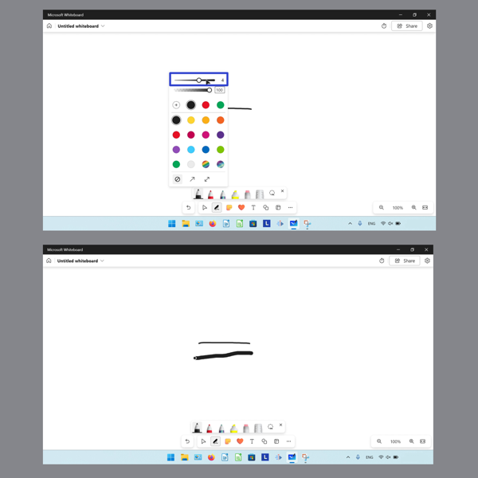

<h2 id="18">How to Change Pen Opacity by Default</h1>

* Step 1: [Switch](#1) to Inking mode. Double click a pen. 

* Step 2: In the menu that opens, click and drag the second slider, or type a number in the field. 
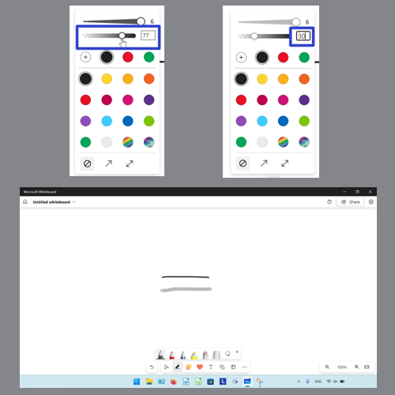

<h1 id="19">How to Change Pen Opacity With Menu</h1>

* Step 1: First [switch](#1) to Inking mode. Double click a pen. 

* Step 2: In the menu that opens, click the "More colors" button. 
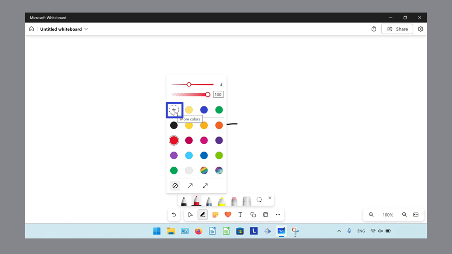

* Step 3: In the window that opens, under "Spectrum" click and drag the second slider. Alternatively, click the "Grid" button, then click and drag the slider. 
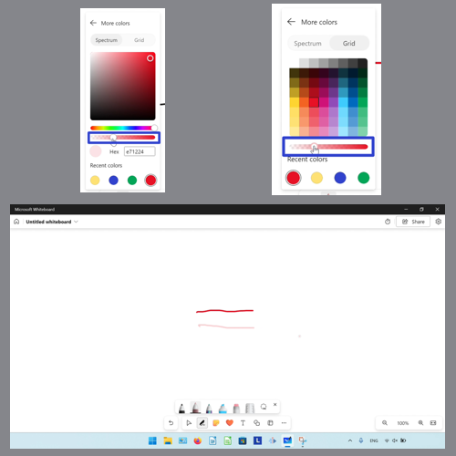

<h1 id="20">How to Change Pen Color to Default Colors</h1>

* Step 1: [Switch](#1) to Inking mode. Double click a pen. 

* Step 2: In the menu that opens, click to select a color. 
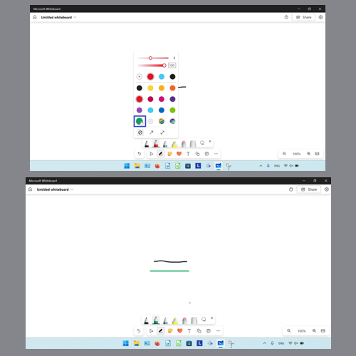

<h1 id="21">How to Change Pen Color to Custom Colors</h1>

* Step 1: First [switch](#1) to Inking mode. Double click a pen. 

* Step 2: In the menu that opens, click the "More colors" button. 

* Step 3: In the window that opens, under "Spectrum" click and drag the first slider to browse the different colors, and click inside the square to select a color. Alternatively, type a value in the "Hex" field. 
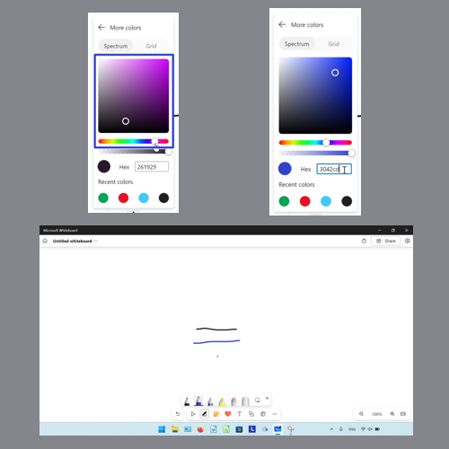

* Alternatively, click the "Grid" button, then click to select a color swatch. 
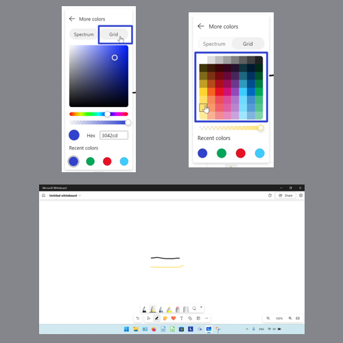

Save a copy of these instructions for later with this free [PDF tutorial](https://drive.google.com/file/d/1cj_BBdshwwPUOhHTtt3w_sozsDti7mXc/view?usp=sharing).

 

