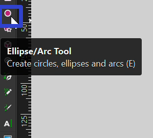
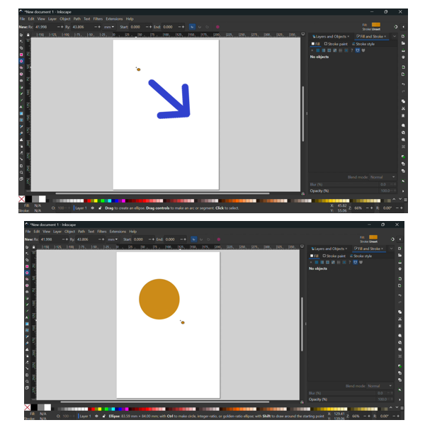
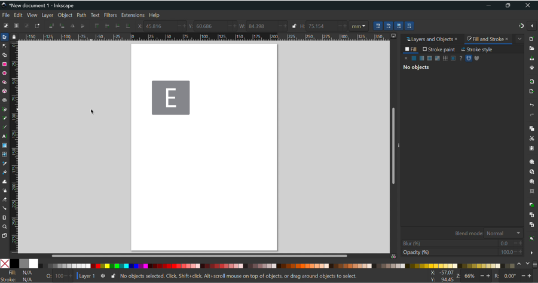
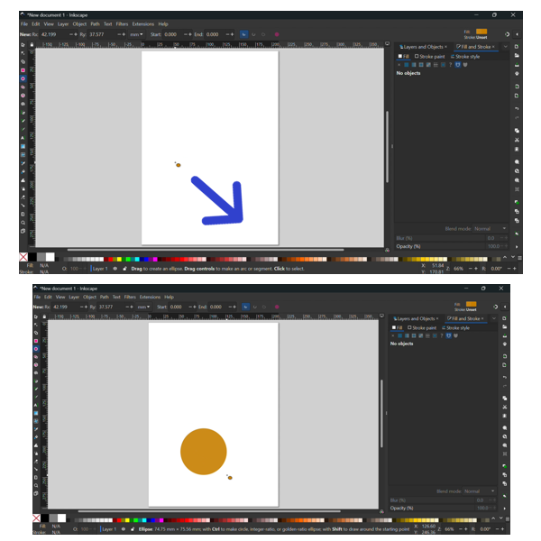
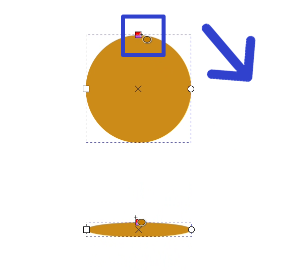
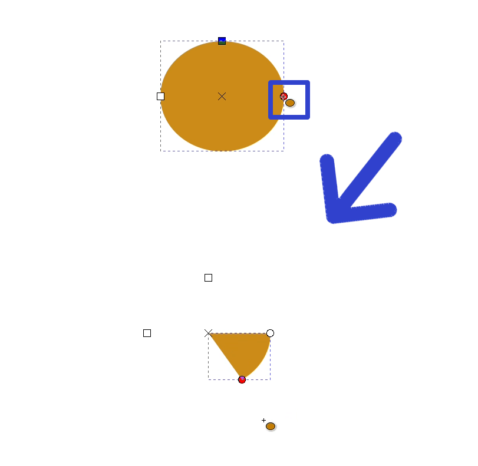

This tutorial covers:

## How to Insert a Circle:
1. [With Mouse](#1)
2. [With Keyboard](#2)

## [How to Resize a Circle](#3)

## [How to Edit the Circle Shape](#4)

No time to scroll down? Click through this tutorial presentation:

<iframe src="https://docs.google.com/presentation/d/e/2PACX-1vRxZ09fE18oTUyMaiW238xP7WAjuNrhSe9t_tAApb_gYCRwJl7OVo8BFb6Md1YAge_NNgXFyg64USNI/embed?start=false&loop=false&delayms=3000" frameborder="0" width="480" height="299" allowfullscreen="true" mozallowfullscreen="true" webkitallowfullscreen="true"></iframe>

 

Follow along with a video tutorial:
<iframe class="BLOG_video_class" allowfullscreen="" youtube-src-id="Pd2mdQx2jik" width="100%" height="416" src="https://www.youtube.com/embed/Pd2mdQx2jik"></iframe>

 

<h1 id="1">How to Insert a Circle With Mouse</h1>

* Step 1: First click the Circle tool.  

 
* Step 2: Click and drag the mouse on the canvas to create a circle. 

 

<h1 id="2">How to Insert a Circle With Keyboard</h1>

* Step 1: On the keyboard press **E**. 

 
* Step 2: Click and drag the mouse on the canvas to create a circle. 

<h1 id="3">How to Resize a Circle</h1>
 
* Step 1: First [insert](#1) a circle. Click, hold, and drag the square sizing handle. 

* To resize a rectangle proportionally, hold the **Shift** key, then click and drag to resize. 

<h1 id ="4">How to Edit the Circle Shape</h1>

* Step 1: [Insert](#1) a circle. Click, hold, and drag the circle handle to adjust the arc of the circle. 

Refer to these instructions for later with this free [tutorial PDF](https://drive.google.com/file/d/1U41q4kaebvf2c13tlGhxMI_0vs4OhMCp/view?usp=sharing).

 

