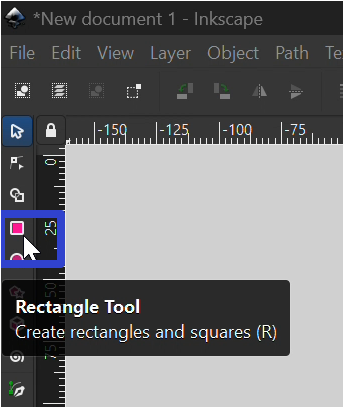
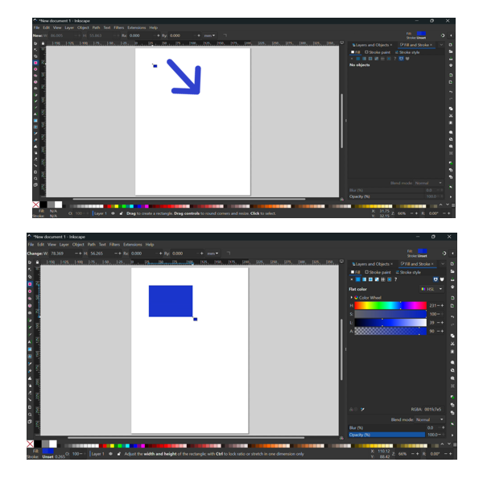
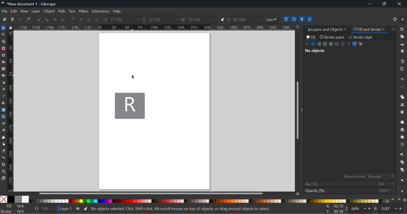
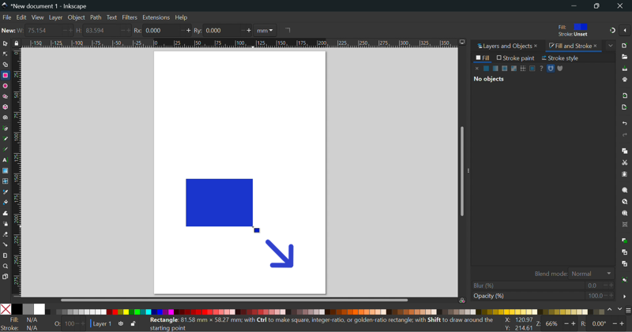
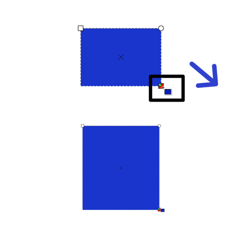
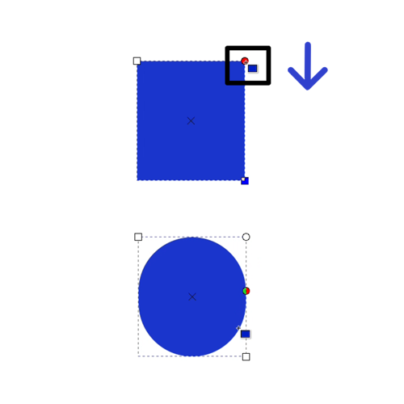

This tutorial covers:

## How to Insert a Rectangle:
1. [With Mouse](#1)
2. [With Keyboard](#2)

## [How to Resize a Rectangle](#3)

## [How to Edit the Rectangle Shape](#4)

No time to scroll down? Click through this presentation tutorial:

<iframe src="https://docs.google.com/presentation/d/e/2PACX-1vSwfl54CVkW7IffXsYdscB_ZCHquyFTXMrwGdtJiIehz89h5Nf2Zf99jpG5QmVK0Z7v17RXR7bPYoAz/embed?start=false&loop=false&delayms=3000" frameborder="0" width="480" height="299" allowfullscreen="true" mozallowfullscreen="true" webkitallowfullscreen="true"></iframe>

 

See a with a tutorial video:
<iframe class="BLOG_video_class" allowfullscreen="" youtube-src-id="faExizJfT-g" width="100%" height="416" src="https://www.youtube.com/embed/faExizJfT-g"></iframe>

 

<h1 id="1">How to Insert a Rectangle With Mouse</h1>

* Step 1: First click the Rectangle tool.  

 
* Step 2: Click and drag the mouse on the canvas to create a rectangle. 

 

<h1 id="2">How to Insert a Rectangle With Keyboard</h1>

* Step 1: On the keyboard press **R**. 

 
* Step 2: Click and drag the mouse on the canvas to create a rectangle. 

<h1 id="3">How to Resize a Rectangle</h1>
 
* Step 1: First [insert](#1) a rectangle. Click, hold, and drag the square sizing handle. 

* To resize a rectangle proportionally, hold the **Shift** key, then click and drag to resize. 

<h1 id ="4">How to Edit the Rectangle Shape</h1>

* Step 1: [Insert](#1) a rectangle. Click, hold, and drag the circle handle to make the rectangle edges more round. 

Save these instructions for later with this free [PDF tutorial](https://drive.google.com/file/d/1fbvxebAHMAuvuZJzzmYM1s27jhn2DIem/view?usp=sharing).

 

