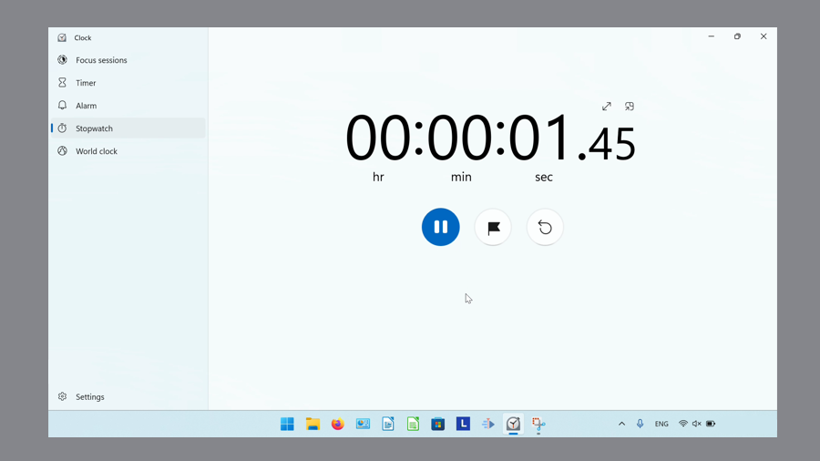

This tutorial covers:

## [How to Start the Stopwatch](#1)

## [How to Pause the Stopwatch](#2)

## [How to Add a Lap/Split](#3)

## [How to Reset the Stopwatch](#4)

No time to scroll down? Click through these tutorial slides:

<iframe src="https://docs.google.com/presentation/d/1nKhPe-I6RT9edU3edwUKQArr_6v3omkb5V4jC-yDFpw/embed?start=false&loop=false&delayms=3000" frameborder="0" width="480" height="299" allowfullscreen="true" mozallowfullscreen="true" webkitallowfullscreen="true"></iframe>

 

Watch a video tutorial:
<iframe class="BLOG_video_class" allowfullscreen="" youtube-src-id="_GPZUJbEP2o" width="100%" height="416" src="https://www.youtube.com/embed/_GPZUJbEP2o"></iframe>

 

<h1 id="1">How to Start the Stopwatch</h1>

* Step 1: First [switch](https://qhtutorials.github.io/posts/how-to-edit-windows-clock-settings/) to Stopwatch mode. Click the "Start" button.  

 
* The Stopwatch starts running. 

 

<h1 id="2">How to Pause the Stopwatch</h1>

* Step 1: [Start](#1) to the Stopwatch. Click the "Pause" button. 

 
* The Stopwatch pauses. 

<h1 id="3">How to Add a Lap/Split</h1>
 
* Step 1: First [start](#1) the Stopwatch. Click an "Laps / Splits" button. 

* Step 2: Continue clicking the "Laps / Splits" button to add multiple laps or splits. 

* Step 3: Right click the data. 

* Step 4: In the menu that opens, click to select an option to copy the data. 

<h1 id="4">How to Reset the Stopwatch</h1>

* Method 1: [Pause](#2) the Stopwatch. Click the "Reset" button. 

* The Stopwatch resets the time. 

 

Save these instructions for later with this free [tutorial PDF](https://drive.google.com/file/d/14LmcfYujYlzdQnuC7VXEAb20ggFvbpQx/view?usp=sharing).

 

