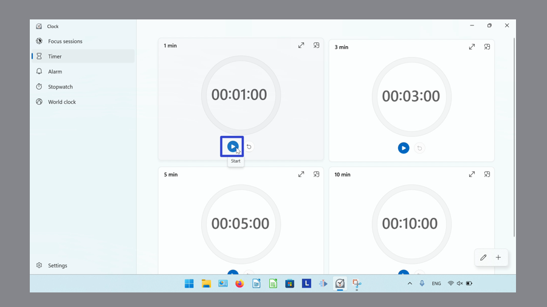
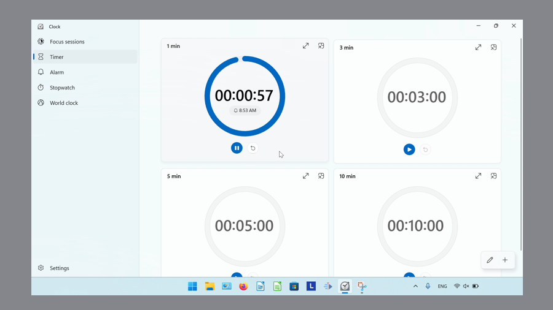
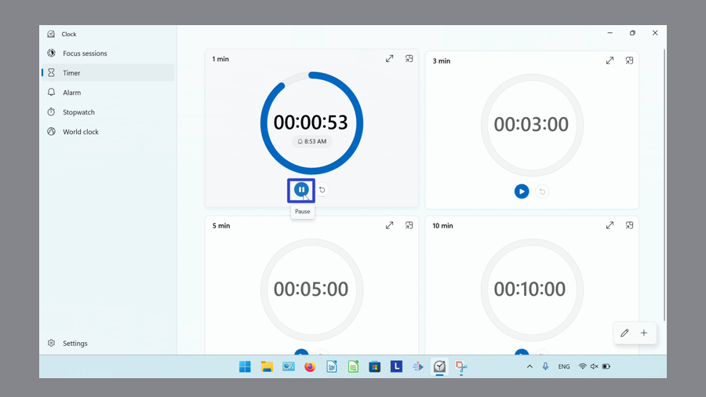
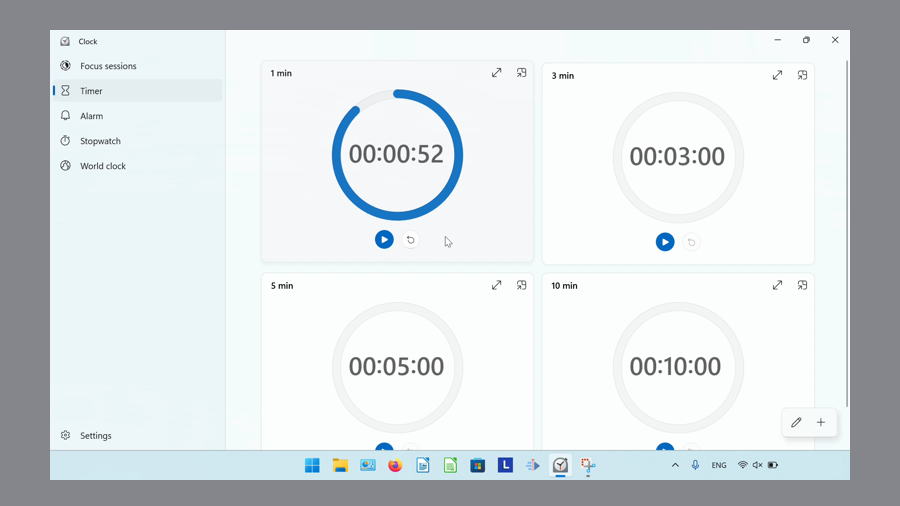
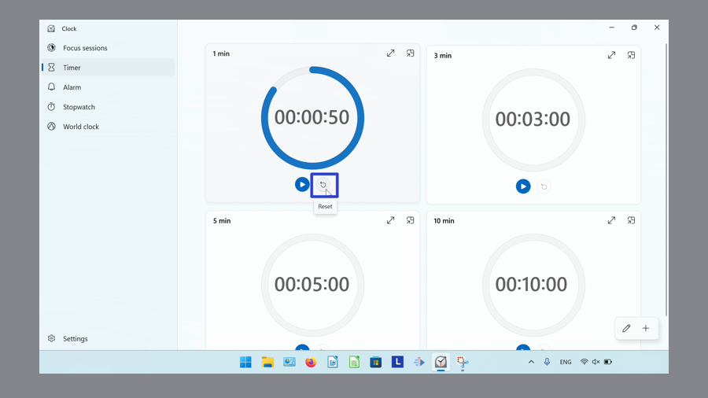
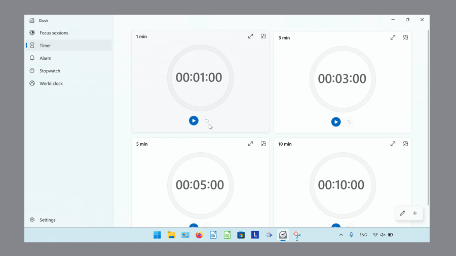

This tutorial covers:

## [How to Start the Timer](#1)

## [How to Pause the Timer](#2)

## [How to Reset the Timer](#3)

No time to scroll down? Click through this tutorial presentation:

<iframe src="https://docs.google.com/presentation/d/1kpyoHfZAiRKaXowpiUFjB3kZcpWProgbgKd3WWogrKQ/embed?start=false&loop=false&delayms=3000" frameborder="0" width="480" height="299" allowfullscreen="true" mozallowfullscreen="true" webkitallowfullscreen="true"></iframe>

 

Watch a video tutorial:
<iframe class="BLOG_video_class" allowfullscreen="" youtube-src-id="ns22Pzf5n28" width="100%" height="416" src="https://www.youtube.com/embed/ns22Pzf5n28"></iframe>

 

<h1 id="1">How to Start the Timer</h1>

* Step 1: First [switch](https://qhtutorials.github.io/posts/how-to-edit-windows-clock-settings/) to Timer mode. Click the "Start" button. 

* The Timer starts. 

<h1 id="2">How to Pause the Timer</h1>

Step 1: [Start](#1) a Timer. Click the "Pause" button. 

* The Timer pauses. 

<h1 id="3">How to Reset the Timer</h1>

* Step 1: First [pause](#2) a Timer. Click the "Reset" button. 

* The Timer resets. 

Refer to these instructions for later with this free [tutorial PDF](https://drive.google.com/file/d/1Yq95a5u7Kkl7MAkVtOTOFXIzX9LqTzBJ/view?usp=sharing).

 

