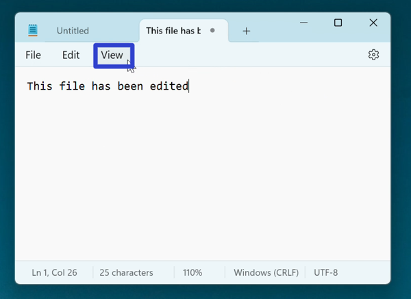

This tutorial covers:

## How to Zoom In:
1. [With Menu](#1)
2. [With Keyboard Shortcut](#2)

## How to Zoom Out:
1. [With Menu](#3)
2. [With Keyboard Shortcut](#4)

## How to Restore Default Zoom:
1. [With Menu](#5)
2. [With Keyboard Shortcut](#6)

 

No time to scroll down? Click through this tutorial presentation:

<iframe src="https://docs.google.com/presentation/d/e/2PACX-1vRTKhsrJytS1on9_WXRt_KtfmvJUw3jHO5gltjIj7bZoZpumIVmRWmuj1LhZHynVA8bWQezO3Tw7Tos/embed?start=false&loop=false&delayms=3000" frameborder="0" width="480" height="299" allowfullscreen="true" mozallowfullscreen="true" webkitallowfullscreen="true"></iframe>

 

Follow along with a video tutorial:
<iframe class="BLOG_video_class" allowfullscreen="" youtube-src-id="fPEMNak8GPY" width="100%" height="416" src="https://www.youtube.com/embed/fPEMNak8GPY"></iframe>

<h1 id="1">How to Zoom In With Menu</h1>

* Step 1: First [open](https://qhtutorials.github.io/posts/how-to-open-notepad/) Notepad. In the upper left click the "View" button. 

* Step 2: In the menu that opens, hover over "Zoom", and in the second menu that opens click "Zoom in". The Notepad window zoom percentage increases by 10%. 

<h1 id="2">How to Zoom In With Keyboard Shortcut</h1>

* Step 1: [Open](https://qhtutorials.github.io/posts/how-to-open-notepad/) Notepad. On the keyboard press **Ctrl** and **+**. The Notepad window zoom percentage increases by 10%. 

<h1 id="3">How to Zoom Out With Menu</h1>

* Step 1: First [open](https://qhtutorials.github.io/posts/how-to-open-notepad/) Notepad. In the upper left click the "View" button. 

* Step 2: In the menu that opens, hover over "Zoom", and in the second menu that opens click "Zoom out". The Notepad window zoom percentage decreases by 10%. 

<h1 id="4">How to Zoom Out With Keyboard Shortcut</h1>

* Step 1: [Open](https://qhtutorials.github.io/posts/how-to-open-notepad/) Notepad. On the keyboard press **Ctrl** and **-**. The Notepad window zoom percentage decreases by 10%. 

<h1 id="5">How to Restore Default Zoom With Menu</h1>

* Step 1: First [open](https://qhtutorials.github.io/posts/how-to-open-notepad/) Notepad and [zoom in](#2) or [zoom out](#4). In the upper left click the "View" button. 

* Step 2: In the menu that opens, hover over "Zoom" and in the second menu that opens, click "Restore default zoom". The Notepad window zoom percentage returns to 100%. 

<h1 id="6">How to Restore Default Zoom With Keyboard Shortcut</h1>

* Step 1: [Open](https://qhtutorials.github.io/posts/how-to-open-notepad/) Notepad and [zoom in](#2) or [zoom out](#4). On the keyboard press **Ctrl + 0**. The Notepad window zoom percentage returns to 100%. 

Refer to these instructions later with this free [tutorial PDF](https://drive.google.com/file/d/1C-5wekQK96qUu72Z_eMPy8N3Bpe0NmOk/view?usp=sharing).

 

