This tutorial covers:

## How to Zoom In:
1. [With Click](#1)
2. [With Keyboard Shortcut](#2)
3. [With Menu](#3)
4. [With Fit to Screen](#4)

## [How to Center to Selection](#5)

## How to Zoom Out:
1. [With Click](#8)
2. [With Keyboard Shortcut](#9)
3. [With Menu](#10)
4. [With Fit to Screen](#11)

No time to scroll down? Click through this presentation tutorial:

<iframe src="https://docs.google.com/presentation/d/e/2PACX-1vT0WN9x7lwRqJWA1ko5gGdMYsdloIB6yHAPr30E9vQV2_ATpkgwu3GbZwVzTvUrqSctR2utaULdqavf/embed?start=false&loop=false&delayms=3000" frameborder="0" width="480" height="299" allowfullscreen="true" mozallowfullscreen="true" webkitallowfullscreen="true"></iframe>

 

Watch a tutorial video:
<iframe class="BLOG_video_class" allowfullscreen="" youtube-src-id="LRjlx4phRU4" width="100%" height="416" src="https://www.youtube.com/embed/LRjlx4phRU4"></iframe>

 

<h1 id="1">How to Zoom In With Click</h1>

* Step 1: First [open](https://qhtutorials.github.io/posts/how-to-open-microsoft-whiteboard/) a whiteboard template. In the lower right side click the "Zoom in " button. 
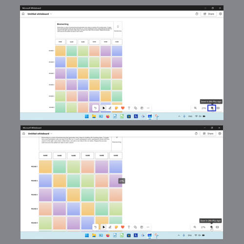

<h1 id="2">How to Zoom In With Keyboard Shortcut</h1>

* Method 1: [Open](https://qhtutorials.github.io/posts/how-to-open-microsoft-whiteboard/) a whiteboard template. On the keyboard press **Alt + Plus**, or the **Alt** and **+** keys. 
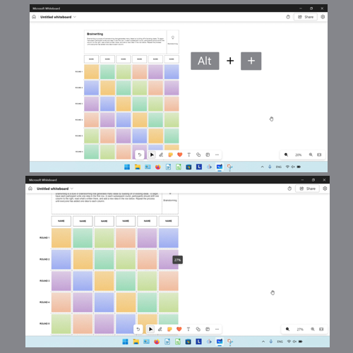

* Method 2: First [open](https://qhtutorials.github.io/posts/how-to-open-microsoft-whiteboard/) a whiteboard template. On the keyboard hold down **Shift** and press the **up arrow** key. 
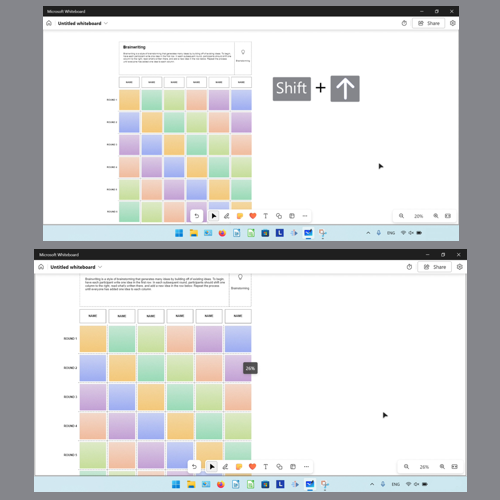

<h1 id="3">How to Zoom In With Menu</h1>

* Step 1: [Open](https://qhtutorials.github.io/posts/how-to-open-microsoft-whiteboard/) a whiteboard template. In the lower right side click the "Zoom level" button. 
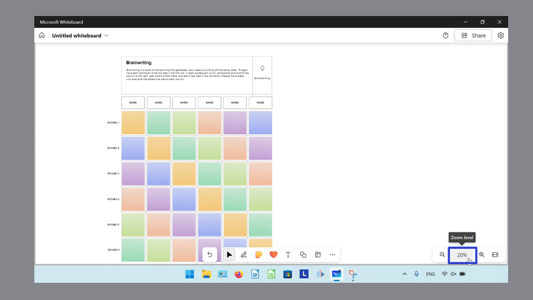

* Step 2: In the menu that opens, click to select a higher zoom percentage. 
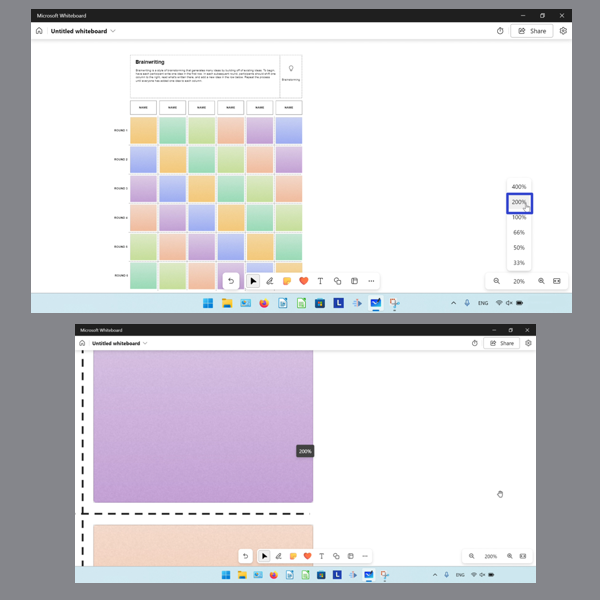

<h1 id="4">How to Zoom In With "Fit to Screen"</h1>

* Step 1: First [open](https://qhtutorials.github.io/posts/how-to-open-microsoft-whiteboard/) a whiteboard template, then [resize](https://qhtutorials.github.io/posts/how-to-customize-microsoft-whiteboard/) the app window to a larger size. 
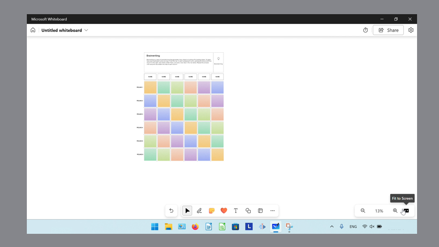

* Step 2: In the lower right click the "Fit to Screen" button. 
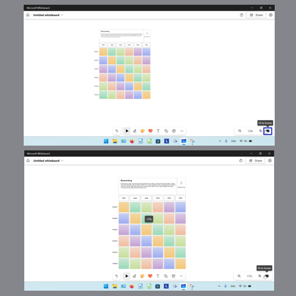

<h1 id="5">How to Center to Selection</h1>

* Step 1: [Open](https://qhtutorials.github.io/posts/how-to-open-microsoft-whiteboard/) a whiteboard template. Click to select any object, such as a sticky note. 
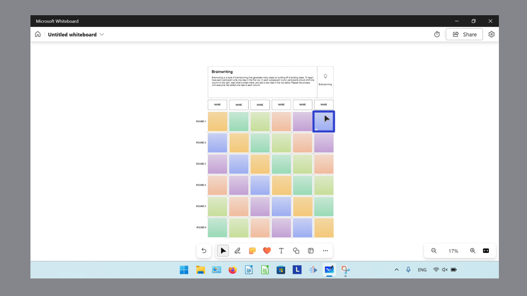

* Step 2: In the lower right click the "Center to selection" button. 
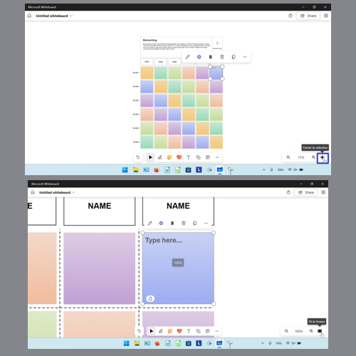

<h1 id="6">How to Zoom Out With Click</h1>

* Step 1: First [open](https://qhtutorials.github.io/posts/how-to-open-microsoft-whiteboard) a whiteboard template. In the lower right click the "Zoom out" button. 
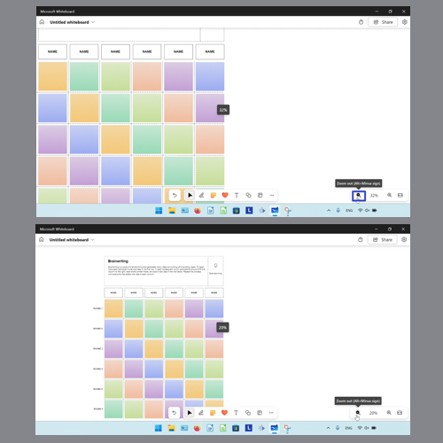

<h1 id="7">How to Zoom Out With Keyboard Shortcut</h1>

* Method 1: [Open](https://qhtutorials.github.io/posts/how-to-open-microsoft-whiteboard) a whiteboard template. On the keyboard press **Alt + Minus** or the **Alt** and **-** keys. 
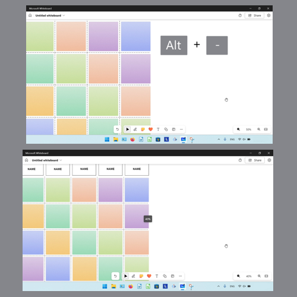

* Method 2: First [open](https://qhtutorials.github.io/posts/how-to-open-microsoft-whiteboard) a whiteboard template. On the keyboard hold **Shift** and press the **down arrow** key. 
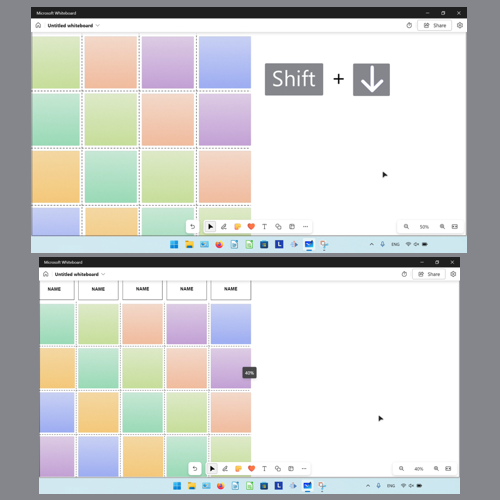

<h1 id="8">How to Zoom Out With Menu</h1>

* Step 1: [Open](https://qhtutorials.github.io/posts/how-to-open-microsoft-whiteboard) a whiteboard template. In the lower right click the "Zoom level" button. 
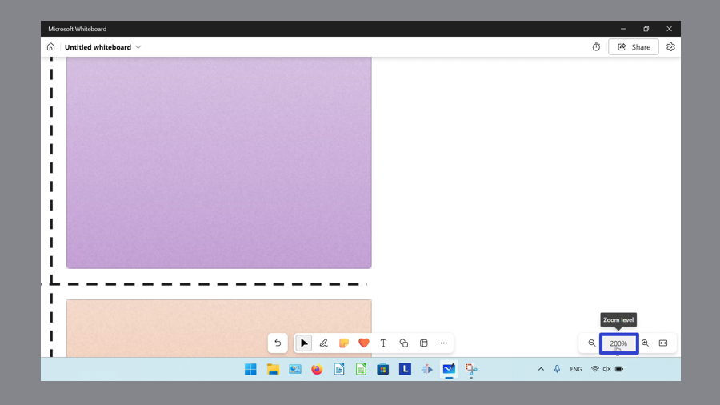

* Step 2: In the menu that opens, click to select a lower zoom percentage. 
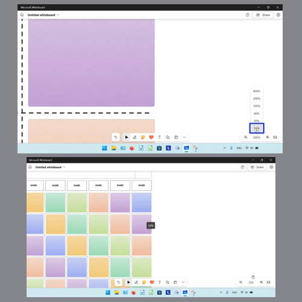

<h1 id="9">How to Zoom Out With "Fit to Screen"</h1>

* Step 1: First [open](https://qhtutorials.github.io/posts/how-to-open-microsoft-whiteboard) a whiteboard template, then [resize](https://qhtutorials.github.io/posts/how-to-customize-microsoft-whiteboard/) the app window to a smaller size. Double click the top of the window. 
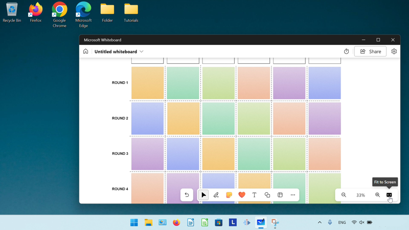

* Step 2: In the lower left click the "Fit to Screen" button. 
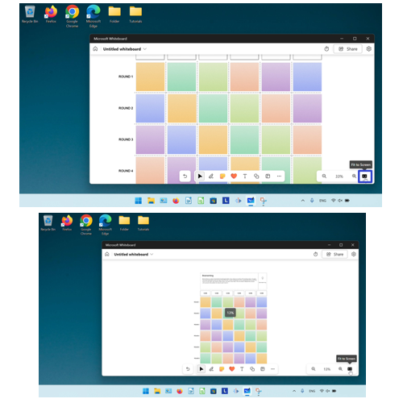

Keep a copy of these instructions for later with this free [tutorial PDF](https://drive.google.com/file/d/1W5IsxrC9pf6BE90QBpSj8WM5f13SkLCa/view?usp=sharing).

 

