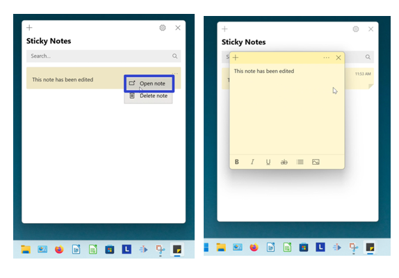
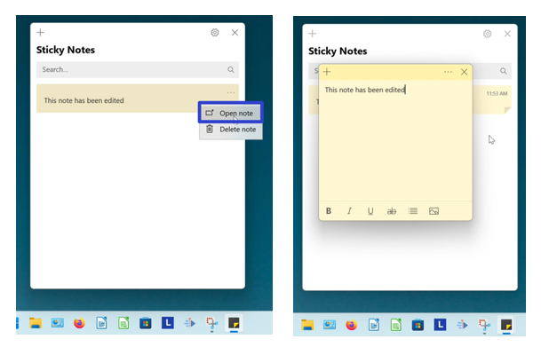

This tutorial covers:

## How to Open a Sticky Note:
1. <a href="#1">With Double Click</a>
2. <a href="#2">With Hover</a>
3. <a href="#3">With Right Click</a>
4. <a href="#4">From the Notes List</a>

 

No time to scroll down? Click through this presentation tutorial:

<iframe src="https://docs.google.com/presentation/d/e/2PACX-1vSSQTI5vZpqpZGCxS-A4Vo0g9fsz8Vzm0kEX8pHCcnQLBs-AhPVXQUO5iiZZxvgG0EwFmUrReppExE-/embed?start=false&loop=false&delayms=3000" frameborder="0" width="480" height="299" allowfullscreen="true" mozallowfullscreen="true" webkitallowfullscreen="true"></iframe>

 

View a video tutorial:
<iframe class="BLOG_video_class" allowfullscreen="" youtube-src-id="fQ30gjzGnWk" width="100%" height="416" src="https://www.youtube.com/embed/fQ30gjzGnWk"></iframe>

<h1 id="1">How to Open a Sticky Note with Double Click</h1>

* Step 1: First [open](https://qhtutorials.github.io/posts/openstickynotes/) the Sticky Notes app. In the Notes List window, double click a sticky note to open it.

<h1 id="2">How to Open a Sticky Note With Hover</h1>

* Step 1: [Open](https://qhtutorials.github.io/posts/openstickynotes/) the Sticky Notes app. Go down to the taskbar and hover the mouse over the Sticky Notes app icon. 

* Step 2: Two small windows appear; one is the Notes List and one is the sticky note. Click the sticky note window to open the sticky note. 

<h1 id="3">How to Open a Sticky Note With Right Click</h1>

* Step 1: First [open a sticky note](#1). Type any text into the sticky note, and click anywhere in the Notes List. 

* Step 2: In the Notes List, right click the sticky note. 

* Step 3: In the menu that opens, click "Open note" to open the sticky note.

<h1 id="4">How to Open a Sticky Note From the Notes List</h1>

* Step 1: [Open a sticky note](#1). Type any text into the sticky note and cilck anywhere inside the Notes List.

* Step 2: On the far right side of a sticky note, click the "Menu" or "..." button. 

* Step 3: In the menu that opens, click "Open note" to open the sticky note. 

Refer to these instructions for later with this free [PDF tutorial](https://drive.google.com/file/d/1jCTxgXycW9Vlvw6Fp8hx-mKooqKqWbfS/view?usp=sharing).

 