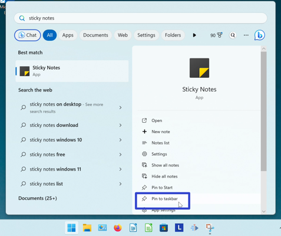
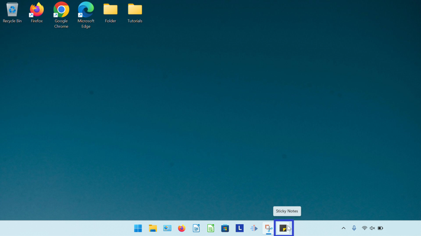

This tutorial covers:

## How to Pin the Sticky Notes App:
1. <a href="#1">To the Taskbar With Search</a>
2. <a href="#2">To the Taskbar With Right Click</a>
3. <a href="#3">To the Taskbar From Start</a>
4. <a href="#4">To Start</a>

 

No time to scroll down? Click through this tutorial presentation:

<iframe src="https://docs.google.com/presentation/d/e/2PACX-1vSEukaNa1VhxbHiw0rU4ho4g0iSzLykUB3QszsJifOAm13X0r-LVIZVP1j2I-5xD20bjXN0Omx7upok/embed?start=false&loop=false&delayms=3000" frameborder="0" width="480" height="299" allowfullscreen="true" mozallowfullscreen="true" webkitallowfullscreen="true"></iframe>

 

Follow along with a tutorial video:
<iframe class="BLOG_video_class" allowfullscreen="" youtube-src-id="Dtbi3jJBnQs" width="100%" height="416" src="https://www.youtube.com/embed/Dtbi3jJBnQs"></iframe>

<h1 id="1">How to Pin Sticky Notes to the Taskbar With Search</h1>

* Step 1: Go down to the taskbar and click Start (four blue squares). 

* Step 2: In the Start window that opens, click the top search bar and type "sticky notes". 

* Step 3: On the search results screen, click the down arrow to expand the menu. 

* Step 4: Click "Pin to taskbar". 

* Step 5: Go down to the taskbar and click the pinned Sticky Notes app icon. 

* The Sticky Notes app opens. 

<h1 id="2">How to Pin Sticky Notes to the Taskbar With Right Click</h1>

* Step 1: First [open](https://qhtutorials.github.io/posts/openstickynotes/) the Sticky Notes app. Go down to the taskbar and right click the app icon. 

* Step 2: In the menu that opens, click "Pin to taskbar". 

* Step 3: Right click the pinned Sticky Notes app icon. 

* Step 4: In the menu that opens, click "Sticky Notes" to open the app. 

* The Sticky Notes app opens. 

<h1 id="3">How to Pin Sticky Notes to the Taskbar From Start</h1>

* Step 1: Go down to the taskbar and click Start (four blue squares). 

* Step 2: In the Start window that opens, right click the pinned Sticky Notes app icon (if Sticky Notes is not yet pinned to start, see the last section). 

* Step 3: In the menu that opens, click "Pin to taskbar".

* The pinned Sticky Notes app icon appears on the taskbar. 

<h1 id="4">How to Pin Sticky Notes to Start</h1>

* Step 1: Go down to the taskbar and click Start (four blue squares). 

* Step 2: In the Start window that opens, click the top search bar and type "sticky notes". 

* Step 3: On the search results screen, click the down arrow to expand the menu. 

* Step 4: On the search results screen, click "Pin to Start". 

* Step 5: Click the Start button twice, and in the Start window that opens, click the pinned Sticky Notes app icon. 

* The Sticky Notes app opens. 

Download a free [tutorial PDF](https://drive.google.com/file/d/1JSYyVw9PwulK7yNpqd7RoE1PUlBYGJN7/view?usp=sharing).

 